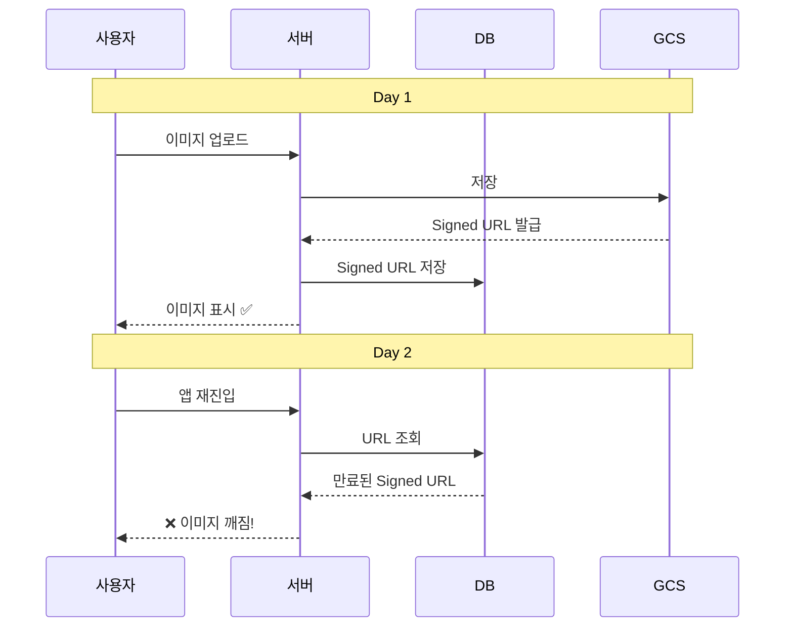
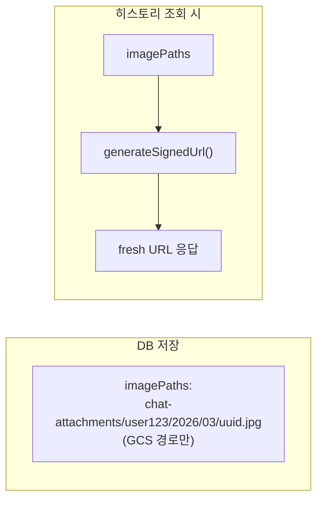
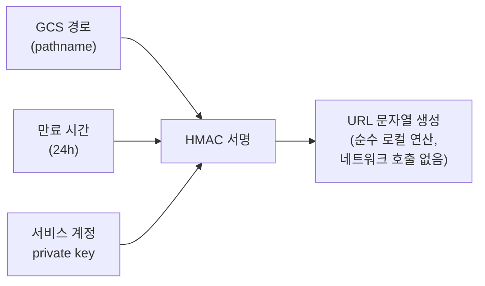
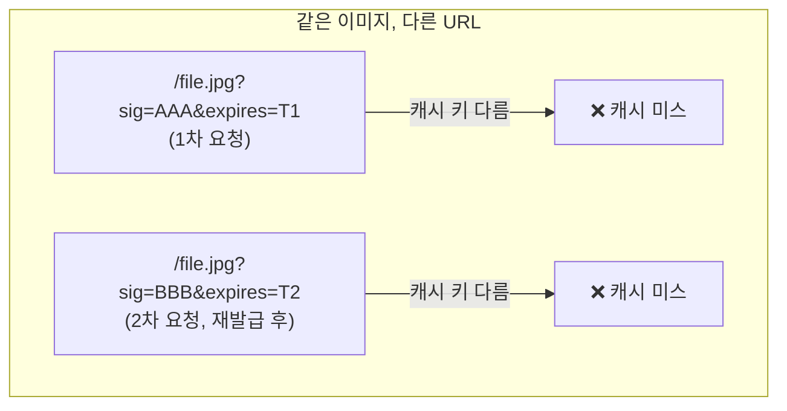
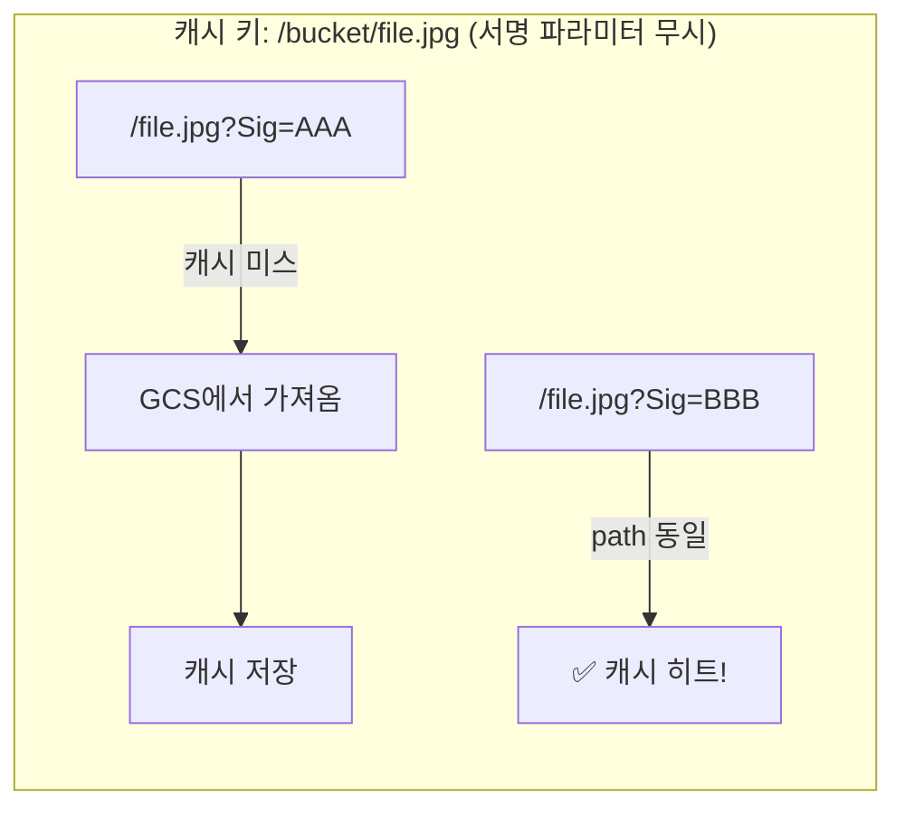

안녕하세요. 채팅 서비스를 개발하면서 이미지 첨부 기능을 직접 설계한 경험을 공유합니다.

처음에는 "파일을 업로드하고 URL을 저장하면 끝 아닌가?"라고 생각했습니다. 그런데 막상 설계를 시작하니 업로드 타이밍, URL 보안, 영속성, 압축, CDN까지 생각보다 많은 결정이 필요했습니다. 이 글에서는 각 결정 지점에서 어떤 선택지를 검토했고, 왜 그 방향을 선택했는지를 정리합니다.

---

## 1. 업로드 타이밍: 즉시 업로드 vs 전송 시 업로드

사용자가 이미지를 선택한 후, 텍스트를 입력하고, 전송 버튼을 누르기까지 시간 차이가 있습니다. 이미지를 **언제** 서버에 업로드할 것인가가 첫 번째 결정이었습니다.

### 선택지

| 방식 | 설명 |
|------|------|
| **즉시 업로드** | 이미지 선택 즉시 서버에 업로드 시작 |
| **전송 시 업로드** | 전송 버튼을 누를 때 이미지를 업로드 |

### 즉시 업로드를 선택한 이유

```mermaid
gantt
    title 이미지 업로드 타이밍 비교
    dateFormat  s
    axisFormat  %S초

    section 즉시 업로드
    이미지 선택      : milestone, m1, 0, 0
    백그라운드 업로드 : upload1, 0, 2
    텍스트 입력       : text1, 0, 3
    전송 (대기 0ms)  : milestone, m2, 3, 0

    section 전송 시 업로드
    이미지 선택      : milestone, m3, 0, 0
    텍스트 입력       : text2, 0, 3
    업로드 대기       : crit, upload2, 3, 5
    전송 완료        : milestone, m4, 5, 0
```



1. **체감 속도**: 사용자가 텍스트를 입력하는 동안 백그라운드에서 업로드가 완료됩니다. 전송 버튼을 누르면 대기 시간 0ms입니다.
2. **실패 사전 감지**: 네트워크 오류나 파일 문제를 전송 전에 미리 알 수 있습니다.
3. **복수 이미지 성능**: 3~5장을 동시에 올릴 때 선택 즉시 병렬 업로드가 시작됩니다. 전송 시 업로드는 한 번에 올려야 하므로 대기 시간이 장 수에 비례해 늘어납니다.
4. **업계 표준**: ChatGPT, Slack, Discord, WhatsApp 모두 이 방식을 사용합니다.

### 고아 파일 문제

즉시 업로드의 단점은 사용자가 이미지를 올렸다가 삭제하면 서버에 사용되지 않는 "고아 파일"이 남는다는 점입니다. 하지만 실제로 계산해보면:

- 고아 파일 1,000장 ≈ 5GB ≈ 월 $0.1 (GCS 저장 비용)
- GCS Lifecycle Policy로 자동 정리 가능

비용이 극히 미미하므로 실질적인 문제가 아닙니다.

### 전송 버튼 비활성화 규칙

즉시 업로드 방식에서 중요한 UX 디테일이 하나 있습니다. 이미지 업로드가 아직 진행 중일 때 전송 버튼을 비활성화해야 합니다. 업로드가 완료되어 URL을 확보한 후에만 전송을 허용합니다.

| 텍스트 | 이미지 | 업로드 상태 | 전송 버튼 |
|--------|--------|------------|----------|
| 없음 | 없음 | - | 비활성 |
| 있음 | 없음 | - | 활성 |
| 없음 | 있음 | 완료 | 활성 |
| 있음 | 있음 | 업로드 중 | **비활성** |

---

## 2. 이미지 URL 보안: Public URL vs Signed URL

업로드된 이미지에 접근하기 위한 URL을 어떻게 제공할 것인가가 두 번째 결정이었습니다.

### Public URL의 위험성

단순하게 GCS 버킷을 public으로 열고 고정 URL을 제공하면 구현이 쉽습니다. 하지만 채팅 서비스에서 주고받는 이미지는 **약봉지, 약통 등 건강 관련 사진**처럼 민감한 데이터를 포함할 수 있습니다.

| 위험 | 설명 |
|------|------|
| **의료 정보 노출** | 약 이름, 복용량이 담긴 사진이 유출될 수 있습니다 |
| **GDPR 위반** | EU 데이터 보호법상 건강 데이터는 "특수 범주 개인정보"로 분류됩니다. 무단 접근 가능 상태 자체가 위반입니다 |
| **URL 추측 공격** | 경로 패턴이 예측 가능하면 다른 사용자의 이미지에 접근할 수 있습니다 |
| **영구 접근** | URL이 유출되면 만료가 없으므로 **영원히** 접근 가능하고, 회수할 수 없습니다 |

일반적인 프로필 사진이라면 Public URL도 괜찮을 수 있지만, 민감한 건강 데이터에는 부적합합니다.

### Signed URL 선택

GCS Signed URL은 제한된 시간 동안만 유효한 서명된 URL입니다.

```
https://storage.googleapis.com/bucket/file.jpg
  ?X-Goog-Signature=abc123...   ← 서명
  &X-Goog-Expires=86400          ← 24시간 후 만료
```

24시간 만료를 적용하면:
- URL이 유출되더라도 24시간 후 자동 무효화
- GCS 실제 경로는 외부에 노출되지 않음
- GDPR/DiGA 컴플라이언스 충족

### ChatGPT의 방식

ChatGPT도 Signed URL 방식을 사용합니다:

```
https://files.oaiusercontent.com/file-abc123
  ?se=2026-03-20T12:00:00Z    ← 만료 시간
  &sp=r                        ← 읽기 권한만
  &sig=HMAC_SIGNATURE           ← 서명
```

자체 CDN 도메인(`files.oaiusercontent.com`)을 사용하고, 대화 히스토리 로드 시 새 URL을 재발급하는 구조입니다.

---

## 3. 이미지 영속성: DB에 무엇을 저장할 것인가

Signed URL은 24시간 후 만료됩니다. 그런데 사용자가 앱을 껐다가 다음 날 다시 열면 어제 보낸 이미지가 깨져 보일 것입니다.

### 핵심 질문: DB에 Signed URL을 저장하면?



Signed URL을 DB에 저장하면 안 됩니다. 만료 후 복구할 방법이 없습니다.

### 해결: DB에는 GCS pathname만 저장



pathname은 만료되지 않는 GCS 내부 경로이므로, 언제든지 새로운 Signed URL을 생성할 수 있습니다.

### Signed URL 생성은 비용이 들지 않는다

여기서 "매번 URL을 생성하면 성능에 문제가 없나?"라는 의문이 생길 수 있습니다. 결론부터 말하면, **GCS Signed URL 생성은 GCS API를 호출하지 않습니다.**



서버 로컬에서 private key로 서명하는 암호화 연산일 뿐이라, 수 ms도 걸리지 않습니다. 메시지 100개에 이미지가 각각 5개씩 있어도 URL 500개 생성은 수십 ms 이내에 완료됩니다.

실제로 GCS에 네트워크 요청이 가는 건 **클라이언트가 그 URL로 이미지를 다운로드할 때**뿐입니다.

### 클라이언트에 만료 시간을 내려줘야 하나?

"서버가 만료 시간을 알려주면 클라이언트가 만료 전에 갱신 요청을 보내는 게 낫지 않을까?"

두 가지 접근법을 비교했습니다:

| 방법 | 클라이언트 복잡도 | API 호출 |
|------|------------------|----------|
| 만료 시간 전달 + 클라이언트 갱신 | 높음 (타이머, 만료 체크, 갱신 요청 관리) | 이미지별 개별 갱신 API |
| 히스토리 조회 시 서버가 항상 fresh URL 제공 | **낮음** (신경 쓸 것 없음) | 히스토리 조회 1회에 포함 |

**서버가 매번 fresh URL을 제공하는 방식**이 훨씬 단순합니다. 클라이언트는 만료 시간을 관리할 필요 없이, 히스토리 API를 호출하면 항상 유효한 URL을 받습니다.

유일한 엣지 케이스는 24시간 이상 대화창을 열어놓는 경우인데, 이건 `` 핸들러로 자동 재요청하거나 새로고침으로 해결할 수 있는 드문 케이스입니다.

---

## 4. CDN 도입 여부: 비용 분석

이미지 트래픽이 많아지면 CDN을 고려하게 됩니다.

### GCS 직접 접근 vs Cloud CDN 비용

GCS에서 인터넷으로 데이터를 전송하는 이그레스 비용이 핵심입니다:

| 항목 | GCS 직접 | Cloud CDN |
|------|----------|-----------|
| 이그레스 비용 | $0.12/GB | $0.08/GB |
| 캐시 채우기 | - | $0.04/GB |

월 1,000 MAU, 사용자당 이미지 10장(2MB), 일 3회 앱 진입으로 가정하면:

```
월간 다운로드 트래픽:
  첨부 직후: 1,000 × 10 × 2MB = 20GB
  히스토리 재로드: 1,000 × 3회/일 × 30일 × 10장 × 2MB ≈ 1,800GB
  총: ~1,820GB
```

이 계산은 클라이언트 브라우저 캐싱을 고려하지 않은 수치입니다. 실제로는 동일 기기에서 반복 조회 시 브라우저가 캐시에서 이미지를 로드하므로, 실제 이그레스 트래픽은 이보다 낮을 수 있습니다.

| | CDN 없음 | CDN 사용 |
|--|----------|----------|
| 월 비용 | ~$218 | ~$147 |
| 절감 | - | ~33% |

### 하지만 Signed URL과 CDN은 궁합이 나쁘다

**핵심 문제**: Signed URL은 쿼리 파라미터에 서명이 포함되어 있어서, 같은 이미지라도 매번 다른 URL이 생성됩니다.



### Cloud CDN Signed URL로 해결 가능

Cloud CDN은 자체 Signed URL 체계를 제공합니다. GCS Signed URL과 달리, **URL의 path 부분만으로 캐시 키를 구성**할 수 있습니다:



이렇게 하면 캐시 히트율 80~90%를 달성할 수 있고, 월 비용을 $50~70 수준으로 줄일 수 있습니다.

### 결론: 규모에 따라 결정

| 규모 | 추천 |
|------|------|
| 소규모 (<1,000 MAU) | CDN 불필요. GCS 직접 접근 (월 $10~20) |
| 중규모 (1,000~10,000 MAU) | CDN 검토. Cloud CDN Signed URL 도입 |
| 대규모 (10,000+ MAU) | CDN 필수. Cookie 기반 인증 또는 CDN Signed URL |

소규모에서는 CDN 구축/운영 비용이 절감액보다 크므로, 스케일업 시점에 도입하는 것이 합리적입니다.

---

## 5. 이미지 압축: 클라이언트에서 처리하는 이유

스마트폰 카메라의 원본 사진은 3~15MB에 달합니다. 원본 그대로 올리면 저장·전송 비용이 과도합니다. "압축은 해야 한다"는 건 명확한데, 문제는 **어디서** 할 것인가입니다.

### 선택지 비교

| 방식 | 장점 | 단점 |
|------|------|------|
| **서버 압축** | 일관된 품질 보장, 모든 클라이언트에 동일 적용 | 원본이 먼저 네트워크를 타야 함 |
| **클라이언트 압축** | 대역폭 절감, 서버 부하 0, 업로드 속도 향상 | 브라우저 Canvas API 의존 |
| **둘 다** | 이론적으로 최적 | 이중 압축으로 화질 저하, 과잉 설계 |

### 클라이언트 압축을 선택한 핵심 이유

이 결정의 본질은 **"네트워크 비용을 어디서 절감할 수 있는가"**입니다. 서버 압축은 원본이 네트워크를 타는 순간 이미 대역폭을 소비한 것입니다. 서버에서 아무리 잘 압축해도 **이미 지나간 5MB는 돌려받을 수 없습니다.**

실제 사용자는 모바일 환경에서 이미지를 전송합니다. 네트워크 조건별 업로드 시간 차이가 결정적이었습니다:

| 환경 | 원본 5MB 전송 | 압축 후 500KB 전송 |
|------|-------------|-----------------|
| 4G LTE (10Mbps) | 4.0초 | 0.4초 |
| 3G (1Mbps) | 40초 | 4초 |
| 약한 WiFi (3Mbps) | 13초 | 1.3초 |

3G 환경에서 **40초 vs 4초** — 10배 차이입니다. "즉시 업로드" 패턴과 결합하면, 클라이언트 압축은 사용자가 텍스트를 입력하는 3초 안에 업로드가 완료되어 전송 버튼을 누르는 시점에 대기 시간이 0이 됩니다.

또한 서버 압축을 도입하면 CPU-intensive한 이미지 처리를 API 서버가 담당해야 하고, `sharp` 같은 네이티브 C 모듈 의존성이 추가되어 Docker 이미지 크기 증가·Cold Start 지연 같은 부수 비용도 발생합니다. 클라이언트 압축은 이 모든 서버 부담이 0입니다.

### 압축 기준: 충분히 좋으면서 최대한 작게

핵심 원칙은 **AI가 이미지를 인식할 수 있는 최소 품질을 유지하면서 최대한 압축**하는 것입니다.

**해상도 1920px**: Gemini Vision은 내부적으로 이미지를 ~2048px로 리사이즈합니다. 원본 4032px를 보내도 AI가 어차피 줄이므로, 미리 줄여서 보내면 네트워크만 절약됩니다. 12MP 기준 리사이즈만으로도 파일 크기가 약 70% 감소합니다.

**JPEG 품질 80%**: SSIM(Structural Similarity Index) 0.95 이상이면 인간의 눈으로 원본과 구별하기 어렵습니다. 70%로 내리면 160KB를 더 절약하지만 작은 글씨 품질이 떨어지고, 90%로 올리면 400KB를 더 쓰지만 눈에 보이는 개선이 없습니다.

### 압축 결과와 비용 영향

| 항목 | 원본 그대로 | 클라이언트 압축 |
|------|-----------|---------------|
| 월간 저장량 (1,000 MAU) | 50GB | 5GB |
| GCS 저장 비용 | $1.00/월 | $0.10/월 |
| 이그레스 비용 (히스토리 조회) | ~$218/월 | ~$22/월 |
| 사용자 업로드 대기 (LTE) | 4초 | 0.4초 |
| 사용자 업로드 대기 (3G) | 40초 | 4초 |

저장·전송 비용 10배 절감, 사용자 체감 속도 10배 향상입니다.

---

## 6. 전체 아키텍처 요약

| 결정 | 선택 | 핵심 이유 |
|------|------|----------|
| 업로드 타이밍 | 즉시 업로드 | 전송 시 대기 0ms, UX 우수 |
| URL 보안 | Signed URL (24h) | 민감 데이터 보호, GDPR 컴플라이언스 |
| DB 저장 | GCS pathname | Signed URL은 만료되므로 경로만 저장 |
| URL 갱신 | 서버가 매번 재발급 | 클라이언트 복잡도 제거 |
| 이미지 압축 | 클라이언트 (1920px, 80% JPEG) | 네트워크 5.5배 절감, 서버 부하 0 |
| CDN | 현재 미도입 | 소규모에서는 비용 대비 효과 낮음 |

---

## 마치며

이미지 업로드라는 겉보기에 단순한 기능이지만, 보안(GDPR), 성능(즉시 업로드), 영속성(pathname 저장), 비용(압축·CDN)까지 고려하면 꽤 많은 설계 결정이 필요합니다.

아직 개선 여지도 남아 있습니다. 현재는 정적 이미지만 다루고 있는데, 동영상이나 음성 파일 같은 미디어 타입으로 확장할 경우 압축 전략과 스토리지 구조를 다시 검토해야 합니다. 또한 WebP 포맷은 동일 품질 기준에서 JPEG보다 25~35% 더 작지만, AI 모델과 일부 클라이언트의 호환성을 먼저 확인해야 하므로 도입을 보류한 상태입니다. CDN도 현재는 소규모라 미도입이지만, MAU가 증가하는 시점에 Cloud CDN Signed URL 방식으로 전환할 계획입니다.

"일단 돌아가게 만들자"가 아니라 이런 결정들을 미리 정리해두면, 나중에 스케일업할 때 큰 리팩토링 없이 확장할 수 있습니다. 비슷한 고민을 하고 계신 분들께 이 글이 조금이나마 도움이 되었으면 합니다.
