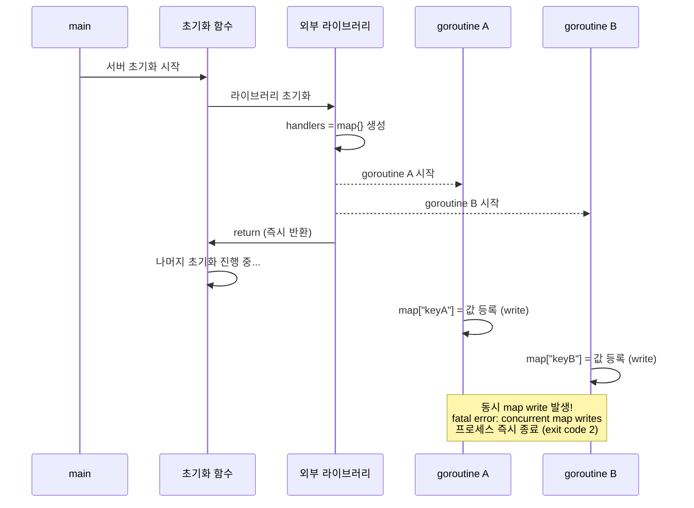

**요약**: 배포 후 컨테이너가 시작되지 않는 장애가 발생했습니다. 원인은 `fatal error: concurrent map writes`로, 두 goroutine이 동시에 같은 map에 write하면서 Go 런타임이 프로세스를 즉시 종료시킨 것이었습니다. 이전 버전에서는 동일한 버그가 있었지만 새로운 기능 추가로 goroutine 스케줄링 타이밍이 바뀌면서 race condition이 발현되었고, goroutine 시작 전에 map 초기화를 완료하는 방식으로 수정했습니다.

배포 직후 컨테이너가 뜨지 않는 장애가 발생했습니다. 로그를 뒤져보니 `fatal error: concurrent map writes`라는 Go 런타임 에러가 원인이었습니다. 이 에러가 왜 발생하는지, 어떻게 고쳤는지, 그리고 관련 코드를 한 줄도 수정하지 않았는데 왜 갑자기 터졌는지를 정리했습니다.

---

## 문제가 발생한 환경

문제가 발생한 서버는 Go로 작성된 백엔드 API 서버로, 서버리스 컨테이너 위에서 동작합니다. 서버가 시작될 때는 다음과 같은 순서로 초기화가 진행됩니다.

```
main() 시작
  → config.Setup()     ← DB 연결, PubSub 연결, Slack 로그 설정 등
  → v1Module.Setup()   ← v1 모듈 초기화
  → v2Module.Setup()   ← v2 모듈 초기화 (새로 추가된 기능 모듈 포함)
  → server.Init()      ← gRPC + HTTP 서버 시작
  → 8080 포트에서 요청 대기  ← 여기까지 와야 "정상"으로 판단
```

서버리스 컨테이너 플랫폼은 컨테이너가 시작되면 지정된 포트에 TCP 연결을 시도합니다. 응답이 오면 "정상 시작"으로 판단하고, 일정 시간 내에 응답이 없으면 "시작 실패"로 판단하여 컨테이너를 종료합니다.

문제는 **8080 포트에 도달하기도 전에**, 즉 `config.Setup()` 단계에서 프로세스가 죽어버렸다는 점입니다.

---

## 증상 분석

### 컨테이너 에러 메시지

배포 후 콘솔에서 확인한 에러 메시지는 다음과 같았습니다.

```
The user-provided container failed to start and listen on the port
defined provided by the PORT=8080 environment variable.

Container called exit(2).
Default STARTUP TCP probe failed 1 time consecutively
for container "server" on port 8080.

fatal error: concurrent map writes
```

### exit code 2의 의미

로그에서 바로 `exit(2)`에 주목했습니다.

- `exit(0)`: 정상 종료
- `exit(1)`: 프로그램이 `os.Exit(1)` 같은 명시적 종료를 호출했을 때
- `exit(2)`: **Go 런타임이 복구 불가능한 fatal error를 감지했을 때 프로세스를 강제 종료**

즉, 포트 문제가 아니라 프로세스 자체가 시작 도중에 비정상적으로 죽고 있다는 뜻이었습니다. 그리고 에러 로그에 `fatal error: concurrent map writes`가 함께 찍혀 있었기 때문에, 이 에러를 중심으로 디버깅을 시작했습니다.

Go의 `map`은 여러 goroutine이 동시에 접근하면 안 됩니다. 동시에 write가 발생하면, Go 런타임이 이를 감지하고 즉시 프로세스를 종료시킵니다. 그리고 이것은 일반적인 `panic`이 아닌 **fatal error**이기 때문에, `recover()`로 잡을 수 없습니다. 프로그램은 그냥 죽습니다.

왜 이런 일이 일어나는지, 제대로 이해하려면 Go의 `map`과 `goroutine`부터 살펴봐야 합니다.

---

## Go의 map이란

Go의 `map`은 키(key)와 값(value)의 쌍을 저장하는 **해시 테이블** 자료구조입니다.

- 키를 해시 함수에 넣어 버킷 위치를 결정하고, 평균 O(1)로 값을 조회합니다.
- **동적으로 크기가 커집니다.** 데이터가 쌓이면 더 큰 버킷 배열을 새로 할당하고 기존 데이터를 전부 이동하는 rehash가 일어납니다.
- 이 rehash 과정이 **원자적이지 않아**, 동시 접근 시 메모리 구조가 깨질 수 있습니다.

---

## Goroutine이란

goroutine은 Go 런타임이 관리하는 **경량 스레드**입니다.

- `go` 키워드 하나로 함수를 별도의 실행 흐름에서 동시에 실행할 수 있습니다.
- 여러 goroutine이 시작되면 어떤 goroutine이 먼저 CPU를 점유할지는 **실행할 때마다 달라집니다.**
- Go 스케줄러는 시스템 부하, 처리 중인 작업량 등을 고려하여 실행 순서를 결정합니다.

이 "순서를 알 수 없다"는 특성이 이번 버그의 핵심입니다.

---

## 왜 map + goroutine이 위험한가

### 노트 한 권에 두 사람이 동시에 쓰는 상황

map을 여러 goroutine이 공유하는 상황을 비유로 설명하면 이렇습니다.

노트 한 권이 있습니다. A와 B가 동시에 이 노트에 뭔가를 쓰려고 합니다. A는 3페이지를 펴고 쓰려는데, B도 마침 3페이지를 쓰려고 합니다. 두 사람이 동시에 같은 페이지에 쓰면 노트가 엉망이 됩니다. 심지어 A가 새 노트로 옮겨 적는 도중에 B가 끼어들면 더 큰 혼란이 생깁니다.

### map에 값을 넣을 때 내부적으로 일어나는 일

`m["apple"] = 3` 이라는 단순한 코드 한 줄도, 내부적으로는 여러 단계가 순차적으로 실행됩니다.

```
1. "apple"의 해시값 계산   → 예: 472831
2. 해시값으로 버킷 위치 결정 → 예: 버킷 3
3. 버킷 3에서 빈 슬롯 찾기
4. 메모리에 key="apple", value=3 쓰기
5. (필요시) 버킷이 꽉 찼으면 rehash 수행
```

이 과정은 **원자적(atomic)이지 않습니다.** 즉, 1번을 실행하는 도중에 다른 goroutine이 끼어들 수 있습니다.

### Go가 concurrent map write를 감지하면

Go 런타임은 1.6버전부터 concurrent map write를 감지하는 기능을 내장하고 있습니다. 내부적으로 map에는 "지금 누군가가 쓰고 있음"을 나타내는 플래그가 있습니다. 두 goroutine이 동시에 쓰려고 하면 이 플래그를 통해 감지됩니다.

감지되는 순간, `fatal error: concurrent map writes`를 출력하고 프로세스를 즉시 종료합니다. 일반적인 `panic`과 달리 `recover()`로 잡을 수 없습니다.

```go
// 이 코드는 프로그램을 죽일 수 있습니다 (recover로 잡을 수 없음)
// 단, race condition은 확률적이므로 항상 재현되지는 않습니다.
// go run -race main.go 로 실행하면 확정적으로 탐지됩니다.
m := map[string]int{}
go func() { m["a"] = 1 }()
go func() { m["b"] = 2 }()
time.Sleep(time.Millisecond)
```

---

## "키가 다른데 왜 위험한가?" — map 내부 구조 상세 설명

이 부분에서 조금 의아한 부분이 있었는데요. "goroutine A는 `"keyA"`에, goroutine B는 `"keyB"`에 쓰는데, 서로 다른 키니까 괜찮지 않나?"라는 생각이 들었습니다.

이 질문에 답하려면 map의 내부 구조에 대해 좀 더 알아보았습니다.

### map 내부는 "버킷 배열"

Go의 map은 내부적으로 **버킷(bucket) 배열**로 구성되어 있습니다. 각 버킷에는 최대 8개의 key-value 쌍이 들어갑니다.

```
map 내부 구조:
┌─────────────────────────────────────┐
│ 메타데이터                            │ ← 전체 키 개수, 버킷 수, 해시 시드 등
├─────────────────────────────────────┤
│ 버킷 배열 포인터                       │ ← 실제 데이터가 저장되는 곳
│  ┌──────────────┐                   │
│  │ 버킷 0       │ ← 여러 key-value 쌍 (최대 8개)
│  │ 버킷 1       │
│  │ 버킷 2       │
│  │ 버킷 3       │
│  │ ...          │
│  └──────────────┘                   │
└─────────────────────────────────────┘
```

`m["a"] = 1` 을 실행하면 내부적으로 이런 과정을 거칩니다.

```
1. "a"의 해시값 계산 → 예: 472831
2. 472831 % 버킷수 → 예: 버킷 3에 저장
3. 버킷 3에 key="a", value=1 을 씀
```

키가 다르더라도 해시값을 버킷 수로 나눈 나머지가 같으면, **같은 버킷에 들어갑니다.** 이를 해시 충돌(hash collision)이라고 합니다. `"debug"`와 `"error"`도 같은 버킷에 배정될 수 있습니다.

### 진짜 위험한 순간: rehash

그런데 버킷이 달라도 위험한 상황이 있습니다. 바로 **rehash**입니다.

map에 데이터가 계속 추가되다 보면, 버킷들이 꽉 차기 시작합니다. 이때 Go 런타임은 더 큰 버킷 배열을 새로 만들고, 기존 데이터를 전부 옮깁니다. 이 과정을 rehash(또는 grow)라고 합니다.

rehash 과정을 단계별로 살펴보면 다음과 같습니다.

```
Step 1: 새 버킷 배열을 메모리에 할당
Step 2: 기존 데이터를 하나씩 새 배열로 복사
Step 3: map의 메타데이터 업데이트 (버킷 수, 포인터 등)
Step 4: 기존 배열을 해제
```

이 과정 역시 **원자적이지 않습니다.**

```
rehash 전: 버킷 4개
┌────┐┌────┐┌────┐┌────┐
│ b0 ││ b1 ││ b2 ││ b3 │
└────┘└────┘└────┘└────┘

rehash 후: 버킷 8개
┌────┐┌────┐┌────┐┌────┐┌────┐┌────┐┌────┐┌────┐
│ b0 ││ b1 ││ b2 ││ b3 ││ b4 ││ b5 ││ b6 ││ b7 │
└────┘└────┘└────┘└────┘└────┘└────┘└────┘└────┘
```

rehash 중에 다른 goroutine이 끼어들면 어떤 일이 생길까요?

```
goroutine A: 새 버킷 배열로 데이터를 복사하는 중...
             (Step 2 진행 중)

goroutine B: map에 새 값을 쓰려고 함
             → 아직 옛날 버킷 배열 주소를 보고 있음
             → 옛날 배열에 씀

goroutine A: 복사 완료, 메타데이터 업데이트
             → goroutine B가 쓴 값은 새 배열에 없음!
             → 메모리 구조가 깨짐
```

책장 비유로 설명하면 이렇습니다. 책장이 꽉 차서 A가 더 큰 책장으로 교체하면서 책을 하나씩 옮기고 있습니다. 그런데 B가 "나도 책 한 권 추가할게"하면서 아직 치우지 않은 옛날 책장에 새 책을 꽂습니다. A가 옮기기를 완료하고 옛날 책장을 치워버리면, B가 방금 꽂은 책은 어디론가 사라지고 맙니다.

### 정리

| 질문 | 답 |
|------|-----|
| 키가 다르면 괜찮지 않나? | 괜찮지 않습니다. 다른 키도 같은 버킷에 들어갈 수 있고, rehash가 일어나면 map 전체 구조가 변경됩니다 |
| 크기가 동적이어서 그런 건가? | 맞습니다. map은 동적으로 커지는 구조라서 write 시 내부 구조가 통째로 바뀔 수 있습니다 |
| 왜 배열은 괜찮고 map은 안 되나? | 배열은 크기가 고정이라 내부 구조가 바뀌지 않습니다. map은 동적이라 write가 구조 자체를 변경할 수 있습니다 |

---

## 실제로 무슨 일이 일어났나

서버 초기화 과정에서 사용하는 외부 라이브러리가 있었습니다. 이 라이브러리의 초기화 함수는 객체를 만들고 즉시 return하지만, 내부에서 **백그라운드 goroutine을 여러 개 시작**합니다. return된 후에도 이 goroutine들은 계속 실행됩니다.

문제는 이 goroutine들이 시작 직후 같은 map에 각자의 항목을 등록(write)하는 코드가 있었다는 점입니다. goroutine A는 `handlers["keyA"]`에, goroutine B는 `handlers["keyB"]`에 동시에 write를 시도합니다. Go 런타임이 이를 감지하고 `fatal error`를 발생시킵니다.

### 전체 타임라인



컨테이너가 포트에서 listen을 시작하기도 전에 프로세스가 죽어버리니, 컨테이너 플랫폼 입장에서는 "포트에서 응답이 없음"으로 판단한 것입니다.

---

## 관련 코드를 수정하지 않았는데 왜 이전 버전에서는 잘 되었는가?

이 질문이 race condition을 이해하는 데 매우 중요합니다.

### Race condition은 확률적으로 발현됩니다

v1.5.2 버전에서도 동일한 버그가 코드 안에 있었습니다. 하지만 터지지 않았을 뿐입니다.

goroutine A와 B가 map에 접근하는 타이밍이 조금만 차이가 나도 문제가 발생하지 않습니다.

```
✅ 괜찮은 경우: A가 끝나고 B가 시작 (겹치지 않음)

        A 쓰기         B 쓰기
       ┌──────┐       ┌──────┐
───────┤      ├───────┤      ├──────▶ 시간
       └──────┘       └──────┘
                 ↑
            이 틈이 있으면 안전


❌ 문제가 발생하는 경우: A와 B가 동시에 쓰기 (겹침)

       A 쓰기
       ┌──────────┐
───────┤          ├─────────────────▶ 시간
       └──────────┘
          ┌──────────┐
          │  B 쓰기   │
          └──────────┘
       ↑     ↑
       겹치는 구간 → fatal error!
```

### 왜 이전 버전에서는 괜찮았는데 갑자기 문제가 생겼는가?

새 버전에서 기능이 추가되면서 서버 시작 시 처리하는 작업량이 늘어났습니다. 작업량이 늘어나면 CPU가 더 바빠지고, Go 스케줄러가 goroutine들을 더 촘촘하게 번갈아 실행합니다. 그 결과 goroutine A와 B가 동시에 map에 접근할 확률이 높아진 것입니다.

비유하면, 신호등 없는 교차로에 차가 2대 다닐 때는 사고가 안 났지만 차량이 10대로 늘어나면서 결국 사고가 난 것과 같습니다. 교차로의 문제(신호등 없음)는 처음부터 있었습니다.

> **💡 핵심 교훈**: Race condition은 해당 코드를 한 줄도 수정하지 않아도 발현될 수 있습니다. 주변 코드의 변경이 goroutine 스케줄링 타이밍을 바꾸기 때문입니다.

---

## Go에서 concurrent map 문제의 해결 패턴 3가지

concurrent map write 문제를 해결하는 방법은 크게 3가지입니다. 저희가
 검토한 대안과 최종 선택 근거를 먼저 정리합니다.

| 방식 | 장점 | 단점 | 적합한 경우 | 선택 |
|------|------|------|-------------|------|
| sync.Mutex | 범용적, read/write 제어 가능 | Lock 관리 필요, 성능 오버헤드 | 런타임 중 map 변경이 필요할 때 | ❌ |
| sync.Map | 사용 간편, thread-safe | 인터페이스 불편, 쓰기 잦으면 느림 | read 위주 워크로드 | ❌ |
| 초기화 선행 | 가장 단순, 오버헤드 없음 | 초기화 후 변경 불가 | 한 번만 초기화하면 되는 경우 | ✅ |

### 1. sync.Mutex 사용

가장 범용적인 방법입니다. map에 접근하기 전에 Lock을 걸고, 끝나면 Unlock합니다. Mutex는 자물쇠와 같습니다. 한 goroutine이 자물쇠를 잠그면, 다른 goroutine은 자물쇠가 풀릴 때까지 기다립니다.

```go
type SafeMap struct {
    mu sync.RWMutex  // 읽기/쓰기를 구분하는 RWMutex 사용
    m  map[string]chan *logrus.Entry
}

func (s *SafeMap) Set(key string, val chan *logrus.Entry) {
    s.mu.Lock()          // 쓰기 Lock: 다른 모든 접근을 차단
    defer s.mu.Unlock()
    s.m[key] = val
}

func (s *SafeMap) Get(key string) (chan *logrus.Entry, bool) {
    s.mu.RLock()         // 읽기 Lock: 다른 읽기는 허용, 쓰기만 차단
    defer s.mu.RUnlock()
    val, ok := s.m[key]
    return val, ok
}
```

장점: 직관적이고 read/write 모두 제어 가능합니다. `RWMutex`를 사용하면 읽기끼리는 동시에 수행할 수 있어 성능이 더 좋습니다.
단점: Lock/Unlock을 실수로 빠뜨리거나, Lock을 너무 오래 잡으면 성능 문제가 생깁니다.

### 2. sync.Map 사용

Go 표준 라이브러리가 제공하는 thread-safe map입니다. 별도의 Lock 없이 안전하게 사용할 수 있습니다. 읽기가 빈번하고 쓰기가 드문 워크로드에 최적화되어 있습니다.

```go
var m sync.Map

// 쓰기
m.Store("debug", make(chan *logrus.Entry, 100))
m.Store("error", make(chan *logrus.Entry, 100))

// 읽기
val, ok := m.Load("debug")
if ok {
    ch := val.(chan *logrus.Entry)
    // ch 사용
}

// 삭제
m.Delete("debug")
```

장점: 사용이 간편하고 안전합니다.
단점: 일반 map에 비해 인터페이스가 조금 불편하고, 쓰기가 잦은 경우 Mutex보다 느릴 수 있습니다.

### 3. goroutine 시작 전에 초기화 완료 (이번 케이스의 해결법)

map write를 goroutine 시작 전에 모두 끝내고, goroutine 안에서는 read만 수행합니다. 가장 단순하고 오버헤드가 없는 방법입니다. map이 완전히 초기화된 상태에서 goroutine들이 시작되므로, write가 발생하지 않습니다.

```go
// goroutine 시작 전에 map 초기화를 완전히 끝냄
m := map[string]chan *logrus.Entry{
    "debug": make(chan *logrus.Entry, 100),
    "error": make(chan *logrus.Entry, 100),
}

// goroutine은 이미 초기화된 map을 read만 함
go handler(ctx, m, "debug")  // m["debug"]를 읽기만 함
go handler(ctx, m, "error")  // m["error"]를 읽기만 함
```

장점: 가장 단순하고 성능 오버헤드가 전혀 없습니다.
단점: 초기화가 완료된 이후에 map을 변경할 필요가 없는 경우에만 적용 가능합니다.

---

## 실제 수정

3가지 패턴 중 이번 케이스에서는 **3번(goroutine 시작 전에 초기화 완료)**을 선택했습니다. 이유는 간단합니다. `channelHandlers` map은 서버 시작 시 한 번만 초기화하면 되고, 이후에는 변경할 필요가 없었기 때문입니다. Mutex나 sync.Map을 사용하면 불필요한 런타임 오버헤드가 추가되므로, 초기화 시점만 조정하는 것이 가장 깔끔한 해결책이었습니다.

goroutine 안에서 map write를 하는 것이 문제였으므로, goroutine 시작 전에 map entry를 모두 만들어두면 됩니다.

### Before (수정 전)

```
1. 빈 map 생성
2. goroutine A 시작 → 내부에서 map["keyA"] = 값 등록 (write)
3. goroutine B 시작 → 내부에서 map["keyB"] = 값 등록 (write)
→ goroutine A와 B가 동시에 같은 map에 write → fatal error
```

### After (수정 후)

```
1. 빈 map 생성
2. map["keyA"] = 값 등록 (write)  ← goroutine 시작 전에 완료
3. map["keyB"] = 값 등록 (write)  ← goroutine 시작 전에 완료
4. goroutine A 시작 → map["keyA"]를 read만 함 (안전)
5. goroutine B 시작 → map["keyB"]를 read만 함 (안전)
→ goroutine 안에서 map write가 없으므로 race condition 없음
```

핵심 변경 사항을 정리하면 다음과 같습니다.

| 항목 | 수정 전 | 수정 후 |
|------|---------|---------|
| map entry 생성 위치 | goroutine 내부 | goroutine 시작 전 |
| goroutine 안에서 map 접근 | write (위험) | read만 (안전) |
| concurrent map write 가능성 | 있음 | 없음 |

이렇게 수정하면 goroutine A와 B는 시작되는 시점에 이미 map이 초기화되어 있으므로, map에 write할 필요가 없습니다. 값을 읽는 것은 concurrent하게 수행해도 안전합니다.

---

## Race Condition 사전 탐지 (-race 플래그)

Go는 race condition을 빌드 및 테스트 단계에서 탐지할 수 있는 **race detector**를 내장하고 있습니다. `-race` 플래그를 붙이기만 하면 됩니다.

```bash
# 빌드 시 race detector 활성화
go build -race ./cmd/server/

# 테스트 시 race detector 활성화 (가장 자주 쓰는 방법)
go test -race ./...
```

race detector를 활성화한 상태로 프로그램을 실행하면, concurrent map access가 발생했을 때 즉시 감지하고 상세한 리포트를 출력합니다.

```
==================
WARNING: DATA RACE
Write at 0x00c0001b4090 by goroutine 8:
  runtime.mapassign_faststr()
      /usr/local/go/src/runtime/map_faststr.go:203 +0x0
  your/package.(*Handler).processChannel()
      /app/handler.go:61 +0x6c

Previous write at 0x00c0001b4090 by goroutine 7:
  runtime.mapassign_faststr()
      /usr/local/go/src/runtime/map_faststr.go:203 +0x0
  your/package.(*Handler).processChannel()
      /app/handler.go:61 +0x6c

Goroutine 8 (running) created at:
  your/package.(*Handler).startHandlers()
      /app/handler.go:55 +0xa4
==================
```

어떤 goroutine이 어느 파일의 몇 번째 줄에서 충돌을 일으켰는지 정확하게 알 수 있습니다. 프로덕션에서 crash가 발생하기 전에, 개발/테스트 단계에서 이 리포트를 보고 수정할 수 있습니다.

### 주의사항: 프로덕션에서는 사용하지 않습니다

race detector는 내부적으로 모든 메모리 접근을 추적하기 때문에, 활성화하면 메모리 사용량이 5~10배, CPU 사용량이 2~20배 늘어납니다. 따라서 프로덕션 바이너리에는 사용하지 않고, 개발/테스트 단계에서만 사용합니다.

---

## 교훈 정리

이번 장애를 통해 배운 것들을 정리합니다.

**Race condition은 코드를 직접 변경하지 않아도 갑자기 발현될 수 있습니다.** goroutine 스케줄링 타이밍은 주변 코드, 시스템 부하, 처리량 등 여러 요소에 영향을 받습니다. "예전에 잘 됐으니 괜찮겠지"라는 생각이 가장 위험합니다.

**Go에서 map을 여러 goroutine이 공유할 때는 반드시 동기화가 필요합니다.** goroutine 안에서 map write가 일어나는 코드가 보인다면, 항상 race condition 가능성을 의심해야 합니다. 키가 다르다고 안전한 것이 아닙니다.

**`go test -race`로 배포 전에 탐지할 수 있습니다.** 이번 케이스처럼 서드파티 라이브러리 내부의 race condition도, 실행 경로에 포함되면 탐지됩니다. 테스트 커버리지가 높을수록 더 많은 경로를 탐지할 수 있습니다.

이 글이 유사한 문제를 겪고 계신 분들께 도움이 되길 바랍니다.
