# 왜 실시간 통신이 필요한가?

일반적인 HTTP 요청은 **"질문-답변"** 구조다.

```
클라이언트: "오늘 날씨 알려줘"
서버: "맑음, 25도" → 연결 끊김
```

하지만 이런 상황이라면?

- 주식 가격이 **실시간으로 계속** 바뀌는 화면
- ChatGPT처럼 AI가 답변을 **글자 단위로 타이핑**하듯 보여주는 화면

매번 "새 데이터 있어?" 하고 물어보는 건 비효율적이다. **서버가 알아서 보내주면** 좋겠다.

이걸 해결하는 세 가지 방법이 **SSE**, **HTTP Streaming**, **WebSocket**이다.

---

# 1. SSE (Server-Sent Events)

## 한 줄 요약

> 서버 → 클라이언트 방향의 **단방향 실시간 채널**. 브라우저가 기본 지원하는 표준 기술.

## 연결부터 종료까지 전체 흐름

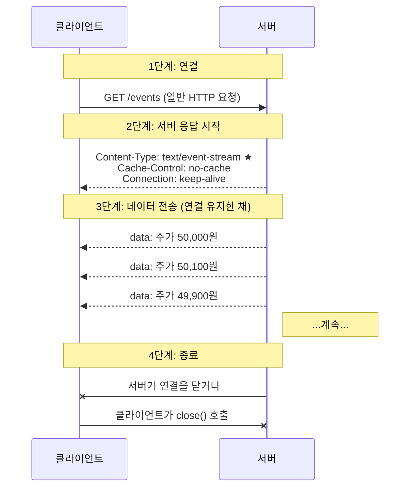
```mermaid
sequenceDiagram
    participant C as 클라이언트
    participant S as 서버

    Note over C,S: 1단계: 연결
    C->>S: GET /events (일반 HTTP 요청)

    Note over C,S: 2단계: 서버 응답 시작
    S-->>C: Content-Type: text/event-stream ★<br/>Cache-Control: no-cache<br/>Connection: keep-alive

    Note over C,S: 3단계: 데이터 전송 (연결 유지한 채)
    S-->>C: data: 주가 50,000원
    S-->>C: data: 주가 50,100원
    S-->>C: data: 주가 49,900원
    Note right of S: ...계속...

    Note over C,S: 4단계: 종료
    S-xC: 서버가 연결을 닫거나
    C-xS: 클라이언트가 close() 호출
```

## 데이터 형식

SSE는 **텍스트 기반의 정해진 형식**이 있다:

```
event: price-update        ← 이벤트 이름 (선택)
id: 42                     ← 이벤트 ID (선택, 재연결 시 사용)
retry: 3000                ← 재연결 대기시간 ms (선택)
data: {"stock": "삼성", "price": 50000}   ← 실제 데이터 (필수)
                           ← 빈 줄로 하나의 메시지 끝을 표시
```

## 클라이언트 코드

브라우저가 `EventSource`라는 API를 기본 제공한다.

```javascript
const eventSource = new EventSource('/api/stock-prices');

eventSource.onmessage = (e) => console.log(e.data);       // 메시지 수신
eventSource.addEventListener('price-update', (e) => {});   // 특정 이벤트 수신
eventSource.onerror = () => {};  // 끊기면 브라우저가 자동 재연결
eventSource.close();             // 종료
```

## SSE의 핵심 특징

| 특징 | 설명 |
|------|------|
| **단방향** | 서버 → 클라이언트만 가능. 클라이언트가 보내려면 별도 HTTP 요청 필요 |
| **자동 재연결** | 연결 끊기면 브라우저가 알아서 다시 연결 시도 |
| **이벤트 ID** | 재연결 시 `Last-Event-ID` 헤더로 "여기까지 받았어" 전달 |
| **텍스트만** | 바이너리 데이터 전송 불가 (JSON 문자열은 OK) |
| **HTTP/1.1 기반** | 브라우저당 도메인별 최대 6개 연결 제한 |

---

# 2. HTTP Streaming

## 한 줄 요약

> 일반 HTTP 응답을 끊지 않고 **데이터를 조금씩 흘려보내는 방식**. 별도 표준이 아니라 HTTP의 동작 방식을 활용하는 기법.

## 연결부터 종료까지 전체 흐름

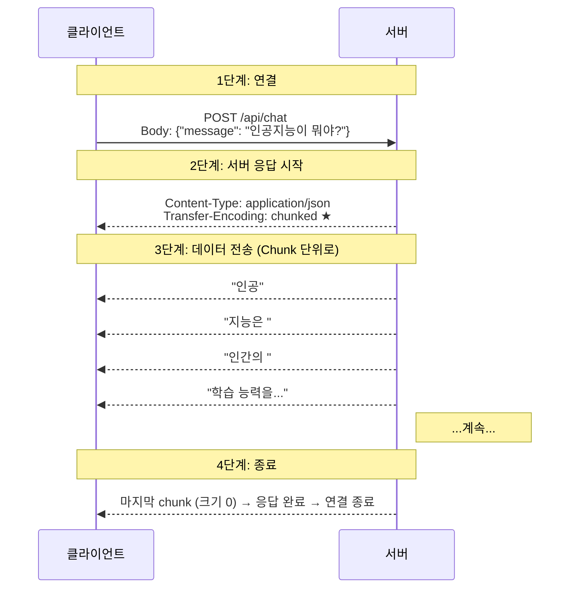
```mermaid
sequenceDiagram
    participant C as 클라이언트
    participant S as 서버

    Note over C,S: 1단계: 연결
    C->>S: POST /api/chat<br/>Body: {"message": "인공지능이 뭐야?"}

    Note over C,S: 2단계: 서버 응답 시작
    S-->>C: Content-Type: application/json<br/>Transfer-Encoding: chunked ★

    Note over C,S: 3단계: 데이터 전송 (Chunk 단위로)
    S-->>C: "인공"
    S-->>C: "지능은 "
    S-->>C: "인간의 "
    S-->>C: "학습 능력을..."
    Note right of S: ...계속...

    Note over C,S: 4단계: 종료
    S-->>C: 마지막 chunk (크기 0) → 응답 완료 → 연결 종료
```

## 핵심 메커니즘: Chunked Transfer Encoding

일반 HTTP는 응답의 전체 크기를 미리 알려준다:
```
Content-Length: 1024    ← "1024바이트짜리 응답이야"
```

HTTP Streaming은 **전체 크기를 모른다**:
```
Transfer-Encoding: chunked    ← "크기 모르겠고, 조각조각 보낼게"
```

## 클라이언트 코드

`EventSource`와 달리 `fetch` API로 직접 스트림을 읽어야 한다.

```javascript
const response = await fetch('/api/chat', {
  method: 'POST',
  body: JSON.stringify({ message: '인공지능이 뭐야?' }),
});
const reader = response.body.getReader();
const decoder = new TextDecoder();

while (true) {
  const { done, value } = await reader.read();
  if (done) break;
  console.log(decoder.decode(value));  // 받은 조각 출력
}
```

## HTTP Streaming의 핵심 특징

| 특징 | 설명 |
|------|------|
| **유연함** | GET, POST 등 아무 메서드 사용 가능. 요청 Body도 보낼 수 있음 |
| **자동 재연결 없음** | 끊기면 직접 재연결 로직 구현 필요 |
| **형식 자유** | 데이터 형식을 마음대로 정할 수 있음 (JSON, 텍스트, 바이너리 등) |
| **1회성 응답** | 하나의 요청에 대한 하나의 (긴) 응답. 응답 끝나면 연결 종료 |
| **바이너리 가능** | 이미지, 파일 등 바이너리 데이터도 스트리밍 가능 |

## 잠깐, SSE랑 HTTP Streaming이 뭐가 다른 건데?

둘 다 "서버가 데이터를 조금씩 보내는 것"이라 헷갈릴 수밖에 없다. 가장 큰 차이는 **연결의 수명**이다.

- **HTTP Streaming** = 서버가 할 말을 다 하면 `res.end()` 호출 → 응답 끝 → 연결 종료. **1회성.**
- **SSE** = 서버가 **의도적으로 `res.end()`를 호출하지 않는다**. 연결을 계속 열어둔 채, 새 이벤트가 생길 때마다 데이터를 push. **지속적.**

비유하면 이렇다:

- **HTTP Streaming** = 질문하면 답변을 천천히 해주고, **다 말하면 전화 끊음**
- **SSE** = **라디오 주파수**를 켜두면 DJ가 계속 방송해줌. 끊기면 자동으로 다시 주파수 잡음


```mermaid
flowchart TB
    subgraph SSE_box["SSE (표준 규격)"]
        direction TB
        SSE1["Content-Type: text/event-stream"]
        SSE2["정해진 형식: data: / event: / id:"]
        SSE3["브라우저 API: EventSource"]
        SSE4["자동 재연결 + 이벤트 ID 복구"]
        SSE5["연결이 계속 열려 있음 (지속적)"]
    end

    subgraph HTTP_box["HTTP Streaming (기법)"]
        direction TB
        HTTP1["Content-Type: 자유 (application/json 등)"]
        HTTP2["형식 자유: 원하는 대로"]
        HTTP3["fetch + ReadableStream 직접 구현"]
        HTTP4["재연결? 직접 만들어야 함"]
        HTTP5["응답 끝나면 연결 종료 (1회성)"]
    end

    style SSE_box fill:#e3f2fd,stroke:#1565c0,stroke-width:2px
    style HTTP_box fill:#fff3e0,stroke:#e65100,stroke-width:2px
```

| 구분 | SSE | HTTP Streaming |
|------|-----|----------------|
| **정체** | W3C 표준 규격 | HTTP의 chunked 응답을 활용하는 기법 |
| **연결 수명** | 계속 열려 있음 (서버가 원할 때 데이터 push) | 1회성 응답이 끝나면 연결 종료 |
| **비유** | 라디오 주파수를 켜두면 계속 들림 | 수도꼭지를 틀면 물이 나오고, 다 나오면 끝 |
| **재연결** | 브라우저가 자동으로 | 직접 구현 |
| **데이터 형식** | `data:`, `event:`, `id:` 고정 | 자유 |
| **HTTP 메서드** | GET만 | POST 등 모두 가능 |

> **그래서 ChatGPT는?** POST로 요청 Body를 보내야 하고, 응답이 끝나면 연결이 끊어지는 1회성이니까 HTTP Streaming이다. 다만 데이터 형식만 SSE의 `text/event-stream`을 빌려 쓴다.

---

# 3. WebSocket

## 한 줄 요약

> HTTP로 악수한 다음, **완전히 다른 프로토콜로 전환**해서 양방향 자유 통신하는 기술.

## 연결부터 종료까지 전체 흐름

### 1단계: 핸드셰이크 (HTTP → WebSocket 업그레이드)

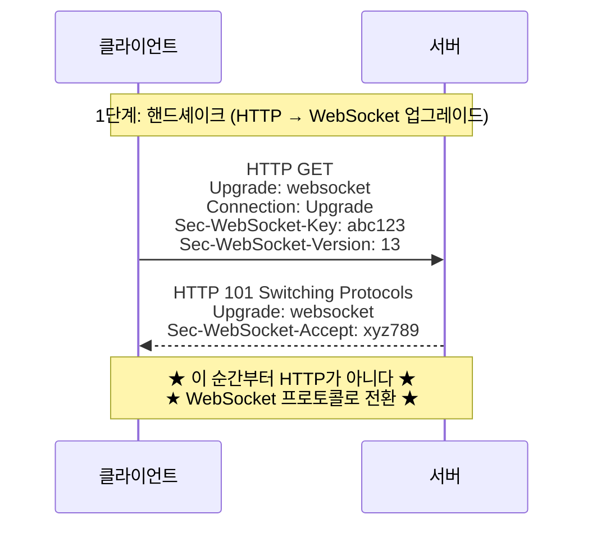
```mermaid
sequenceDiagram
    participant C as 클라이언트
    participant S as 서버

    Note over C,S: 1단계: 핸드셰이크 (HTTP → WebSocket 업그레이드)
    C->>S: HTTP GET<br/>Upgrade: websocket<br/>Connection: Upgrade<br/>Sec-WebSocket-Key: abc123<br/>Sec-WebSocket-Version: 13
    S-->>C: HTTP 101 Switching Protocols<br/>Upgrade: websocket<br/>Sec-WebSocket-Accept: xyz789

    Note over C,S: ★ 이 순간부터 HTTP가 아니다 ★<br/>★ WebSocket 프로토콜로 전환 ★
```

HTTP는 **딱 한 번**, 악수(핸드셰이크)할 때만 사용된다. 그 이후로는 완전히 다른 프로토콜이다.

### 2단계: 양방향 통신 (Full-Duplex)

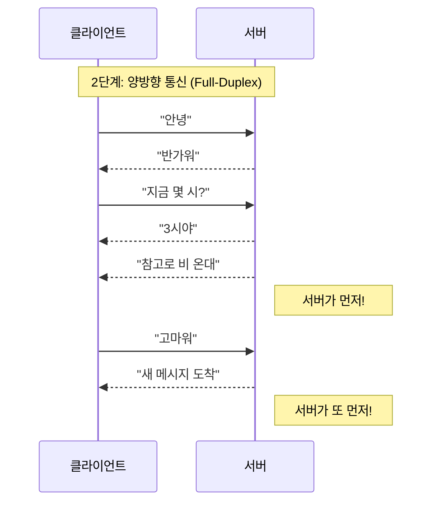
```mermaid
sequenceDiagram
    participant C as 클라이언트
    participant S as 서버

    Note over C,S: 2단계: 양방향 통신 (Full-Duplex)
    C->>S: "안녕"
    S-->>C: "반가워"
    C->>S: "지금 몇 시?"
    S-->>C: "3시야"
    S-->>C: "참고로 비 온대"
    Note right of S: 서버가 먼저!
    C->>S: "고마워"
    S-->>C: "새 메시지 도착"
    Note right of S: 서버가 또 먼저!
```

**Full-Duplex**란 전화 통화처럼 **동시에 말하고 들을 수 있다**는 뜻이다. HTTP는 워키토키(한쪽이 말하면 다른 쪽은 기다려야 함)에 가깝다.

### 3단계: 데이터 전송 (Frame 단위)

WebSocket은 **Frame(프레임)**이라는 단위로 데이터를 보낸다:

```
┌─────────────────────────────────────┐
│            WebSocket Frame          │
├──────┬──────┬────────┬──────────────┤
│ FIN  │ 종류 │ 길이   │   데이터     │
│ 1bit │ 4bit │ 7bit+  │   N bytes    │
├──────┼──────┼────────┼──────────────┤
│  1   │ 0x1  │  5     │  "안녕"      │  ← 텍스트 메시지
│  1   │ 0x2  │  1024  │  [바이너리]  │  ← 바이너리 (이미지 등)
│  1   │ 0x9  │  0     │              │  ← Ping (살아있니?)
│  1   │ 0xA  │  0     │              │  ← Pong (살아있어!)
│  1   │ 0x8  │  2     │  [코드]      │  ← 종료 요청
└──────┴──────┴────────┴──────────────┘
```

HTTP처럼 헤더가 매번 붙지 않는다. **프레임 헤더가 2~14바이트**밖에 안 되어서 오버헤드가 매우 적다.

### 4단계: 연결 유지 (Ping/Pong)

```
서버: "살아있니?" (Ping) ──→ 클라이언트
클라이언트: "살아있어!" (Pong) ──→ 서버

30초마다 반복... 응답 없으면 연결 끊긴 걸로 판단
```

### 5단계: 종료 (Close Handshake)

```
종료하고 싶은 쪽 ── Close Frame (코드: 1000, 이유: "정상 종료") ──→ 상대방
상대방           ── Close Frame (코드: 1000) ──→ 종료 요청한 쪽
```

양쪽 모두 Close Frame을 교환해야 깔끔한 종료다.

주요 종료 코드:

| 코드 | 의미 |
|------|------|
| 1000 | 정상 종료 |
| 1001 | 떠남 (페이지 이동 등) |
| 1006 | 비정상 종료 (연결 끊김) |
| 1011 | 서버 에러 |

## 클라이언트 코드

```javascript
const ws = new WebSocket('wss://example.com/chat');

ws.onopen = () => ws.send('안녕하세요');           // 연결 성공
ws.onmessage = (e) => console.log(e.data);         // 메시지 수신
ws.onclose = (e) => console.log(e.code, e.reason);  // 연결 종료 (자동 재연결 없음!)
ws.close(1000, '사용자가 나감');                     // 수동 종료
```

## WebSocket의 핵심 특징

| 특징 | 설명 |
|------|------|
| **양방향** | 클라이언트 ↔ 서버 자유롭게 통신 (Full-Duplex) |
| **별도 프로토콜** | HTTP로 핸드셰이크 후 WS 프로토콜로 전환 |
| **낮은 오버헤드** | 프레임 헤더 2~14바이트 (HTTP 헤더보다 훨씬 작음) |
| **자동 재연결 없음** | 직접 구현 필요 |
| **텍스트 + 바이너리** | 모든 형식의 데이터 전송 가능 |
| **방화벽 주의** | 일부 기업 방화벽/프록시에서 차단될 수 있음 |

---

# 4. 세 가지 한눈에 비교

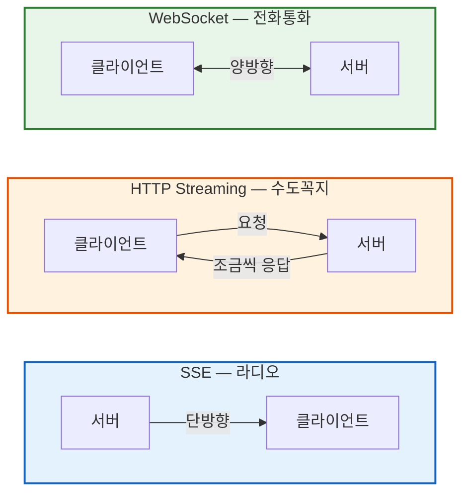
```mermaid
flowchart LR
    subgraph SSE["SSE — 라디오"]
        direction LR
        SSE_S["서버"] -->|단방향| SSE_C["클라이언트"]
    end

    subgraph HTTP["HTTP Streaming — 수도꼭지"]
        direction LR
        HTTP_C["클라이언트"] -->|요청| HTTP_S["서버"]
        HTTP_S -->|조금씩 응답| HTTP_C
    end

    subgraph WS["WebSocket — 전화통화"]
        direction LR
        WS_C["클라이언트"] <-->|양방향| WS_S["서버"]
    end

    style SSE fill:#e3f2fd,stroke:#1565c0,stroke-width:2px
    style HTTP fill:#fff3e0,stroke:#e65100,stroke-width:2px
    style WS fill:#e8f5e9,stroke:#2e7d32,stroke-width:2px
```

## 종합 비교표

| 구분 | SSE | HTTP Streaming | WebSocket |
|------|-----|----------------|-----------|
| **프로토콜** | HTTP | HTTP | WS (별도 프로토콜) |
| **방향** | 서버→클라 단방향 | 응답만 스트리밍 | 양방향 (Full-Duplex) |
| **연결** | 계속 열림 | 응답 끝나면 닫힘 | 계속 열림 |
| **재연결** | 자동 | 직접 구현 | 직접 구현 |
| **데이터 형식** | 텍스트만 | 자유 | 텍스트 + 바이너리 |
| **오버헤드** | HTTP 헤더 (큼) | HTTP 헤더 (큼) | 프레임 헤더 2~14바이트 (작음) |
| **HTTP 메서드** | GET만 | 모두 가능 | 해당 없음 (별도 프로토콜) |
| **방화벽/프록시** | 잘 통과 | 잘 통과 | 가끔 차단됨 |
| **브라우저 API** | `EventSource` | `fetch + ReadableStream` | `WebSocket` |
| **서버 부담** | 낮음 | 낮음 | 높음 (연결 유지 비용) |

---

# 5. 언제 뭘 써야 할까?

| 상황 | 추천 기술 | 이유 |
|------|----------|------|
| 실시간 알림, 뉴스피드 | **SSE** | 서버→클라 단방향이면 충분, 자동 재연결 |
| ChatGPT 스트리밍 응답 | **HTTP Streaming** (SSE 형식) | 요청에 Body 필요, 1회성 응답 |
| 채팅 앱 | **WebSocket** | 양방향 실시간 필수 |
| 온라인 게임 | **WebSocket** | 초저지연 양방향 필수 |
| 주식 시세 | **SSE** 또는 **WebSocket** | 단순 시세면 SSE, 주문까지 하면 WebSocket |
| 파일 업로드 진행률 | **HTTP Streaming** | 1회성, 진행 상황만 보여주면 됨 |
| 실시간 협업 편집 (Google Docs) | **WebSocket** | 양방향 + 저지연 + 빈번한 데이터 교환 |

---

# 6. 실전: ChatGPT는 뭘 쓸까?

ChatGPT는 **SSE 형식을 사용하는 HTTP Streaming**이다.

```
POST /v1/chat/completions
Body: { "stream": true, "messages": [...] }

응답:
data: {"choices":[{"delta":{"content":"인"}}]}
data: {"choices":[{"delta":{"content":"공"}}]}
data: {"choices":[{"delta":{"content":"지능"}}]}
data: [DONE]
```

"POST인데 SSE?" → OpenAI는 SSE의 **데이터 형식**(`text/event-stream`)을 빌려 쓰되, `EventSource` 대신 `fetch`로 구현한다. 엄밀히는 **SSE 형식을 사용하는 HTTP Streaming**이라고 볼 수 있다.

---

# 7. 관련 기술과의 관계

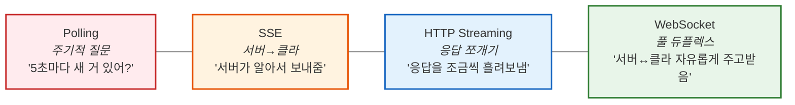
```mermaid
flowchart LR
    P["Polling<br/><i>주기적 질문</i><br/>'5초마다 새 거 있어?'"]
    S["SSE<br/><i>서버→클라</i><br/>'서버가 알아서 보내줌'"]
    H["HTTP Streaming<br/><i>응답 쪼개기</i><br/>'응답을 조금씩 흘려보냄'"]
    W["WebSocket<br/><i>풀 듀플렉스</i><br/>'서버↔클라 자유롭게 주고받음'"]

    P --- S --- H --- W

    style P fill:#ffebee,stroke:#c62828,stroke-width:2px
    style S fill:#fff3e0,stroke:#e65100,stroke-width:2px
    style H fill:#e3f2fd,stroke:#1565c0,stroke-width:2px
    style W fill:#e8f5e9,stroke:#2e7d32,stroke-width:2px
```

---

# 8. Deep Dive: HTTP/1.1 vs HTTP/2에서의 SSE

SSE는 HTTP 위에서 동작하기 때문에, HTTP 버전에 따라 동작 방식이 크게 달라진다.

## HTTP/1.1에서의 SSE

### 핵심 한계: 도메인당 연결 수 제한

HTTP/1.1은 **하나의 TCP 연결 = 하나의 요청/응답**이다. SSE는 연결을 계속 열어두니까, **TCP 연결 하나를 점유**하게 된다.

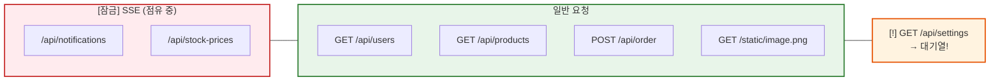
```mermaid
flowchart LR
    subgraph SSE["[잠금] SSE (점유 중)"]
        C1["/api/notifications"]
        C2["/api/stock-prices"]
    end

    subgraph Normal["일반 요청"]
        C3["GET /api/users"]
        C4["GET /api/products"]
        C5["POST /api/order"]
        C6["GET /static/image.png"]
    end

    C7["[!] GET /api/settings<br/>→ 대기열!"]

    SSE --- Normal --- C7

    style SSE fill:#ffebee,stroke:#c62828,stroke-width:2px
    style Normal fill:#e8f5e9,stroke:#2e7d32,stroke-width:2px
    style C7 fill:#fff3e0,stroke:#e65100,stroke-width:2px
```

더 심각한 문제는 **탭 간 연결 공유**다.

"도메인당 6개"는 **탭 하나가 아니라 브라우저 전체** 기준이다. 같은 도메인(`example.com`)에 대한 TCP 연결을 브라우저의 모든 탭이 나눠 쓴다. 즉 탭을 아무리 많이 열어도 총 6개를 넘길 수 없다.

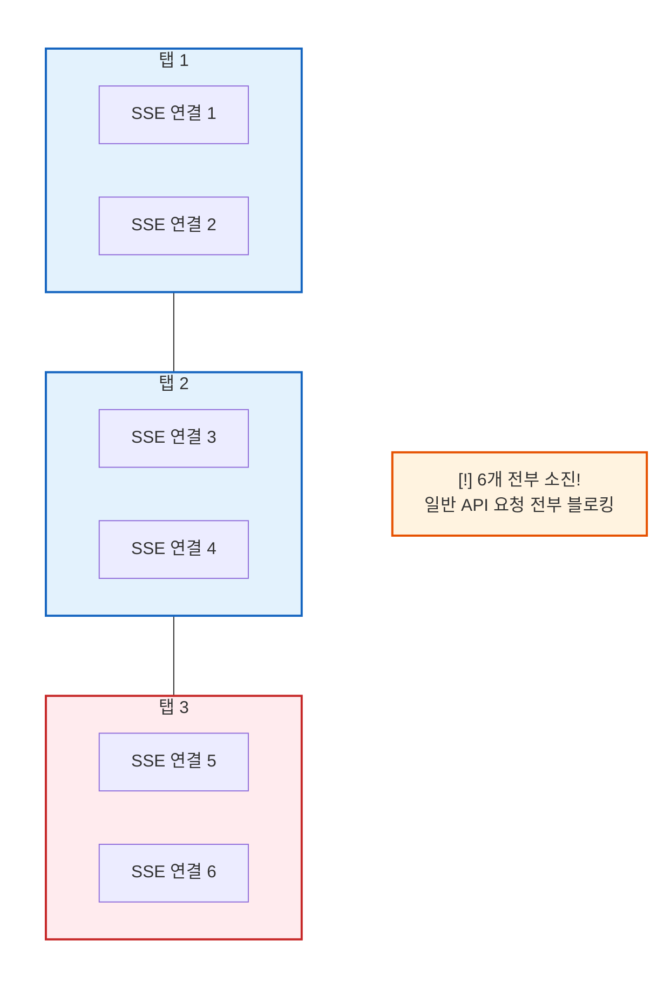
```mermaid
flowchart LR
    subgraph Tabs[" "]
        direction TB
        subgraph T1["탭 1"]
            direction LR
            T1C1["SSE 연결 1"]
            T1C2["SSE 연결 2"]
        end
        subgraph T2["탭 2"]
            direction LR
            T2C1["SSE 연결 3"]
            T2C2["SSE 연결 4"]
        end
        subgraph T3["탭 3"]
            direction LR
            T3C1["SSE 연결 5"]
            T3C2["SSE 연결 6"]
        end
        T1 --- T2 --- T3
    end

    Warning["[!] 6개 전부 소진!<br/>일반 API 요청 전부 블로킹"]

    Tabs ~~~ Warning

    style Tabs fill:none,stroke:none
    style T1 fill:#e3f2fd,stroke:#1565c0,stroke-width:2px
    style T2 fill:#e3f2fd,stroke:#1565c0,stroke-width:2px
    style T3 fill:#ffebee,stroke:#c62828,stroke-width:2px
    style Warning fill:#fff3e0,stroke:#e65100,stroke-width:2px
```

탭 3개에서 각각 SSE 2개씩 열면 6개가 전부 SSE에 점유된다. 이 상태에서 어떤 탭이든 일반 API 요청(`GET /api/settings` 등)을 보내면 빈 연결이 없어서 **앞선 연결이 끝날 때까지 대기**해야 한다. SSE는 연결을 끝내지 않으니, 사실상 무한 대기다.

### 헷갈리기 쉬운 포인트: HTTP 응답 종료 ≠ TCP 연결 종료

SSE 응답이 끝나면 "연결이 끊긴다"고 생각하기 쉽지만, 실제로는 **HTTP 응답**과 **TCP 연결**은 별개다.

서버가 `res.end()`를 호출하면 HTTP 응답은 닫히지만, TCP 연결은 Keep-Alive 기본값에 의해 살아있다. 이 TCP 연결은 유휴(idle) 상태로 대기하다가, 클라이언트가 다시 요청하면 같은 TCP 연결을 재사용한다 (3-way 핸드셰이크 생략).

| 상황 | HTTP 응답 | TCP 연결 |
|------|----------|----------|
| `res.end()` 호출 시 | 닫힘 | 유지 (Keep-Alive) |
| Keep-Alive 타임아웃 만료 시 | 이미 없음 | 닫힘 |
| `Connection: close` 헤더 시 | 닫힘 | 같이 닫힘 |

HTTP/1.1에서 `Connection: keep-alive`가 기본값이기 때문에, 명시적으로 `Connection: close`를 보내지 않는 한 TCP 연결은 응답 후에도 살아있다. 즉 SSE 스트림이 끝나고 클라이언트가 바로 재연결하면, **새 TCP 핸드셰이크 없이** 기존 연결을 재사용할 수 있다.

## HTTP/2에서의 SSE

### 핵심 개선: 멀티플렉싱 (Multiplexing)

HTTP/2는 **하나의 TCP 연결 안에서 여러 스트림을 동시에** 처리할 수 있다.

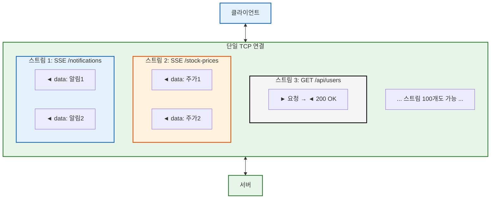
```mermaid
flowchart TB
    subgraph TCP["단일 TCP 연결"]
        direction TB
        subgraph S3["스트림 3: GET /api/users"]
            S3D1["► 요청 → ◄ 200 OK"]
        end
        subgraph S2["스트림 2: SSE /stock-prices"]
            S2D1["◄ data: 주가1"]
            S2D2["◄ data: 주가2"]
        end
        subgraph S1["스트림 1: SSE /notifications"]
            S1D1["◄ data: 알림1"]
            S1D2["◄ data: 알림2"]
        end
        S4["... 스트림 100개도 가능 ..."]
    end

    C["클라이언트"] <--> TCP
    TCP <--> S["서버"]

    style TCP fill:#e8f5e9,stroke:#2e7d32,stroke-width:2px
    style S1 fill:#e3f2fd,stroke:#1565c0,stroke-width:2px
    style S2 fill:#fff3e0,stroke:#e65100,stroke-width:2px
    style S3 fill:#f5f5f5,stroke:#000,stroke-width:2px
    style C fill:#e3f2fd,stroke:#1565c0,stroke-width:2px
    style S fill:#e8f5e9,stroke:#2e7d32,stroke-width:2px
```

SSE가 몇 개든 일반 API 요청을 블로킹하지 않는다.

## 비교표

| 구분 | HTTP/1.1 | HTTP/2 |
|------|----------|--------|
| **연결 구조** | 요청당 TCP 연결 1개 | 1개 TCP 연결에 다수 스트림 |
| **SSE 연결 제한** | 도메인당 최대 6개 (브라우저 제한) | 사실상 무제한 (스트림 단위) |
| **탭 간 영향** | 같은 도메인이면 6개 공유 → 서로 블로킹 | 영향 없음 |
| **일반 요청 블로킹** | SSE가 연결 점유 → 일반 요청 대기 | SSE와 일반 요청 공존 |
| **헤더 오버헤드** | 매 메시지마다 전체 HTTP 헤더 | HPACK 압축으로 헤더 최소화 |

## 데이터 전송 방식의 차이

### 전송 방식 비교

| 구분 | HTTP/1.1 | HTTP/2 |
|------|----------|--------|
| **전송 형식** | 평문 텍스트 | 바이너리 프레임 |
| **헤더** | 매번 전체 HTTP 헤더 전송 | HPACK 압축으로 최소화 |
| **SSE 메시지 형식** | `data:`, `event:`, `id:` 동일 | `data:`, `event:`, `id:` 동일 |
| **차이점** | 전송 계층만 다름 | 더 효율적인 바이너리 인코딩 |

SSE의 메시지 형식 자체는 동일하지만, HTTP/2에서는 **전송 계층**이 바이너리 프레임으로 바뀌어 더 효율적이다.

## HTTP/1.1 시절의 우회 방법들

연결 6개 제한 때문에 다양한 우회가 필요했다:

```
방법 1: 서브도메인 분리
  api.example.com     → 일반 API (6개)
  stream.example.com  → SSE 전용 (6개)
  → 총 12개 연결 확보

방법 2: SSE 연결 하나로 통합
  여러 이벤트 타입을 하나의 SSE 연결에 몰아넣기

  event: notification
  data: {"type": "message", "content": "안녕"}

  event: stock
  data: {"symbol": "삼성", "price": 50000}

방법 3: Long Polling으로 대체
  SSE 대신 주기적으로 HTTP 요청
```

HTTP/2에서는 이런 우회가 **전부 불필요**하다. 하나의 TCP 연결 안에서 SSE 스트림과 일반 API 요청이 자유롭게 공존할 수 있기 때문이다.

## 정리

```
HTTP/1.1 + SSE:
  "쓸 수는 있지만, 연결 제한 때문에 조심해야 한다"
  → 서브도메인 분리, 연결 통합 같은 우회 필요

HTTP/2 + SSE:
  "SSE의 약점이 거의 사라진다"
  → 멀티플렉싱 덕분에 연결 제한 문제 해결
  → 헤더 압축으로 오버헤드도 감소
  → 사실상 SSE의 최적 환경
```

현재 대부분의 프로덕션 환경은 HTTP/2를 사용하고 있어서, SSE의 연결 제한 문제는 실무에서 거의 문제가 되지 않는다.

---

# 9. Deep Dive: 스트리밍에서 데이터가 쌓이는 문제와 TCP 백프레셔

SSE든 HTTP Streaming이든, 서버가 데이터를 보내고 클라이언트가 소비하는 구조다. 그런데 **서버가 보내는 속도 > 클라이언트가 소비하는 속도**라면 어떻게 될까?

## 문제: 버퍼에 데이터가 쌓인다

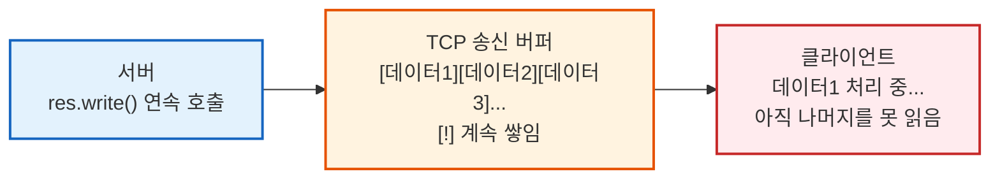
```mermaid
flowchart LR
    S["서버<br/>res.write() 연속 호출"] --> B["TCP 송신 버퍼<br/>[데이터1][데이터2][데이터3]...<br/>[!] 계속 쌓임"]
    B --> C["클라이언트<br/>데이터1 처리 중...<br/>아직 나머지를 못 읽음"]

    style S fill:#e3f2fd,stroke:#1565c0,stroke-width:2px
    style B fill:#fff3e0,stroke:#e65100,stroke-width:2px
    style C fill:#ffebee,stroke:#c62828,stroke-width:2px
```

서버가 데이터를 아무리 빨리 보내도, 클라이언트가 느리면 중간 버퍼에 데이터가 쌓이게 된다. 이게 무한히 쌓이면 메모리 문제가 발생할 수 있다.

## 해결: TCP 백프레셔 (Backpressure)

TCP 프로토콜 자체에 이 문제를 해결하는 메커니즘이 내장되어 있다.

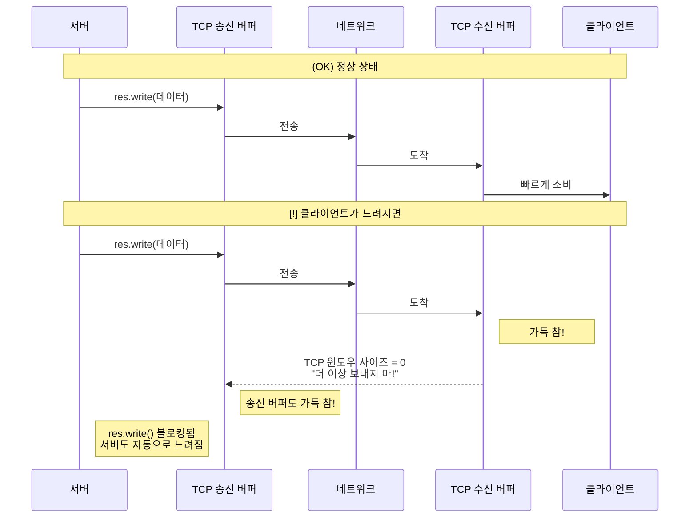
```mermaid
sequenceDiagram
    participant S as 서버
    participant SB as TCP 송신 버퍼
    participant NW as 네트워크
    participant RB as TCP 수신 버퍼
    participant C as 클라이언트

    Note over S,C: (OK) 정상 상태
    S->>SB: res.write(데이터)
    SB->>NW: 전송
    NW->>RB: 도착
    RB->>C: 빠르게 소비

    Note over S,C: [!] 클라이언트가 느려지면
    S->>SB: res.write(데이터)
    SB->>NW: 전송
    NW->>RB: 도착
    Note right of RB: 가득 참!
    RB-->>SB: TCP 윈도우 사이즈 = 0<br/>"더 이상 보내지 마!"
    Note right of SB: 송신 버퍼도 가득 참!
    Note right of S: res.write() 블로킹됨<br/>서버도 자동으로 느려짐
```

단계별로 보면:

1. 클라이언트의 소비가 느려짐
2. 클라이언트 측 TCP 수신 버퍼가 가득 참
3. 클라이언트가 서버에게 **TCP 윈도우 사이즈 = 0** 통보 ("더 보내지 마")
4. 서버 측 TCP 송신 버퍼도 가득 참
5. 서버의 `res.write()` 호출이 블로킹됨
6. 서버가 자연스럽게 속도를 줄임

**메모리가 무한히 쌓이지 않는다.** TCP가 알아서 흐름을 조절해준다.

## 그래도 문제가 될 수 있는 시나리오

TCP 백프레셔가 대부분의 경우를 해결해주지만, 다음 상황에서는 주의가 필요하다:

| 시나리오 | 어떤 일이 벌어지나 | 영향 |
|----------|-------------------|------|
| **클라이언트 네트워크가 극도로 느린 경우** (2G 등) | TCP 윈도우가 가득 차서 서버 write가 블로킹 | 서버 스레드/이벤트 루프 점유 시간 증가 |
| **모바일 앱이 백그라운드로 전환** | 수신 콜백이 멈추고, 내부 버퍼에 데이터 쌓임 | 포그라운드 복귀 시 밀린 데이터 한꺼번에 처리 |
| **서버 측 애플리케이션 버퍼** | TCP 버퍼와 별개로 애플리케이션 레벨 버퍼가 쌓일 수 있음 | 프레임워크에 따라 메모리 사용량 증가 |

## 실무에서는 대부분 괜찮은 이유

LLM 스트리밍 응답 같은 일반적인 케이스를 생각해보면:

| 구간 | 속도 | 쌓일 가능성 |
|------|------|------------|
| LLM → 서버 | 토큰 생성 속도 (느림) | 거의 없음 |
| 서버 → 클라이언트 | 네트워크 전송 (빠름) | 거의 없음 |
| 클라이언트 파싱 | JSON.parse (매우 빠름) | 거의 없음 |

**데이터를 생성하는 쪽(LLM)이 병목**이다. 토큰 생성 속도가 초당 수십~수백 개 수준이라, 네트워크나 클라이언트 파싱이 따라가지 못하는 상황은 현실적으로 거의 발생하지 않는다. 만약 클라이언트가 느려지더라도 TCP 백프레셔가 자동으로 속도를 조절해준다.

---

# 10. Deep Dive: 동시 연결 수가 너무 많아지는 문제

9장에서 다룬 건 **하나의 연결 안에서 데이터가 쌓이는** 문제였다. 이번에는 완전히 다른 문제다: **연결 자체의 수**가 너무 많아지는 경우.

```
9장 (데이터 쌓임):                    10장 (연결 쌓임):
┌─ 연결 1개 ─────────────────┐       ┌─ 연결 1: 유저A ─┐
│  [데이터1][데이터2][데이터3] │       ├─ 연결 2: 유저B ─┤
│  버퍼에 데이터가 쌓임       │       ├─ 연결 3: 유저C ─┤
└────────────────────────────┘       ├─ ...            ┤
                                     ├─ 연결 10000     ─┤
                                     └──────────────────┘
                                     연결 수 자체가 문제
```

## 왜 문제가 되는가?

SSE와 WebSocket은 **연결을 계속 유지**한다. 일반 HTTP 요청은 응답 후 바로 연결이 반환되지만, 스트리밍 연결은 클라이언트가 연결을 끊거나 서버가 명시적으로 종료할 때까지 살아있다.

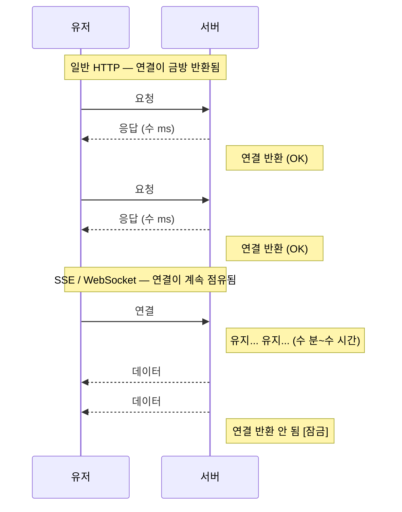
```mermaid
sequenceDiagram
    participant U as 유저
    participant S as 서버

    Note over U,S: 일반 HTTP — 연결이 금방 반환됨
    U->>S: 요청
    S-->>U: 응답 (수 ms)
    Note right of S: 연결 반환 (OK)

    U->>S: 요청
    S-->>U: 응답 (수 ms)
    Note right of S: 연결 반환 (OK)

    Note over U,S: SSE / WebSocket — 연결이 계속 점유됨
    U->>S: 연결
    Note right of S: 유지... 유지... (수 분~수 시간)
    S-->>U: 데이터
    S-->>U: 데이터
    Note right of S: 연결 반환 안 됨 [잠금]
```

## 연결이 쌓이면 서버에서 무슨 일이 벌어지나

### 서버가 연결 하나당 소비하는 리소스

| 리소스 | 연결당 비용 | 10,000 연결 시 |
|--------|-----------|---------------|
| **파일 디스크립터 (FD)** | 1개 | 10,000개 |
| **메모리 (TCP 버퍼)** | ~10-20KB | ~100-200MB |
| **메모리 (애플리케이션)** | 프레임워크에 따라 다름 | 수백 MB 이상 가능 |
| **CPU (이벤트 감시)** | 미미 | 누적되면 부담 |

### 단계별 증상

| 동시 연결 수 | 서버 상태 |
|-------------|----------|
| ~1,000개 | 대부분의 서버에서 문제 없음 |
| ~10,000개 | 파일 디스크립터 제한에 걸릴 수 있음 (OS 기본값: 1024) |
| ~50,000개 | 메모리 사용량 증가, GC 압박 |
| ~100,000개 | OS 레벨 튜닝 없이는 커널 리소스 부족 |

## 기술별 차이

| 기술 | 연결 쌓임 문제 | 이유 |
|------|--------------|------|
| **HTTP Streaming** | 상대적으로 적음 | 응답 끝나면 연결 종료. 1회성이라 오래 점유하지 않음 |
| **SSE** | 발생할 수 있음 | 연결을 계속 유지. 다만 단방향이라 서버 부담은 상대적으로 적음 |
| **WebSocket** | 가장 주의 필요 | 양방향 연결 유지 + 프레임 파싱 + 상태 관리까지 필요 |

### SSE가 WebSocket보다 서버 부담이 적은 이유

둘 다 연결을 계속 유지하는 건 같다. 하지만 서버가 **연결 하나당 해야 할 일**이 다르다.

**SSE (단방향)** — 서버는 `res.write()`로 데이터를 흘려보내기만 하면 된다. 클라이언트에서 이 연결로 데이터가 오지 않으므로, 서버는 읽기 감시를 할 필요가 없다. 프레임 파싱도 없고, 그냥 텍스트를 쓰면 끝이다.

**WebSocket (양방향)** — 서버는 보내는 것뿐 아니라 클라이언트가 보내는 데이터도 **동시에 읽어야** 한다. 게다가 WebSocket 프레임 스펙에 따라 opcode 확인, 마스킹 해제(unmask), payload 길이 계산 등 **프레임 파싱** 작업이 필요하다. 연결이 살아있는지 확인하는 Ping/Pong 처리, 종료 시 Close 핸드셰이크도 서버가 관리해야 한다. 채팅 같은 앱이라면 "이 유저가 어느 방에 있는지" 같은 **연결별 상태**까지 메모리에 들고 있어야 한다.

| 부담 요소 | SSE | WebSocket |
|----------|-----|-----------|
| 쓰기 | O | O |
| 읽기 감시 | X | O |
| 프레임 파싱 | X | O (마스킹 해제 포함) |
| Ping/Pong | X | O |
| Close 핸드셰이크 | X | O |
| 연결별 상태 관리 | 단순 | 복잡 (방, 구독 등) |
| 메모리 버퍼 | 쓰기 버퍼만 | 읽기 + 쓰기 버퍼 |

결국 같은 10,000개 연결이라도, SSE는 "보내기만 하는 파이프 10,000개"이고 WebSocket은 "양방향 전화 10,000통"이다. 연결 수 자체의 부담은 같지만, 연결당 CPU·메모리 비용이 WebSocket이 더 높다.

## 해결 방법

### 1. 연결 타임아웃 설정

일정 시간 동안 데이터가 없으면 서버에서 연결을 끊는다.

```
[연결 유지]
클라이언트 ◄── data: 메시지1 ── 서버
클라이언트 ◄── data: 메시지2 ── 서버
클라이언트    (30초간 데이터 없음...)
서버: "타임아웃! 연결 종료"
클라이언트: 자동 재연결 (SSE) 또는 직접 재연결 (WebSocket)
```

유휴 연결이 서버 리소스를 낭비하는 걸 방지한다.

### 2. Heartbeat (하트비트)

타임아웃과 함께 사용한다. 실제 데이터가 없어도 주기적으로 빈 메시지를 보내서 **진짜 살아있는 연결**과 **죽은 연결**을 구분한다.

```
서버 ──► ": heartbeat\n\n" (SSE 주석)     ← 15초마다
서버 ──► ": heartbeat\n\n"
클라이언트 응답 없음 → 죽은 연결로 판단 → 정리
```

### 3. 연결 수 제한 (Connection Limiting)

서버당, 유저당 최대 연결 수를 제한한다.

```
정책 예시:
  - 서버 인스턴스당 최대 동시 SSE 연결: 5,000개
  - 유저당 최대 SSE 연결: 3개 (탭 3개까지)
  - 초과 시: 가장 오래된 연결 끊기 또는 429 Too Many Requests 반환
```

### 4. 수평 확장 (Horizontal Scaling)

서버 한 대로 감당이 안 되면 서버를 늘린다.

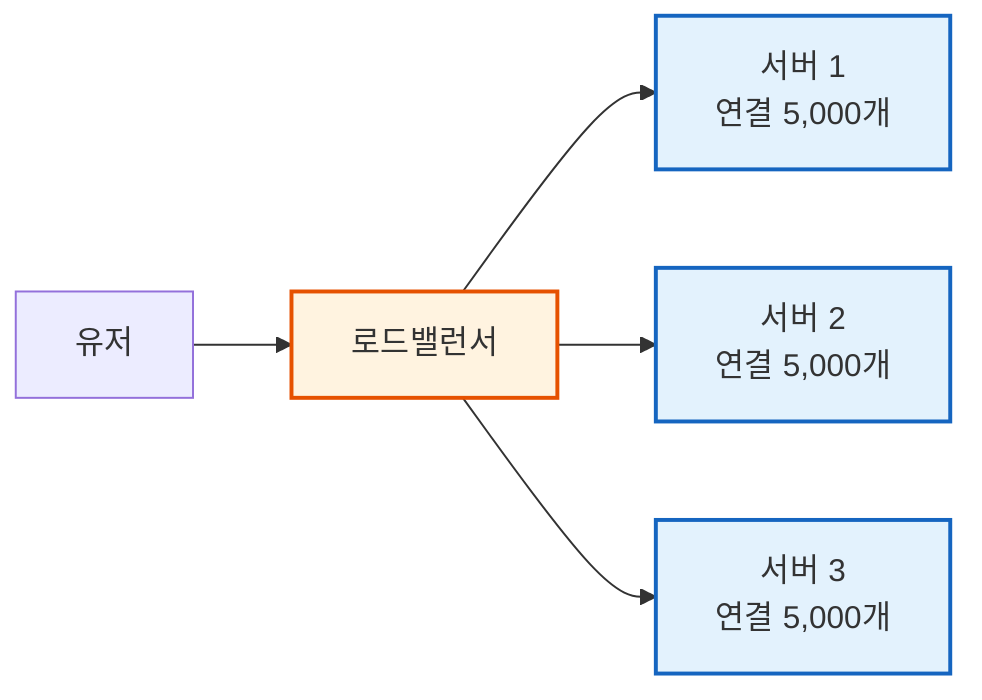
```mermaid
flowchart LR
    U["유저"] --> LB["로드밸런서"]
    LB --> S1["서버 1<br/>연결 5,000개"]
    LB --> S2["서버 2<br/>연결 5,000개"]
    LB --> S3["서버 3<br/>연결 5,000개"]

    style LB fill:#fff3e0,stroke:#e65100,stroke-width:2px
    style S1 fill:#e3f2fd,stroke:#1565c0,stroke-width:2px
    style S2 fill:#e3f2fd,stroke:#1565c0,stroke-width:2px
    style S3 fill:#e3f2fd,stroke:#1565c0,stroke-width:2px
```

단, SSE/WebSocket은 **Sticky Session**(같은 유저를 같은 서버로 라우팅)이 필요할 수 있다. 연결이 유지되는 동안 서버가 바뀌면 안 되기 때문이다. Sticky Session의 한계와 대안(Redis Pub/Sub)은 [12장](#12-deep-dive-다중-인스턴스에서-실시간-세션-관리---redis-pubsub-적용)에서 자세히 다룬다.

### 5. OS 레벨 튜닝

대규모 동시 연결을 처리하려면 OS 설정도 조정해야 한다.

```bash
# 파일 디스크립터 제한 늘리기 (기본값 1024 → 65535)
ulimit -n 65535

# 리눅스 커널 파라미터 조정
sysctl -w net.core.somaxconn=65535        # 최대 대기 연결 수
sysctl -w net.ipv4.tcp_max_syn_backlog=65535
```

### 6. 연결 풀링 / 팬아웃 아키텍처

4번(수평 확장)에서 로드밸런서로 서버를 늘려 연결을 분산했다. 하지만 **서버를 늘리는 것만으로는 해결 안 되는 문제**가 있다.

예를 들어 주식 시세 서비스에서 삼성 주가가 바뀌면, SSE로 연결된 **모든 유저에게** 이 변경을 보내야 한다. 서버가 3대인데 유저가 각 서버에 흩어져 있다면, 주가 변경 데이터를 **3대 모두에게 전달**해야 한다. 이때 중간에 **메시지 브로커**를 두면 이 문제가 깔끔하게 풀린다.

**서버 1대 (팬아웃 없이)** — 서버 한 대가 10,000개 연결을 다 들고 있다. 주가가 바뀔 때마다 10,000번 `res.write()`를 호출해야 한다. 유저가 더 늘면 서버 한 대로는 감당이 안 된다.

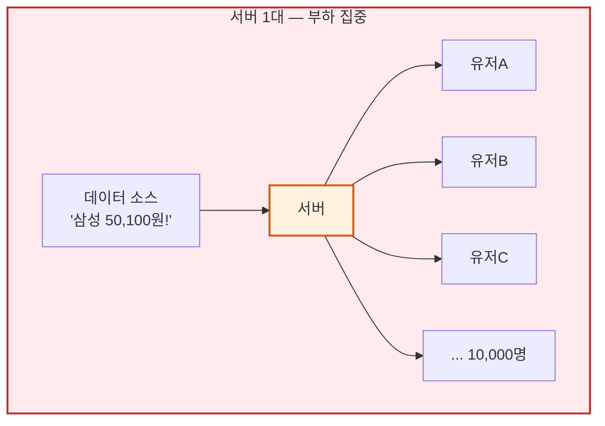
```mermaid
flowchart LR
    subgraph before["서버 1대 — 부하 집중"]
        direction LR
        D1["데이터 소스<br/>'삼성 50,100원!'"] --> SV1["서버"]
        SV1 --> UA["유저A"]
        SV1 --> UB["유저B"]
        SV1 --> UC["유저C"]
        SV1 --> UD["... 10,000명"]
    end

    style before fill:#ffebee,stroke:#c62828,stroke-width:2px
    style SV1 fill:#fff3e0,stroke:#e65100,stroke-width:2px
```

**메시지 브로커 사용 (팬아웃)** — 데이터 소스가 Redis에 **한 번만 publish**하면, 서버 3대가 각각 subscribe해서 자기 유저에게 전달한다. 서버를 더 늘리면 더 많은 유저를 처리할 수 있다.

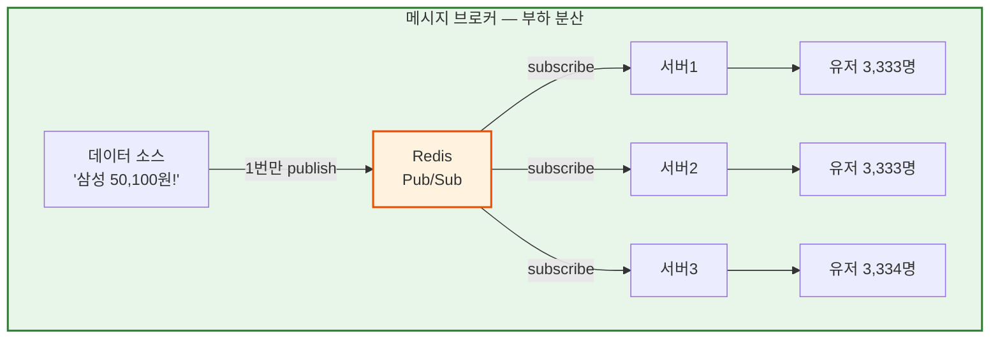
```mermaid
flowchart LR
    subgraph after["메시지 브로커 — 부하 분산"]
        direction LR
        D2["데이터 소스<br/>'삼성 50,100원!'"] -->|1번만 publish| R["Redis<br/>Pub/Sub"]
        R -->|subscribe| S1["서버1"] --> G1["유저 3,333명"]
        R -->|subscribe| S2["서버2"] --> G2["유저 3,333명"]
        R -->|subscribe| S3["서버3"] --> G3["유저 3,334명"]
    end

    style after fill:#e8f5e9,stroke:#2e7d32,stroke-width:2px
    style R fill:#fff3e0,stroke:#e65100,stroke-width:2px
```

정리하면:

- **수평 확장 (4번)**: 서버를 늘려서 연결을 분산 → "연결 부하" 해결
- **팬아웃 아키텍처 (6번)**: 거기에 Redis Pub/Sub을 추가 → "서버 간 데이터 동기화"까지 해결

Redis Pub/Sub, Kafka 같은 메시지 브로커를 사용하면 서버를 쉽게 수평 확장하면서도 모든 유저에게 동일한 데이터를 전달할 수 있다.

## 정리

| 방법 | 효과 | 적용 난이도 |
|------|------|------------|
| 연결 타임아웃 | 유휴 연결 정리 | 쉬움 |
| Heartbeat | 죽은 연결 탐지 | 쉬움 |
| 연결 수 제한 | 리소스 보호 | 보통 |
| 수평 확장 | 처리 용량 증가 | 보통~어려움 |
| OS 튜닝 | 단일 서버 한계 확장 | 보통 |
| 메시지 브로커 | 대규모 팬아웃 | 어려움 |

데이터가 쌓이는 문제(9장)는 TCP 백프레셔가 자동으로 해결해주지만, 연결이 쌓이는 문제는 **직접 설계하고 관리**해야 한다. 서비스 규모에 맞는 전략을 선택하는 것이 중요하다.

---

# 11. Deep Dive: Cloud Run에서 스트리밍 운영 시 주의할 점

10장까지는 일반적인 서버 환경을 기준으로 설명했다. 하지만 Cloud Run 같은 **서버리스 컨테이너** 환경에서는 전통 서버와 다른 특성 때문에 추가적인 문제가 발생한다.

## Cloud Run의 특성부터 이해하자

| 구분 | 전통 서버 (EC2, VM) | Cloud Run |
|------|-------------------|-----------|
| **인스턴스** | 항상 떠 있음 → 연결 유지 자유로움 | 요청 없으면 0개로 축소 (Scale to Zero) |
| **확장** | 직접 관리 | 자동 스케일링 (Auto Scaling) |
| **과금** | 고정 비용 → 놀고 있어도 돈 나감 | 요청 처리 시간 기준 |
| **타임아웃** | 제한 없음 (직접 설정) | 최대 60분 |
| **상태** | 서버 간 공유 가능 | 인스턴스 간 상태 공유 불가 (Stateless) |
| **배포** | 직접 관리 | Rolling Update (기존 인스턴스 교체) |

이 특성이 스트리밍 기술과 만나면 여러 문제가 생긴다.

## 이슈 1: 요청 타임아웃 (최대 60분)

Cloud Run은 하나의 요청에 대해 **최대 60분**의 타임아웃이 있다.

| 기술 | 60분 타임아웃 영향 |
|------|------------------|
| **HTTP Streaming** | 보통 수초~수분이라 문제 없음 ✅ |
| **SSE** | 장시간 연결이 목적인데 60분 제한 ⚠️ |
| **WebSocket** | 채팅 같은 장시간 연결에 치명적 ⚠️ |

**대응 방법:**
- SSE: `EventSource`의 자동 재연결 덕분에 60분마다 끊겨도 클라이언트가 알아서 복구
- WebSocket: 클라이언트에 재연결 로직 필수 구현. 60분 되기 전에 서버에서 먼저 끊고 재연결 유도
- HTTP Streaming: LLM 응답 같은 1회성은 보통 수 분 내 완료되므로 문제 없음

## 이슈 2: Scale to Zero와 과금

Cloud Run의 핵심 장점인 "안 쓰면 0원"이 스트리밍에서는 작동하지 않는다.

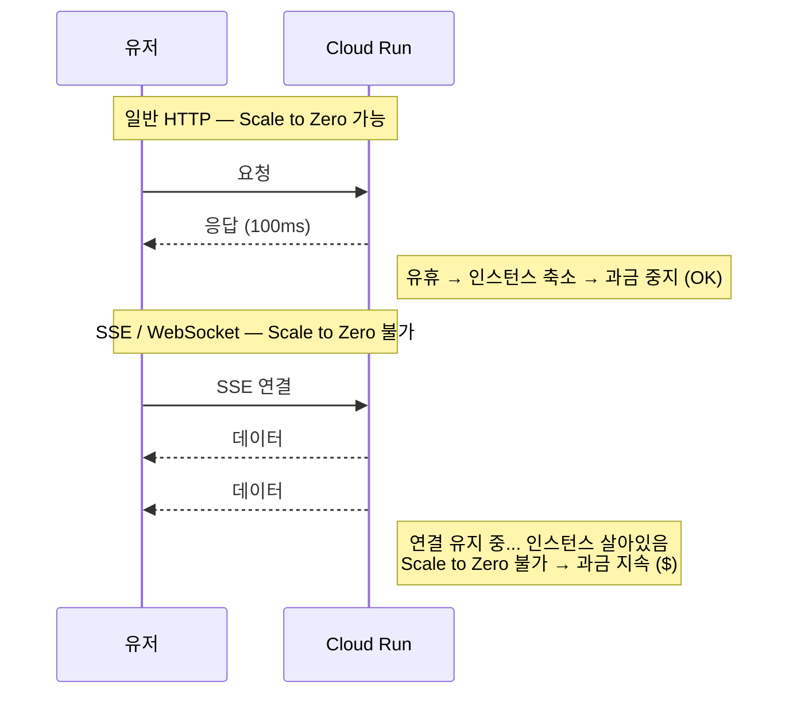
```mermaid
sequenceDiagram
    participant U as 유저
    participant CR as Cloud Run

    Note over U,CR: 일반 HTTP — Scale to Zero 가능
    U->>CR: 요청
    CR-->>U: 응답 (100ms)
    Note right of CR: 유휴 → 인스턴스 축소 → 과금 중지 (OK)

    Note over U,CR: SSE / WebSocket — Scale to Zero 불가
    U->>CR: SSE 연결
    CR-->>U: 데이터
    CR-->>U: 데이터
    Note right of CR: 연결 유지 중... 인스턴스 살아있음<br/>Scale to Zero 불가 → 과금 지속 ($)
```

과금 영향도 크다:

| 구분 | 요청 → 과금 | 하루 총 활성 시간 |
|------|-----------|-----------------|
| **일반 HTTP** | 요청 → 처리(100ms) → 응답 → 과금: 100ms | 수 분 |
| **SSE/WebSocket** | 연결 → 유지(30분) → 종료 → 과금: 30분 | 동시 100명 × 30분 = 수천 분 💸 |

**대응 방법:**
- 연결에 적절한 타임아웃을 설정해서 유휴 연결 정리
- 비용이 민감하고 트래픽이 적으면 SSE 대신 Polling 고려
- 최소 인스턴스 설정으로 Cold Start와 비용 사이 균형 찾기

## 이슈 3: 배포 시 연결 끊김

Cloud Run은 새 버전 배포 시 **기존 인스턴스를 교체**한다. 이때 모든 스트리밍 연결이 끊긴다.

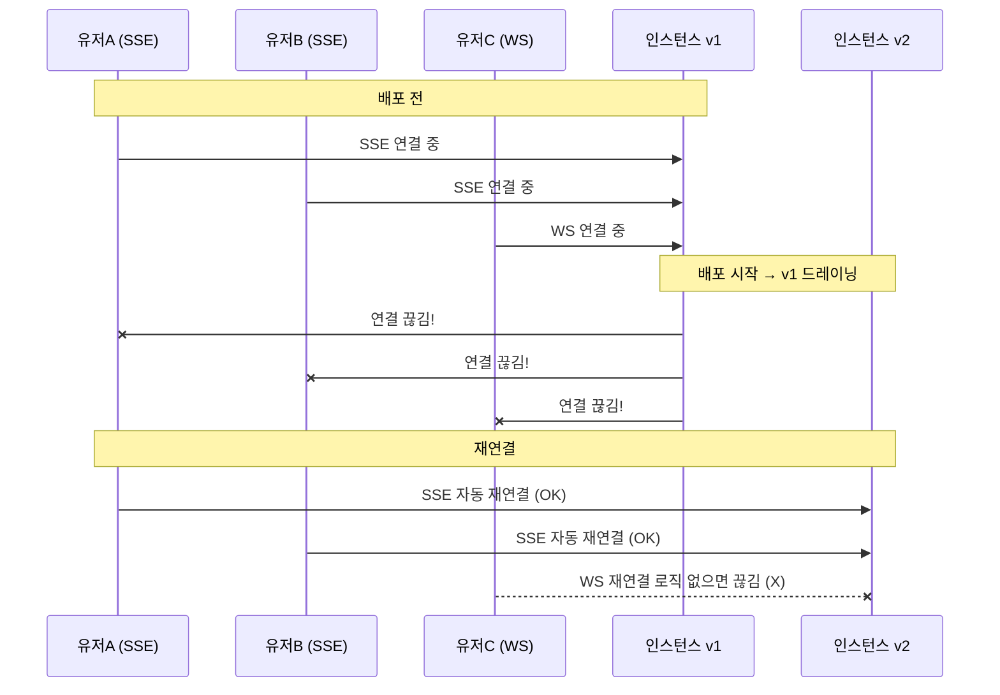
```mermaid
sequenceDiagram
    participant A as 유저A (SSE)
    participant B as 유저B (SSE)
    participant C as 유저C (WS)
    participant V1 as 인스턴스 v1
    participant V2 as 인스턴스 v2

    Note over A,V1: 배포 전
    A->>V1: SSE 연결 중
    B->>V1: SSE 연결 중
    C->>V1: WS 연결 중

    Note over V1,V2: 배포 시작 → v1 드레이닝
    V1-xA: 연결 끊김!
    V1-xB: 연결 끊김!
    V1-xC: 연결 끊김!

    Note over A,V2: 재연결
    A->>V2: SSE 자동 재연결 (OK)
    B->>V2: SSE 자동 재연결 (OK)
    C--xV2: WS 재연결 로직 없으면 끊김 (X)
```

**대응 방법:**
- SSE: `EventSource` 자동 재연결 덕분에 비교적 안전
- WebSocket: 재연결 + 상태 복구 로직 필수
- 모든 방식: 클라이언트가 "연결 끊김 → 재연결" 시나리오를 반드시 처리해야 함

## 이슈 4: 인스턴스 간 상태 공유 불가

Cloud Run 인스턴스는 **Stateless**다. 인스턴스 간 메모리를 공유할 수 없다.

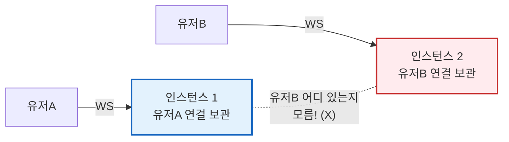
```mermaid
flowchart LR
    A["유저A"] -->|WS| I1["인스턴스 1<br/>유저A 연결 보관"]
    B["유저B"] -->|WS| I2["인스턴스 2<br/>유저B 연결 보관"]
    I1 -.-|"유저B 어디 있는지<br/>모름! (X)"| I2

    style I1 fill:#e3f2fd,stroke:#1565c0,stroke-width:2px
    style I2 fill:#ffebee,stroke:#c62828,stroke-width:2px
```

**대응 방법:**

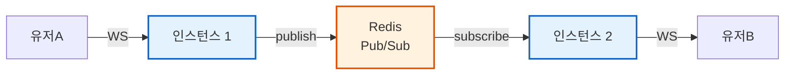
```mermaid
flowchart LR
    A["유저A"] -->|WS| I1["인스턴스 1"]
    I1 -->|publish| R["Redis<br/>Pub/Sub"]
    R -->|subscribe| I2["인스턴스 2"]
    I2 -->|WS| B["유저B"]

    style R fill:#fff3e0,stroke:#e65100,stroke-width:2px
    style I1 fill:#e3f2fd,stroke:#1565c0,stroke-width:2px
    style I2 fill:#e3f2fd,stroke:#1565c0,stroke-width:2px
```

- SSE (단방향): 서버가 일방적으로 보내므로 문제 적음
- WebSocket (양방향): Redis Pub/Sub, Firestore 같은 외부 상태 저장소 필수
- HTTP Streaming: 1회성이라 인스턴스 간 통신 불필요

## 이슈 5: 동시 요청 수 (Concurrency) 설정

Cloud Run은 인스턴스당 동시 처리 가능한 요청 수를 설정할 수 있다 (기본 80, 최대 1000).

```
[Concurrency = 80 설정 시]

인스턴스 1:
  SSE 연결 1 (유지 중...)
  SSE 연결 2 (유지 중...)
  ...
  SSE 연결 80 (유지 중...)
  SSE 연결 81 → ❌ 새 인스턴스로 라우팅
```

일반 HTTP 요청은 수 ms 만에 슬롯을 반환하지만, SSE/WebSocket은 연결 시간 내내 슬롯을 차지한다.

**대응 방법:**
- SSE/WebSocket 전용 서비스는 Concurrency를 높게 설정 (예: 500~1000)
- 일반 API와 SSE 서비스를 **별도 Cloud Run 서비스로 분리**하여 각각 다른 Concurrency 설정 적용

## 이슈 6: Cold Start와 재연결

SSE/WebSocket이 타임아웃이나 배포로 끊기면 클라이언트가 재연결한다. 이때 인스턴스가 이미 축소되었다면 **Cold Start**가 발생한다.

```
연결 끊김 → 인스턴스 축소 (Scale to Zero)
         → 재연결 요청
         → Cold Start (1~3초 대기)
         → 인스턴스 생성
         → 연결 복구

유저 입장: "연결 끊기고 몇 초간 아무것도 안 됨"
```

**대응 방법:**
- 최소 인스턴스를 1로 설정하면 Cold Start 방지 (단, 비용 증가)
- 클라이언트에서 재연결 시 로딩 UI 표시

## 종합 비교: Cloud Run 적합도

| 이슈 | HTTP Streaming | SSE | WebSocket |
|------|---------------|-----|-----------|
| **타임아웃 60분** | 거의 문제 없음 | 자동 재연결로 커버 | 재연결 직접 구현 필요 |
| **Scale to Zero** | 가능 (1회성) | 어려움 (연결 유지) | 어려움 (연결 유지) |
| **배포 시 끊김** | 영향 적음 | 자동 재연결 | 재연결 + 상태 복구 필요 |
| **인스턴스 상태** | 상관 없음 | 대체로 괜찮음 | 외부 저장소 필수 |
| **Concurrency 점유** | 짧은 점유 | 장시간 점유 | 장시간 점유 |
| **과금 효율** | 좋음 | 보통 | 나쁨 |
| **Cloud Run 적합도** | 매우 좋음 ✅ | 괜찮음 ⚠️ | 주의 필요 ⚠️⚠️ |

Cloud Run에서 실시간 통신이 필요하다면, **HTTP Streaming이 가장 궁합이 좋고**, SSE는 자동 재연결 덕분에 쓸 만하며, WebSocket은 추가 인프라(Redis 등)와 재연결 로직이 반드시 필요하다.

---

# 12. Deep Dive: 다중 인스턴스에서 실시간 세션 관리 - Redis Pub/Sub 적용

11장의 이슈 4에서 **인스턴스 간 상태 공유 불가** 문제를 간단히 다뤘다. 이번에는 실제로 이 문제를 어떻게 해결했는지, 구체적인 아키텍처를 살펴보자.

## 문제 상황: "왜 메시지가 안 와요?"

Streamable HTTP(HTTP POST + SSE 결합) 방식으로 서버→클라이언트 실시간 메시지를 구현했다. 로컬에서는 완벽하게 동작했지만, **다중 인스턴스로 배포하자마자** 메시지가 간헐적으로 전달되지 않는 현상이 발생했다.

## 왜 다중 인스턴스에서 세션이 깨지는가?

실시간 메시지 전송의 핵심은 **서버가 사용자의 세션 정보를 메모리에 유지하고 있어야 한다**는 것이다.

```mermaid
flowchart LR
    User["User A"] -->|"1. Session ID 발급 요청"| Server["서버"]
    Server -->|"2. Session ID 반환"| User
    User -->|"3. Session ID로 세션 등록 (SSE 연결)"| Server
    Server -->|"4. 메시지 푸시"| User

    style Server fill:#e3f2fd,stroke:#1565c0,stroke-width:2px
```

인스턴스가 하나일 때는 문제 없다. 하지만 Cloud Run처럼 **다중 인스턴스 + 이벤트 기반 아키텍처**에서는:

```mermaid
flowchart RL
    PS["Pub/Sub"]

    subgraph CR["Cloud Run"]
        direction TB
        A["Instance A<br/>User A Session"]
        B["Instance B"]
        C["Instance C"]
    end

    User["User A"]

    User -.->|"Stream 연결 유지"| A
    C -->|"1. 메시지 생성 완료"| PS
    PS -->|"2. Event 수신"| C
    C --x|"3. 세션이 없어서<br/>전달 불가!"| User

    style A fill:#ffebee,stroke:#c62828,stroke-width:2px
    style B fill:#f5f5f5,stroke:#000,stroke-width:1px
    style C fill:#f5f5f5,stroke:#000,stroke-width:1px
    style CR fill:#e3f2fd,stroke:#1565c0,stroke-width:2px
    style PS fill:#fff3e0,stroke:#e65100,stroke-width:2px
```

User A의 세션은 **인스턴스 A**의 메모리에 있다. 그런데 이벤트를 수신한 **인스턴스 C**가 User A에게 메시지를 전달해야 하는 상황이 발생한다. 인스턴스 C는 User A의 세션 정보가 없으니 **메시지를 전달할 방법이 없다**.

핵심은 **세션을 가진 인스턴스 ≠ 이벤트를 처리하는 인스턴스**라는 것이다.

## 해결: Redis Pub/Sub 도입

인스턴스 간에 **"이 사용자에게 메시지를 보내줘"**라고 통신할 수 있는 채널이 필요하다. 여기서 **Redis Pub/Sub**을 선택했다.

```mermaid
flowchart LR
    P["Publisher"] -->|publish| CH["Channel<br/>user-messages"]
    CH -->|subscribe| SA["인스턴스 A"]
    CH -->|subscribe| SB["인스턴스 B"]
    CH -->|subscribe| SC["인스턴스 C"]

    style CH fill:#fff3e0,stroke:#e65100,stroke-width:2px
```

발행자가 구독자를 알 필요 없다. 채널에 던지면 구독 중인 모든 인스턴스가 받는다.

### Case 1: 다른 인스턴스에 세션이 있는 경우

```mermaid
flowchart RL
    Redis["Redis"]

    subgraph CR["Cloud Run"]
        direction TB
        A["Instance A<br/>User A Session"]
        B["Instance B"]
        C["Instance C"]
    end

    User["User A"]

    C -->|"0. 메시지 생성"| C
    C -->|"1. Session 확인"| Redis
    C -->|"2-1. 세션 있음 (온라인)<br/>Message Publish"| Redis
    Redis -->|"3. 메시지 Sub"| A
    Redis -->|"3. 메시지 Sub"| B
    A -->|"4. 실시간 메시지 전달<br/>Stream"| User
    C -.->|"2-2. 세션 없을 경우 (오프라인)<br/>Push Message 전송"| User

    style A fill:#ffebee,stroke:#c62828,stroke-width:2px
    style B fill:#f5f5f5,stroke:#000,stroke-width:1px
    style C fill:#f5f5f5,stroke:#000,stroke-width:1px
    style CR fill:#e3f2fd,stroke:#1565c0,stroke-width:2px
    style Redis fill:#fff3e0,stroke:#e65100,stroke-width:2px
```

모든 인스턴스가 Redis 채널을 Subscribe하고 있으므로 메시지를 수신하고, User A의 세션을 실제로 보유한 **인스턴스 A**만 SSE Stream을 통해 클라이언트에 전달한다.

### Case 2: 해당 인스턴스에 세션이 있는 경우

```mermaid
flowchart LR
    User["User A"]

    subgraph CR["Cloud Run"]
        direction TB
        A["Instance A"]
        B["Instance B"]
        C["Instance C<br/>User A Session"]
    end

    Redis["Redis"]

    C -->|"0. 메시지 생성"| C
    C -->|"1. Session 확인"| Redis
    C -->|"2. 자체 메모리에서<br/>세션 확인 → 있다!"| C
    C -->|"3. 실시간 메시지 전달<br/>Stream (바로 전달)"| User

    style A fill:#f5f5f5,stroke:#000,stroke-width:1px
    style B fill:#f5f5f5,stroke:#000,stroke-width:1px
    style C fill:#ffebee,stroke:#c62828,stroke-width:2px
    style CR fill:#e3f2fd,stroke:#1565c0,stroke-width:2px
    style Redis fill:#fff3e0,stroke:#e65100,stroke-width:2px
```

이벤트를 처리하는 인스턴스가 마침 세션도 가지고 있으면, Redis Pub/Sub을 거치지 않고 **바로 전달**한다. 이 최적화 경로 덕분에 불필요한 Redis 통신을 줄일 수 있다.

### Case 3: 세션 종료도 Pub/Sub으로

```mermaid
flowchart LR
    User["User A"]

    subgraph CR["Cloud Run"]
        direction TB
        A["Instance A<br/>User A Session"]
        B["Instance B"]
        C["Instance C"]
    end

    Redis["Redis Pub/Sub"]

    User -->|"1. 세션 종료 요청"| C
    C -->|"2. Session 종료<br/>메시지 Publish"| Redis
    Redis -->|"3. 메시지 Sub"| A
    Redis -->|"3. 메시지 Sub"| B
    A -->|"4. User A Session 삭제"| A

    style A fill:#ffebee,stroke:#c62828,stroke-width:2px
    style B fill:#f5f5f5,stroke:#000,stroke-width:1px
    style C fill:#f5f5f5,stroke:#000,stroke-width:1px
    style CR fill:#e3f2fd,stroke:#1565c0,stroke-width:2px
    style Redis fill:#fff3e0,stroke:#e65100,stroke-width:2px
```

세션 종료 요청이 어떤 인스턴스에 도착하든, 실제 세션을 가진 인스턴스가 이를 수신하고 정리할 수 있다.

## 왜 Sticky Session이나 공유 세션 저장소가 아닌가?

| 방법 | 장점 | 단점 |
|------|------|------|
| **Sticky Session** (로드밸런서) | 구현 간단 | Cloud Run에서 지원 제한, 오토스케일링과 충돌 |
| **공유 세션 저장소** (Redis에 세션 자체 저장) | 어느 인스턴스든 세션 접근 가능 | SSE 연결은 특정 인스턴스에 묶여 있어 근본 해결 안됨 |
| **Redis Pub/Sub** | 느슨한 결합, 확장 용이 | 메시지 영속성 없음 (실시간 전달 전용) |

핵심은 SSE 연결이 특정 인스턴스의 메모리에 바인딩된다는 것이다. 세션을 공유 저장소에 옮기는 것만으로는 해결이 안 된다. 결국 **"세션을 가진 인스턴스에게 알려주는"** 메커니즘이 필요하고, Redis Pub/Sub이 이 역할에 적합하다.

또한 실시간 메시지는 전달 시점에만 의미가 있고, 오프라인 사용자에게는 별도로 푸시 알림을 보내므로 Pub/Sub의 "fire-and-forget" 특성이 오히려 적합하다.

## 남은 과제: 브로드캐스트 최적화

현재 구조에서는 메시지가 **모든 인스턴스에 브로드캐스트**된다. 인스턴스가 수백 개로 늘어나면 불필요한 네트워크 트래픽이 발생할 수 있다.

개선 방향은 **인스턴스 매핑 레지스트리**를 만드는 것이다:

```
Redis Hash: session-registry
  user-a → instance-id-1
  user-b → instance-id-3
  user-c → instance-id-1
```

채널을 `user-messages:{instance-id}`처럼 인스턴스별로 분리하면 **타겟 Pub/Sub**이 가능해져 불필요한 메시지 처리를 줄일 수 있다.
