## 배경

BullMQ로 예약 작업(delayed job)을 구현했는데, delay가 짧으면 잘 동작하고 길면 간헐적으로 실행되지 않는 현상을 겪었다. 원인을 하나씩 추적해 나간 과정을 정리한다.

<!--more-->

> **이 글에서 다루는 내용**
>
> BullMQ delayed job이 간헐적으로 실행되지 않는 문제를 추적하며 발견한 세 가지 함정.
> 네트워크(VPC), 런타임(Cloud Run), 애플리케이션(큐 설계) — 각각 다른 레이어에서 동시에 발생한 문제를 하나씩 풀어간다.

---

## 아키텍처 개요

먼저 현재 아키텍처는 다음과 같이 구성되어 있다.

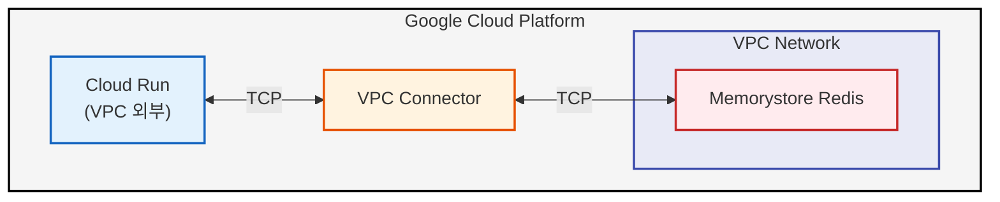

각 구성 요소를 간단히 설명하면:

| 구성 요소 | 설명 |
|----------|------|
| **GCP (Google Cloud Platform)** | Google의 클라우드 인프라. 이 안에서 서버, 데이터베이스, 네트워크 등을 관리한다. |
| **Cloud Run** | GCP의 서버리스 컨테이너 실행 환경. 코드를 컨테이너로 패키징하면 서버 관리 없이 HTTP 요청을 처리할 수 있다. VPC 외부에서 실행된다. |
| **VPC (Virtual Private Cloud)** | GCP 안에서 격리된 사설 네트워크. Memorystore Redis 같은 내부 리소스는 여기에 위치하며, 외부에서 직접 접근할 수 없다. |
| **VPC Connector** | VPC 외부(Cloud Run)와 VPC 내부(Redis)를 연결하는 브릿지. Cloud Run이 Redis에 접근하려면 반드시 이 Connector를 경유해야 한다. |
| **Memorystore Redis** | GCP에서 관리하는 Redis 인스턴스. VPC 내부에 위치하며, BullMQ의 잡 저장소로 사용한다. |

### 왜 VPC Connector가 필요한가?

Cloud Run이 Redis에 직접 접근하지 못하는 이유는 **네트워크 격리** 때문이다.

1. **Memorystore Redis는 VPC 내부에만 존재한다** — GCP Memorystore Redis는 보안상 VPC(사설 네트워크) 안에서만 접근 가능하도록 설계되어 있다. 공인 IP가 없고, 내부 IP만 가진다.
2. **Cloud Run은 기본적으로 VPC 외부에서 실행된다** — Cloud Run은 Google이 관리하는 서버리스 인프라 위에서 돌아가며, 이 인프라는 사용자의 VPC 네트워크에 속해 있지 않다. 즉, Cloud Run 컨테이너의 네트워크와 Redis가 있는 VPC 네트워크는 서로 다른 네트워크다.
3. **VPC Connector가 브릿지 역할을 한다** — 서로 다른 두 네트워크를 연결해주는 다리다. Cloud Run의 트래픽을 VPC Connector를 통해 VPC 내부로 라우팅해준다.

비유하자면, Redis는 **사설 건물 안에 있는 서버실**이고, Cloud Run은 **건물 밖에 있는 외부 서비스**다. 건물에 들어가려면 **출입 게이트(VPC Connector)**를 통과해야 하는 것과 같다.

> 참고로 GCP에서는 VPC Connector 대신 **Direct VPC Egress**라는 더 새로운 방식도 제공한다. Cloud Run 인스턴스를 VPC 서브넷에 직접 배치하는 방식으로, Connector 없이도 VPC 리소스에 접근할 수 있다.

이 글에서 다루는 문제는 **Cloud Run → VPC Connector → Redis** 사이의 TCP 연결에서 발생한다.

---

## BullMQ란?

BullMQ는 **Node.js용 메시지 큐 라이브러리**다. Redis를 백엔드로 사용하여 "나중에 실행할 작업"을 안정적으로 관리한다.

### 왜 필요한가?

"2시간 뒤에 이메일을 보내줘"라는 요청을 처리하는 방법을 생각해보자.

```typescript
// 1. setTimeout — 가장 단순하지만 위험
setTimeout(() => sendEmail(userId), 2 * 60 * 60 * 1000);
// 문제: 서버가 재시작되면 사라짐. 메모리에만 존재.

// 2. BullMQ — 안정적
await emailQueue.add('send-email', { userId, emailId }, { delay: 7200000 });
// Redis에 영구 저장. 서버가 재시작되어도 잡이 살아있음.
```

### 핵심 구성 요소

BullMQ는 세 가지 역할로 구성된다:

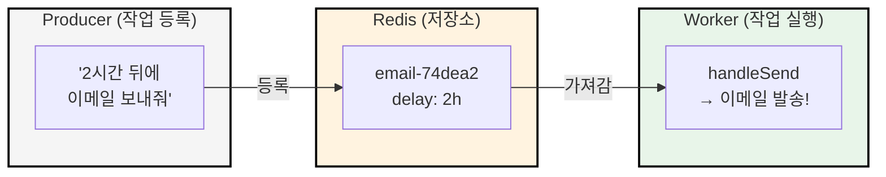

| 역할 | 설명 |
|------|------|
| **Producer** | 잡을 큐에 등록하는 쪽 |
| **Queue** | Redis에 잡을 저장하고 관리 |
| **Worker** | 잡을 꺼내서 실제 작업을 수행 |

### Delayed Job의 동작 원리

BullMQ에서 `delay` 옵션을 주면, 잡은 즉시 실행되지 않고 지정된 시간이 지난 후에 실행된다. 내부적으로는 이렇게 동작한다:

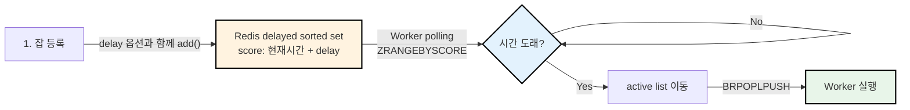

Redis의 sorted set을 사용하기 때문에 시간순 정렬이 O(log N)으로 효율적이고, 여러 Worker가 있어도 한 잡을 한 Worker만 가져가도록 원자적 연산(MULTI/EXEC)을 사용한다.

---

## 현상: 긴 delay의 Job이 간헐적으로 실행되지 않는다

| delay 시간 | 결과 |
|-----------|------|
| 5분 | 정상 실행 |
| 46분 | 간헐적 실패 |
| 2시간 | 높은 확률로 실패 |

잡 상태를 확인하면 `SCHEDULED`로 남아있고, Worker의 processing 로그가 전혀 없었다. delay가 길수록 실패 확률이 높아지는 패턴이었다.

### 인프라 구성

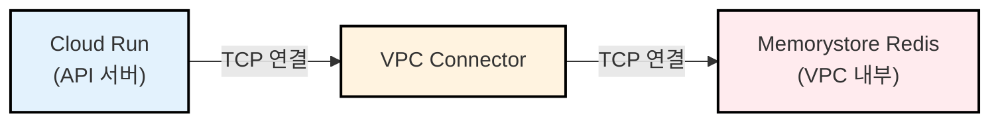

Cloud Run에서 Memorystore Redis에 접근하려면 **VPC Connector**를 경유해야 한다. Redis는 VPC 내부 리소스이기 때문이다.

---

## 첫 번째 의심: VPC Connector의 Idle TCP Timeout

### 가설 수립

5분 delay는 성공하고, 46분이나 2시간과 같이 그 이후의 delay는 실패한다. "특정 시간을 넘기면 실패한다"는 패턴이 보였다. 시간 기반 제한이 있는 무언가가 연결을 끊고 있다는 뜻이다.

Cloud Run과 Redis 사이에는 VPC Connector가 있다. GCP 문서를 확인해보니, VPC Connector에는 **약 10분의 idle TCP timeout**이 존재했다. 5분은 10분 미만이라 통과하고, 46분이나 2시간은 한참 넘으니 끊기는 것 — 설명이 되는 가설이었다.

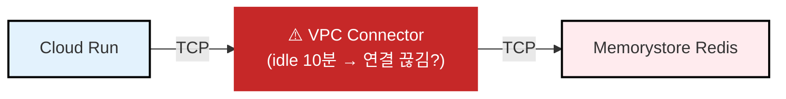

### 개념 이해

GCP VPC Connector는 **약 10분간 데이터 전송이 없는 TCP 연결을 조용히 끊는다**. "조용히 끊는다"는 말이 정확히 무엇을 의미하는지 이해하려면, TCP 연결의 본질부터 알아야 한다.

### TCP 연결은 양쪽 endpoint에만 존재한다

TCP 연결이 성립되면(3-way handshake 완료), **연결 상태는 양 끝(Worker, Redis)의 OS 커널 메모리에만 존재**한다. 전선이나 네트워크 장비가 "연결"을 유지하는 게 아니다.

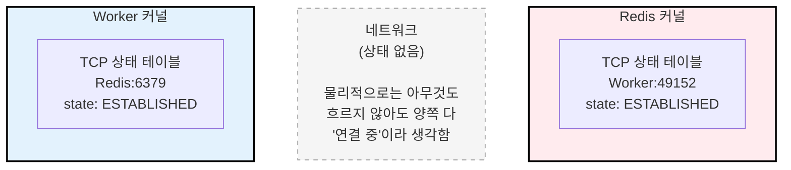

데이터를 안 보내도 양쪽 다 `ESTABLISHED` 상태를 **무한히** 유지한다. TCP 프로토콜 자체에는 "일정 시간 안 쓰면 끊는다"는 규칙이 없다.

### VPC Connector는 "중간자"다

문제는 VPC Connector가 NAT(Network Address Translation) 장비처럼 동작한다는 점이다. Cloud Run은 VPC 외부에 있고, Redis는 VPC 내부에 있으므로, VPC Connector가 중간에서 **연결 추적 테이블(conntrack table)**을 유지한다.

> **conntrack table이란?**
>
> 흔히 혼동하는 개념이 있다. **iptables**는 "어떤 트래픽을 허용/차단할지"의 **규칙(rule)**이고, **conntrack table**은 "지금 어떤 연결이 실제로 살아있는지"의 **상태(state)**다. VPC Connector가 idle timeout으로 삭제하는 것은 iptables 규칙이 아니라, conntrack table의 특정 엔트리다. 즉, "이 출발지-목적지 쌍의 연결이 존재한다"는 매핑 정보를 지우는 것이다. 엔트리가 삭제되면, 이후 해당 연결로 들어오는 패킷은 VPC Connector 입장에서 "모르는 연결"이 되어 DROP된다.

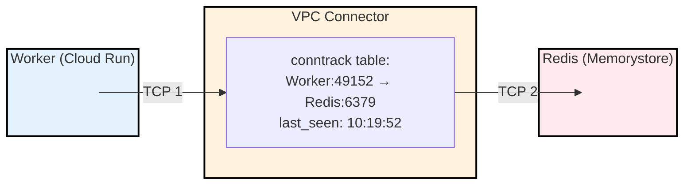

VPC Connector는 TCP 1(Worker→Connector)과 TCP 2(Connector→Redis)를 **매핑**해서, Worker의 패킷을 Redis에 전달하고 응답을 되돌려준다.

### "조용히 끊는다"의 정확한 의미

VPC Connector는 conntrack table의 각 엔트리에 **idle timer**를 유지한다. 약 10분간 패킷이 흐르지 않으면:

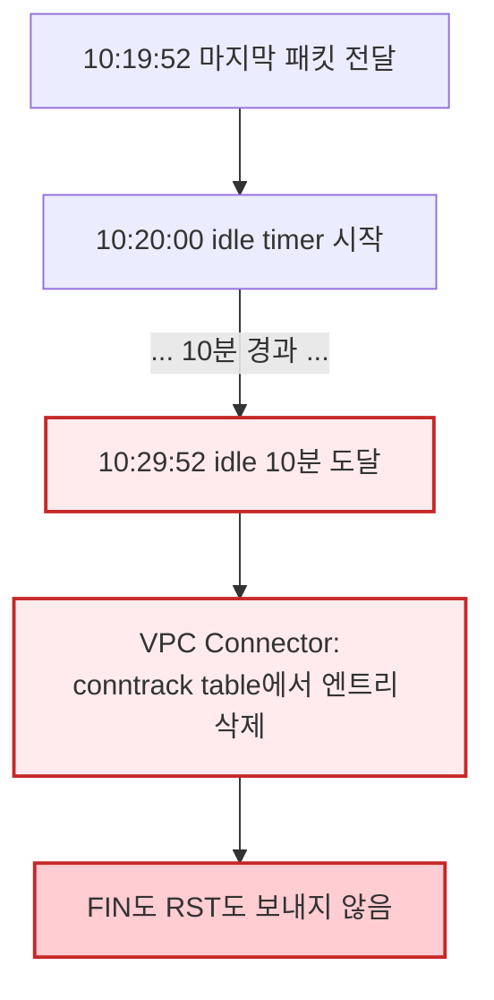

**정상적인 TCP 종료**와 비교하면 차이가 명확하다:

**정상 종료 (FIN/RST):**
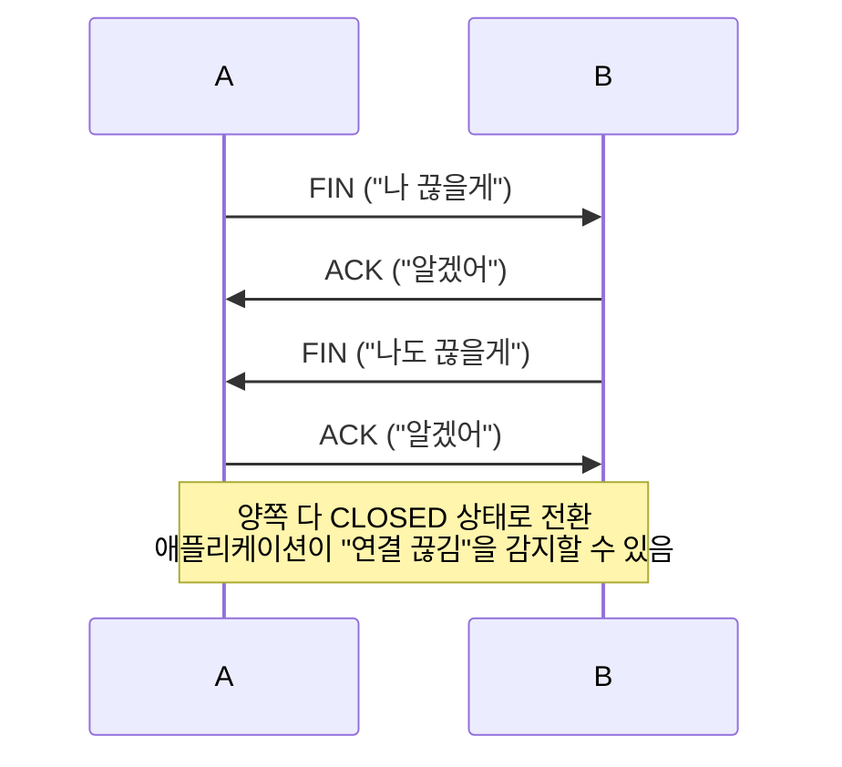

**VPC Connector의 끊김:**
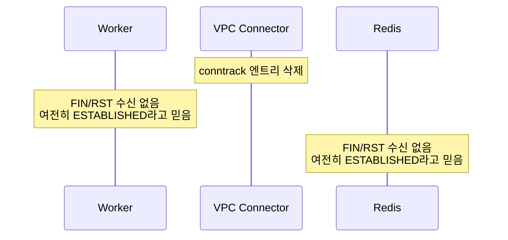

> **실제로는 항상 "조용한" 것은 아니다**
>
> GCP 공식 문서는 conntrack 엔트리 삭제 후 패킷이 **DROP(무시)**되는지 **RST(즉시 에러)**로 응답하는지 명시하지 않는다. 실제 운영 환경의 로그를 확인해보면 `read ECONNRESET`(RST 수신)이 즉시 발생하여 빠르게 reconnect되는 사례가 관찰된다. 이 경우 아래에서 설명하는 "13~20분 hang"은 발생하지 않고, 즉시 에러 → reconnect로 이어진다.
>
> 다만 **RST가 항상 보장되는 것은 아니다**. DROP으로 동작하면 아래의 worst case 시나리오가 발생하므로, 어느 쪽이든 keepAlive로 연결을 유지하는 것이 안전한 방어다.
>
> | VPC Connector 동작 | 결과 | 실제 영향 |
> |-------------------|------|----------|
> | **RST 응답** | `ECONNRESET` 즉시 발생 → reconnect | 해당 요청만 실패, 수 초 내 복구 |
> | **DROP (무시)** | 커널 재전송 13~20분 → `ETIMEDOUT` | 수십 분 hang (worst case) |

### 끊긴 후 어떤 일이 벌어지나

Worker가 Redis에 명령을 보내려고 하면:

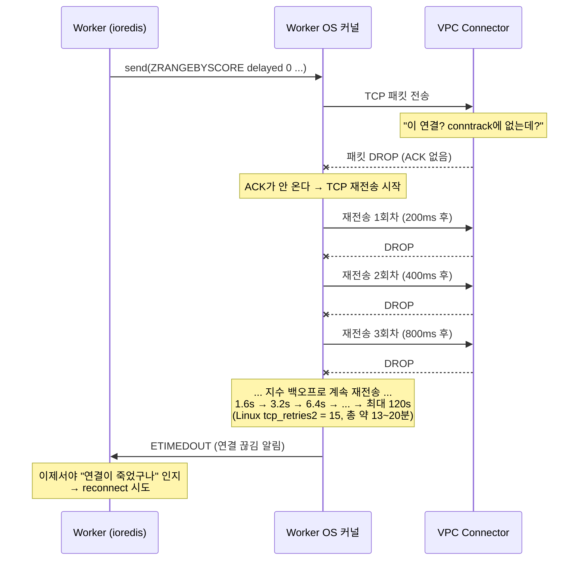

핵심은 **애플리케이션(ioredis)과 OS 커널 사이의 역할 분담**이다.

패킷을 보낸 후 ACK가 돌아오지 않으면, OS 커널의 TCP 스택이 **자체적으로 재전송**을 시도한다. 이 과정에서 애플리케이션에는 아무런 알림이 가지 않는다. 커널은 지수 백오프로 재전송하며, 초기 RTO(Retransmission Timeout)는 측정된 RTT 기반으로 결정된다. VPC 내부 통신은 RTT가 매우 짧으므로 Linux 최솟값인 **200ms**부터 시작하며, 상한은 **120초**다. Linux 기본 설정 `tcp_retries2 = 15`는 커널이 포기 시점을 계산하는 임계값으로, 총 약 **13~20분** 동안 재시도한다.

이 모든 재시도가 실패해야 커널이 `ETIMEDOUT` 에러를 애플리케이션에 전달한다. **그제서야** ioredis가 "연결이 죽었다"는 것을 알게 되고 reconnect를 시작한다.

즉 타임라인은 이렇게 된다:

| 구간 | 소요 시간 | 상태 |
|------|----------|------|
| VPC Connector idle timeout | ~10분 | 연결이 조용히 끊김 |
| OS 커널 TCP 재전송 | 13~20분 | 커널이 알아서 재시도, 앱은 모름 |
| ioredis reconnect | 수 초 | 새 연결 수립 |
| **총합** | **약 23~30분** | 해당 연결을 통한 통신이 지연됨 |

잡 자체는 Redis에 안전하게 남아있으므로 reconnect 후 처리되지만, **예정 시각보다 수십 분 지연**될 수 있다.

다만 BullMQ Worker는 내부적으로 여러 Redis 연결을 사용한다:

| 연결 | 용도 | idle 가능성 |
|------|------|------------|
| **blocking** | `BRPOPLPUSH`로 잡 대기 (수 초 timeout) | 낮음 (주기적으로 패킷 발생) |
| **subscriber** | pub/sub 이벤트 대기 | 높음 (이벤트 없으면 idle) |
| **client** | 일반 명령 | 높음 (트래픽 없으면 idle) |

blocking 연결은 짧은 timeout으로 반복 호출되므로 idle timeout에 잘 걸리지 않는다. 즉, **BullMQ의 핵심 잡 처리 연결은 keepAlive 없이도 VPC idle timeout에 걸리지 않을 가능성이 높다**. 하지만 subscriber나 client 연결이 끊어지면 delayed job 알림 수신이나 상태 조회에 문제가 생길 수 있다. keepAlive는 **모든 연결**에 적용되므로, 이런 부분적 연결 끊김을 방어한다.

> **keepAlive는 "근본 해결"이 아닌 "방어적 설정"이다**
>
> 이후 섹션에서 밝혀지지만, delayed job이 실행되지 않는 직접적 원인은 keepAlive 부재가 아니라 **cpu_idle에 의한 CPU 회수**와 **큐 이름 충돌**이었다. keepAlive는 VPC 환경에서 장시간 TCP 연결을 유지하는 서비스라면 **반드시 적용해야 하는 best practice**이지만, 이 케이스에서 delayed job 실패를 직접 일으킨 원인은 아니었다.

### 대응: TCP KeepAlive 설정

TCP keepalive는 연결이 idle 상태일 때 주기적으로 **빈 ACK 패킷(probe)**을 보내서 연결이 살아있음을 알리는 메커니즘이다. VPC Connector에게 "이 연결 아직 쓰고 있어"라고 알려준다.

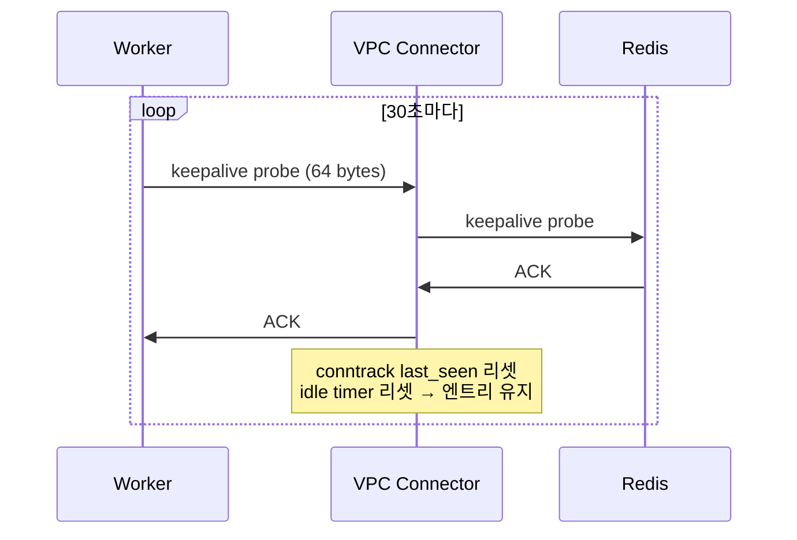

ioredis(BullMQ의 Redis 클라이언트)에서 keepAlive를 활성화한다:

```typescript
// Before — keepAlive 없음
const redisOptions = {
  host: 'redis-host',
  port: 6379,
};

// After — keepAlive 추가
const redisOptions = {
  host: 'redis-host',
  port: 6379,
  enableKeepAlive: true,
  keepAliveInitialDelay: 30000, // 마지막 데이터 전송 후 30초간 통신 없으면 keepalive probe 시작
};
```

VPC Connector의 idle timeout(~10분)보다 훨씬 짧은 간격이므로, 연결이 끊어지는 일을 방지할 수 있다.

keepAlive를 적용하고 배포한 뒤 모니터링했다. VPC 환경에서 장시간 TCP 연결을 유지하는 서비스라면 keepAlive는 반드시 적용해야 하는 설정이다. 하지만 **여전히 간헐적으로 잡이 실행되지 않았다**. keepAlive만으로는 부족했다 — 사실 BullMQ의 핵심 연결(blocking)은 자체적으로 idle 상태가 되지 않으므로, delayed job 실패의 직접적 원인은 다른 곳에 있었다.

> keepAlive는 적용했지만, 이걸로 해결되지 않은 건 어쩌면 당연했다.

---

## 두 번째 의심: Cloud Run의 cpu_idle

### 가설 수립

keepAlive를 넣었는데도 실패한다. keepAlive probe 자체가 보내지지 않는 건 아닐까?

Cloud Run 로그를 다시 확인해보니, 이상한 점이 보였다. HTTP 요청이 없는 시간대에 **Worker의 polling 로그 자체가 없었다**. `min_instances=1`로 설정했으니 컨테이너는 항상 떠 있을 텐데, 왜 polling을 안 하는 걸까?

"컨테이너가 살아있으면 당연히 코드도 실행되고 있는 거 아닌가?" — 이 가정이 틀렸다. Cloud Run 문서를 읽어보니 `cpu_idle`(CPU allocation) 설정을 발견했다. `min_instances`는 컨테이너를 메모리에 유지할 뿐이고, **CPU 할당 여부는 `cpu_idle`이 별도로 제어**한다는 사실을 알게 됐다.

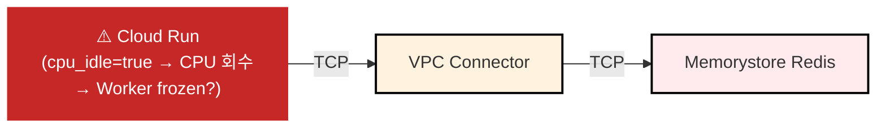

### cpu_idle이란?

Cloud Run은 원래 **HTTP 요청-응답 모델**을 위해 설계된 서비스다. 기본적으로 요청을 처리하는 동안만 CPU를 할당하고, 요청이 끝나면 CPU를 회수한다. 이 동작을 제어하는 설정이 `cpu_idle`이다.

| 설정 | 동작 |
|------|------|
| `cpu_idle = true` (기본) | HTTP 요청을 처리하는 동안만 CPU 할당 |
| `cpu_idle = false` | 항상 CPU 할당 |

### min_instances와 cpu_idle은 다른 레이어다

"min_instances를 1로 설정했으니 컨테이너가 항상 떠 있는 거 아닌가?"라고 생각할 수 있다. 하지만 **컨테이너가 존재하는 것**과 **CPU를 사용할 수 있는 것**은 다르다.

| 설정 | 컨테이너 존재 | 프로세스 존재 | CPU 사용 가능 |
|------|:---:|:---:|:---:|
| `min_instances=0` + 요청 없음 | X | X | X |
| `min_instances=1` + `cpu_idle=true` + 요청 없음 | O | O (frozen) | **X** |
| `min_instances=1` + `cpu_idle=false` + 요청 없음 | O | O (active) | **O** |

`min_instances=1`은 컨테이너를 메모리에 유지해서 **cold start를 방지**한다. 하지만 `cpu_idle=true`이면 요청이 없는 동안 CPU를 회수하므로, 프로세스는 존재하지만 **얼어붙은(frozen) 상태**가 된다.

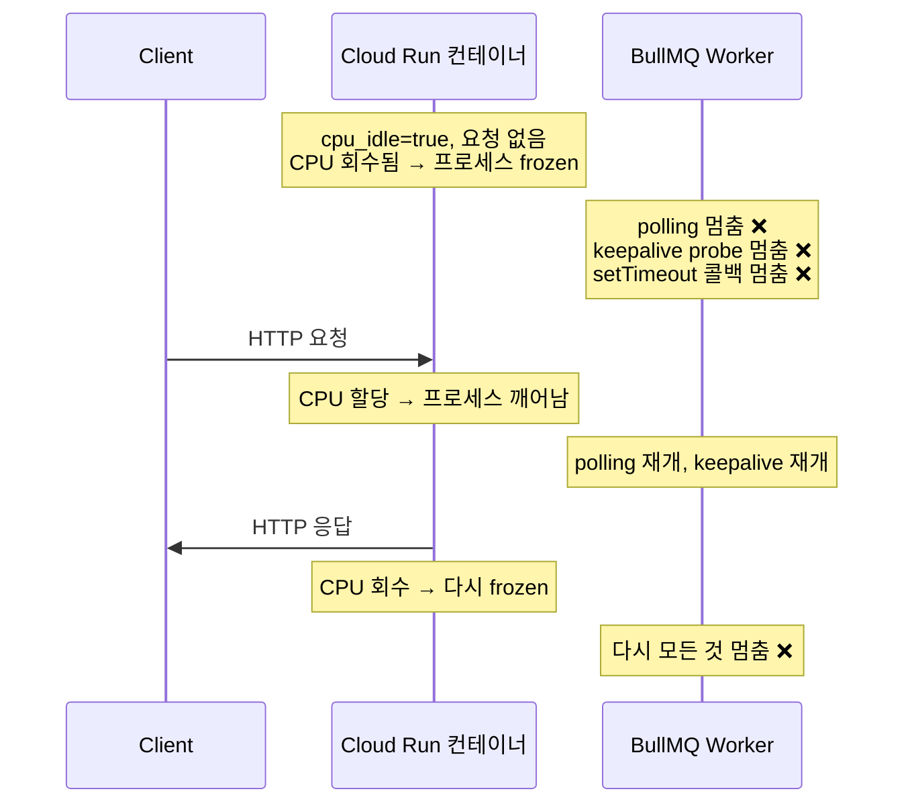

즉 `cpu_idle = true`이면:
- BullMQ Worker의 polling이 멈춤
- keepalive probe도 보내지 못함 → VPC idle timeout까지 유발
- delayed job 실행 시점을 놓침

아무리 keepAlive를 설정해도 CPU가 없으면 소용이 없다. Cloud Run에서 BullMQ Worker처럼 백그라운드 프로세스를 돌린다면, **반드시 `cpu_idle = false`로 설정**해야 한다.

### 비용 영향

`cpu_idle = false`로 바꾸면 요청이 없어도 항상 CPU가 할당되므로 비용이 증가한다. 실제로 얼마나 차이가 나는지 보자.

**Cloud Run 과금 단가 (Tier 1 리전 기준):**

| | cpu_idle=true (요청 시만 과금) | cpu_idle=false (항상 과금) |
|--|--|--|
| CPU | $0.000024 / vCPU-초 | $0.000018 / vCPU-초 |
| 메모리 | $0.0000025 / GiB-초 | $0.0000025 / GiB-초 |

`cpu_idle=false`의 vCPU 단가가 25% 저렴하지만, **항상 과금**되므로 총 비용은 높아진다.

**월간 비용 비교 (1 vCPU, 512MiB, 24/7 운영, 요청 처리 비율 10% 가정):**

| | cpu_idle=true | cpu_idle=false |
|--|--|--|
| CPU 과금 시간 | 전체의 10% (요청 처리 중만) | 전체의 100% |
| CPU 비용 | ~$6.22 | ~$46.66 |
| 메모리 비용 | ~$0.32 | ~$3.24 |
| **월 합계** | **~$6.54** | **~$49.90** |

약 **7~8배** 차이가 난다. BullMQ Worker를 위해 `cpu_idle = false`를 설정하면 비용이 증가하므로, Worker 전용 인스턴스를 분리하거나 적절한 vCPU/메모리 스펙을 선택하는 것이 좋다.

### 적용 후 확인

`cpu_idle=false`로 변경하고 배포했다. Cloud Run 메트릭에서 요청이 없는 구간에도 CPU가 할당되는 것을 확인했고, Worker의 polling 로그도 HTTP 요청과 무관하게 지속적으로 찍히기 시작했다. 이 수정도 필요했다 — `cpu_idle=true`이면 Worker가 frozen되어 polling과 keepAlive 모두 동작하지 않는다. 하지만 이전과는 **다른 증상**이 남아있었다. 연결이 끊기거나 Worker가 멈추는 게 아니라, Worker가 잡을 가져갔는데 처리에 실패하는 패턴이었다.

> 이것도 수정했다. 이제는 되겠지?

---

## 그런데 여전히 안 된다

keepAlive도 넣고, cpu_idle도 껐다. 네트워크 레벨(VPC idle timeout)과 런타임 레벨(CPU throttling) 모두 해결했다. 그런데 **여전히 간헐적으로 잡이 실행되지 않았다**.

"인프라 문제도 아니고, 런타임 문제도 아니면 대체 뭐지?"

다시 로그를 자세히 들여다보니, 이전과는 다른 패턴이 보였다. Worker가 잡을 가져가긴 하는데, **DB에서 해당 데이터를 찾지 못하고 skip하는 로그**가 있었다. 잡은 실행됐지만, 자기 서비스에서 등록한 잡이 아닌 것을 가져간 것이다. 인프라가 아니라 **애플리케이션 레벨**의 문제였다.

---

## 진짜 원인: 큐 이름 충돌

인프라를 다시 확인해보니, **두 개의 서비스가 같은 Redis 인스턴스에서 같은 큐 이름을 사용**하고 있었다.

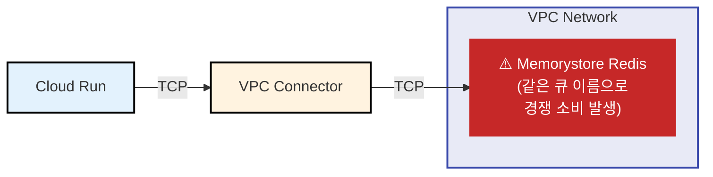

이 프로젝트는 모노레포 구조로, 여러 서비스가 공통 라이브러리를 공유한다. 공통 라이브러리에 BullMQ 큐 이름이 상수로 하드코딩되어 있었고, 각 서비스가 이 라이브러리를 그대로 가져다 쓰면서 동일한 큐 이름을 사용하게 됐다. 서로 다른 서비스를 각각 다른 개발자가 작업하다 보니, Redis를 공유한다는 사실과 큐 이름이 겹친다는 점을 아무도 인지하지 못했다.

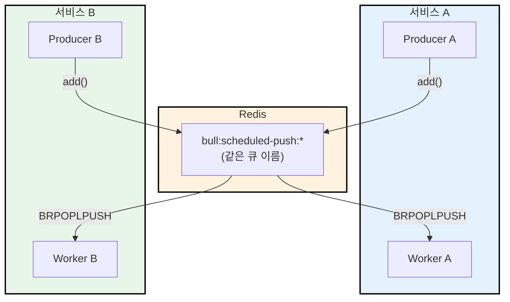

BullMQ의 `BRPOPLPUSH`는 원자적 연산으로, **아무 Worker나 먼저 가져간다**. 서비스 A가 등록한 잡을 서비스 B의 Worker가 가져가면:

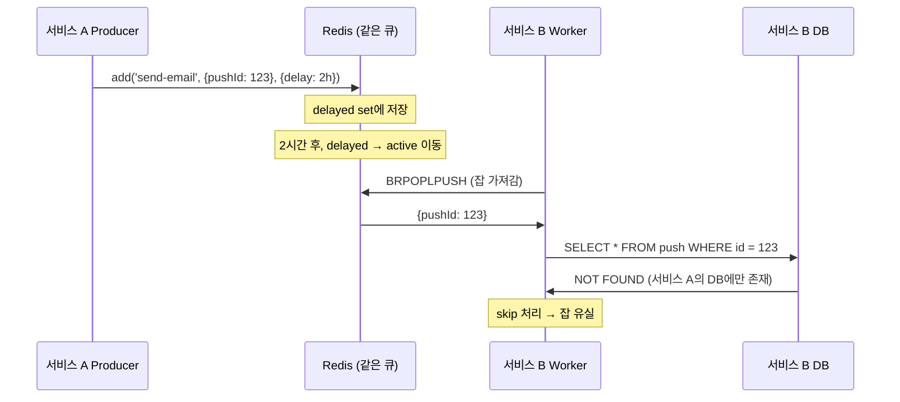

각 서비스는 **별도의 데이터베이스**를 사용하므로, 서비스 B의 Worker가 서비스 A의 잡을 가져가면 DB에서 데이터를 찾지 못하고 skip한다. 잡은 이미 active에서 빠졌으므로 다시 실행되지 않는다.

### 왜 delay가 길수록 실패 확률이 높았나

delay가 길수록 잡이 Redis의 delayed set에 오래 머물고, 그 사이 다른 서비스의 Worker가 active list에서 먼저 가져갈 기회가 많아진다. 5분 delay가 성공한 건 VPC idle timeout 때문이 아니라, 짧은 시간 안에 올바른 Worker가 먼저 가져갈 확률이 높았기 때문이다.

### 해결: 서비스별 큐 이름 분리

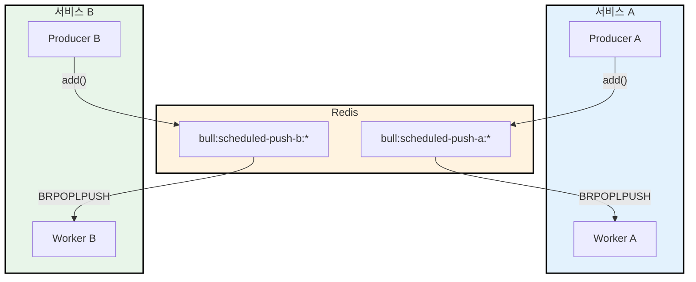

큐 이름을 서비스별로 분리하면, 각 Worker는 자기 서비스의 잡만 가져간다. 경쟁 소비 문제가 원천 차단된다.

---

## 정리

BullMQ delayed job이 실행되지 않을 때, 세 가지 레이어를 모두 확인해야 한다:

| # | 함정 | 증상 | 해결 | 영향도 |
|---|------|------|------|--------|
| 1 | **VPC Connector idle timeout** | 10분 이상 idle 시 TCP 연결이 끊김 → Redis 통신 일시 중단 | `enableKeepAlive: true, keepAliveInitialDelay: 30000` | 방어적 설정 |
| 2 | **Cloud Run cpu_idle** | HTTP 요청 없으면 CPU 중단 → Worker와 keepalive 모두 멈춤 | `cpu_idle = false` | **근본 원인** |
| 3 | **큐 이름 충돌** | 여러 서비스가 같은 큐를 공유 → 경쟁 소비로 잡 유실 | 서비스별 큐 이름 분리 | **근본 원인** |

**근본 원인과 방어적 설정의 차이**:

1번(keepAlive)은 VPC 환경에서 장시간 TCP 연결을 유지하는 모든 서비스에 **반드시 적용해야 하는 best practice**다. 하지만 이번 케이스에서 delayed job 실패를 직접 일으킨 원인은 아니었다. BullMQ Worker의 핵심 연결(blocking)은 수 초마다 `BRPOPLPUSH`를 반복하므로 VPC idle timeout(10분)에 걸리지 않는다. delayed job이 실행되지 않은 **직접적 원인**은 2번(CPU 회수로 Worker 전체가 frozen)과 3번(다른 서비스가 잡을 가져감)이었다.

세 가지 수정의 조합 결과:

| 수정한 것 | 빠뜨린 것 | 결과 |
|----------|----------|------|
| 3번(큐 이름)만 수정 | 2번 미수정 | 경쟁 소비는 해결되지만, cpu_idle로 Worker가 frozen → 잡 실행 지연 |
| 2번(cpu_idle)만 수정 | 3번 미수정 | CPU는 정상이지만, 다른 서비스가 잡을 가져감 → 잡 유실 |
| 2번(cpu_idle) + 3번(큐 이름) 수정 | 1번 미수정 | **delayed job은 정상 동작**. 다만 subscriber/client 연결이 idle 시 끊길 수 있음 |
| **1번 + 2번 + 3번 모두 수정** | 없음 | **정상 동작 + 방어적 안전망 확보** |

각 문제가 일으키는 증상도 다르다:

- **2번 (런타임, 근본 원인)**: 잡이 유실되지는 않지만 **다음 HTTP 요청이 올 때까지 무기한 지연**된다 — CPU가 없어 모든 백그라운드 작업 정지
- **3번 (애플리케이션, 근본 원인)**: 잡이 **완전히 유실**된다 — 다른 서비스가 가져가서 skip 처리하면 복구 불가
- **1번 (네트워크, 방어적 설정)**: BullMQ의 blocking 연결은 영향받지 않으나, subscriber/client 연결이 idle 시 끊길 수 있다. VPC 환경의 장시간 TCP 연결에는 필수

이번 케이스에서는 세 가지 문제가 동시에 존재했고, 디버깅 과정에서 하나씩 발견하여 모두 수정했다. 결과적으로 delayed job 실패의 **근본 원인은 2번과 3번**이었지만, 1번도 VPC 환경에서의 안정성을 위해 반드시 적용해야 하는 설정이다. Cloud Run + Redis + BullMQ 조합을 사용한다면, 이 세 가지를 체크리스트로 점검하는 것을 권장한다.

---

## 후속 조치: 다시 밟지 않으려면

이번 문제를 해결한 것으로 끝이 아니다. 팀에서 새로운 서비스를 만들 때 같은 실수를 반복하지 않으려면, 각 문제에 대한 예방 체계가 필요하다.

### VPC Connector idle timeout → 재발 방지

Cloud Run에서 VPC 내부 리소스(Redis, PostgreSQL 등)에 장시간 TCP 연결을 맺는 서비스를 만들 때마다 동일한 문제가 발생할 수 있다.

- **Cloud Run 서비스 템플릿(boilerplate)에 keepAlive 설정을 기본 포함한다** — 새 서비스를 템플릿에서 시작하면 자연스럽게 적용된다
- **팀 내부 Cloud Run + VPC 사용 가이드에 "VPC Connector 경유 시 keepAlive 필수" 항목을 명시한다**

### cpu_idle → 재발 방지

Cloud Run에서 백그라운드 프로세스(Worker, cron, WebSocket 등)를 돌리는 서비스를 만들 때마다 동일한 문제가 발생할 수 있다.

- **서비스 생성 체크리스트에 "HTTP 요청 외 백그라운드 작업이 있는가?" 항목을 추가한다** — Yes이면 `cpu_idle=false` + `min_instances≥1` 필수
- **Terragrunt 모듈에 worker 용도 프리셋을 추가한다** — `worker = true` 같은 플래그 하나로 `cpu_idle`, `min_instances`가 자동 설정되도록

### 큐 이름 충돌 → 재발 방지

모노레포에서 여러 서비스가 Redis, Kafka 등 공유 인프라를 사용할 때마다 동일한 문제가 발생할 수 있다.

- **큐/토픽 이름을 하드코딩하지 않고 환경변수로 주입하는 패턴을 표준화한다** — 공유 라이브러리에서 상수 하드코딩 금지
- **네이밍 규칙을 문서화한다** — `{서비스명}-{용도}` 형식으로 prefix 규칙 수립 (예: `scheduled-push-sleep`, `scheduled-push-metabolic`)
- **공유 인프라 리소스 목록을 팀 내부에 공유한다** — 어떤 서비스가 어떤 Redis/큐를 사용하는지 한눈에 볼 수 있는 문서를 관리한다. Kafka의 schema registry처럼, 팀 내부에서 큐/토픽 네이밍을 중앙에서 관리하는 체계가 있으면 이런 충돌을 사전에 방지할 수 있다.
- **인프라 아키텍처를 가시화한다** — 이번 문제의 본질은 "누가 뭘 쓰는지 아무도 몰랐다"는 것이다. 서비스가 늘어나고 개발자가 바뀌면, 머릿속에만 있던 아키텍처는 사라진다. 수동 문서는 그린 순간부터 낡기 시작하므로, Terragrunt 설정이나 GCP API 호출을 통해 서비스 간 의존 관계와 공유 인프라 매핑을 **자동으로 추출하고 지속적으로 업데이트되는 아키텍처 다이어그램**을 구축하는 것이 이상적이다.

---

## 부록: AWS 환경이라면?

이 글의 내용은 GCP(Cloud Run + Memorystore Redis) 환경에서의 경험이다. AWS 환경에서 같은 구성을 한다면 어떨까?

### GCP vs AWS 아키텍처 비교

**GCP — Cloud Run + VPC Connector + Memorystore Redis:**

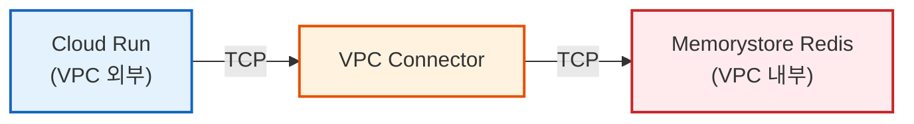

Cloud Run은 VPC **외부**에서 실행되므로 VPC Connector를 경유해야 한다.

**AWS — Lambda + ElastiCache Redis:**

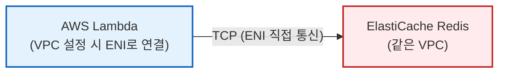

Lambda는 VPC 설정 시 **ENI(Elastic Network Interface)**를 통해 VPC 서브넷에 직접 연결된다. GCP의 VPC Connector 같은 중간자가 아니라, Lambda 함수에 네트워크 인터페이스가 직접 할당되는 방식이다.

### 세 가지 문제가 AWS에서도 발생하는가?

| # | 문제 | GCP (Cloud Run) | AWS (Lambda) |
|---|------|-----------------|--------------|
| 1 | **VPC idle timeout** | 발생 — VPC Connector가 10분 idle 시 연결을 끊음 | **중간자 timeout은 없음** — Hyperplane ENI로 VPC에 직접 연결되어 GCP VPC Connector 같은 중간자가 없음. 다만 Lambda 자체의 idle 연결 제거 메커니즘이 존재 |
| 2 | **cpu_idle** | 발생 — 요청 없으면 CPU 회수 | **다른 형태로 발생** — Lambda는 호출 시에만 실행되고 최대 15분 제한. 상시 polling이 불가능하므로 BullMQ Worker 패턴 자체가 맞지 않음 |
| 3 | **큐 이름 충돌** | 발생 | **동일하게 발생** — 클라우드와 무관한 애플리케이션 레벨 문제 |

1번(VPC idle timeout)에서 GCP VPC Connector 같은 중간자 timeout은 Lambda에서 발생하지 않는다. 하지만 Lambda에는 별도의 연결 관리 이슈가 있다. AWS 공식 문서에 따르면:

> "Lambda purges idle connections over time. Attempting to reuse an idle connection when invoking a function will result in a connection error."
> — [AWS Lambda Best Practices](https://docs.aws.amazon.com/lambda/latest/dg/best-practices.html)

Lambda는 호출 사이에 실행 환경을 **freeze**한다. 이때 보유하고 있던 TCP 연결이 idle 상태로 남게 되고, 시간이 지나면 Lambda가 이 연결을 제거한다. 다음 호출에서 제거된 연결을 재사용하려고 하면 에러가 발생한다. 따라서 Lambda에서도 **연결 재사용 전 유효성 검사**나 **keepAlive 설정**은 여전히 권장된다.

한편, ElastiCache Redis의 서버측 idle timeout(`timeout` 파라미터)은 **기본값이 0(idle 연결을 끊지 않음)**이므로, 명시적으로 설정하지 않는 한 서버측에서 연결을 끊는 문제는 발생하지 않는다.

2번은 **더 근본적인 제약**이 된다. Lambda는 이벤트 기반으로 호출될 때만 실행되고 최대 15분까지만 동작하므로, BullMQ Worker처럼 상시 Redis를 polling하는 패턴에는 적합하지 않다. Lambda에서 delayed job을 구현하려면 BullMQ 대신 **EventBridge Scheduler**나 **SQS delay** 같은 AWS 네이티브 서비스를 사용하는 것이 일반적이다.

### 다만 AWS에서도 주의할 점

- **NAT Gateway idle timeout**: Lambda가 VPC **외부**(인터넷)로 나갈 때 NAT Gateway를 경유하는데, **350초(약 5분 50초)** idle timeout이 있다. ElastiCache처럼 같은 VPC 안의 리소스에 접근할 때는 해당 없지만, 외부 Redis(예: Redis Cloud)를 사용하면 비슷한 문제가 발생할 수 있다.
- **AWS App Runner**: Cloud Run과 유사한 서버리스 컨테이너 모델이다. App Runner도 VPC Connector를 사용하므로, GCP와 **동일한 idle timeout 문제가 발생**할 수 있다.
