## 배경

BullMQ로 예약 작업(delayed job)을 구현했는데, delay가 짧으면 잘 동작하고 길면 간헐적으로 실행되지 않는 현상을 겪었다. 원인을 하나씩 추적해 나간 과정을 정리한다.

<!--more-->

---

## BullMQ란?

BullMQ는 **Node.js용 메시지 큐 라이브러리**다. Redis를 백엔드로 사용하여 "나중에 실행할 작업"을 안정적으로 관리한다.

### 왜 필요한가?

"2시간 뒤에 이메일을 보내줘"라는 요청을 처리하는 방법을 생각해보자.

```typescript
// 1. setTimeout — 가장 단순하지만 위험
setTimeout(() => sendEmail(userId), 2 * 60 * 60 * 1000);
// 문제: 서버가 재시작되면 사라짐. 메모리에만 존재.

// 2. BullMQ — 안정적
await emailQueue.add('send-email', { userId, emailId }, { delay: 7200000 });
// Redis에 영구 저장. 서버가 재시작되어도 잡이 살아있음.
```

### 핵심 구성 요소

BullMQ는 세 가지 역할로 구성된다:


| 역할 | 설명 |
|------|------|
| **Producer** | 잡을 큐에 등록하는 쪽 |
| **Queue** | Redis에 잡을 저장하고 관리 |
| **Worker** | 잡을 꺼내서 실제 작업을 수행 |

### Delayed Job의 동작 원리

BullMQ에서 `delay` 옵션을 주면, 잡은 즉시 실행되지 않고 지정된 시간이 지난 후에 실행된다. 내부적으로는 이렇게 동작한다:

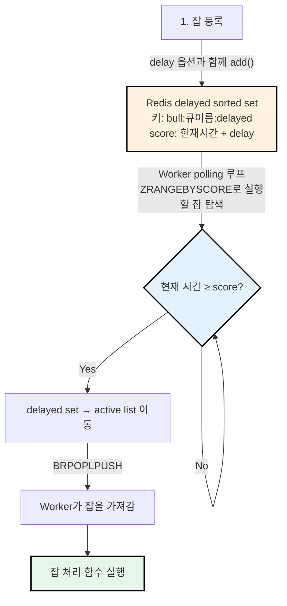

Redis의 sorted set을 사용하기 때문에 시간순 정렬이 O(log N)으로 효율적이고, 여러 Worker가 있어도 한 잡을 한 Worker만 가져가도록 원자적 연산(MULTI/EXEC)을 사용한다.

---

## 현상: 긴 delay의 Job이 간헐적으로 실행되지 않는다

| delay 시간 | 결과 |
|-----------|------|
| 5분 | 정상 실행 |
| 46분 | 간헐적 실패 |
| 2시간 | 높은 확률로 실패 |

잡 상태를 확인하면 `SCHEDULED`로 남아있고, Worker의 processing 로그가 전혀 없었다. delay가 길수록 실패 확률이 높아지는 패턴이었다.

### 인프라 구성

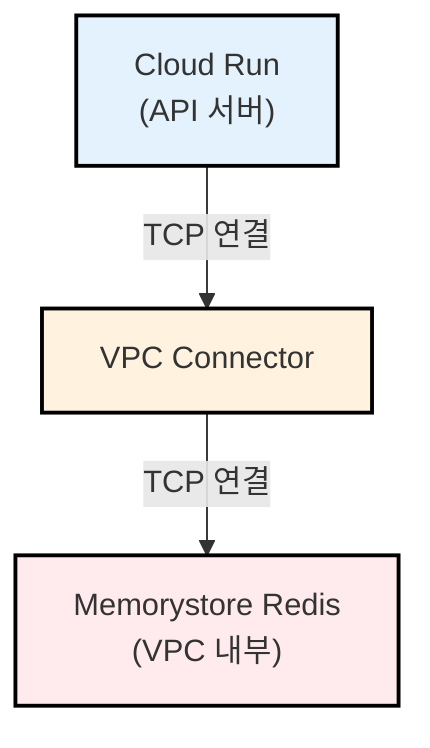

Cloud Run에서 Memorystore Redis에 접근하려면 **VPC Connector**를 경유해야 한다. Redis는 VPC 내부 리소스이기 때문이다.

---

## 첫 번째 의심: VPC Connector의 Idle TCP Timeout

가장 먼저 의심한 것은 네트워크 레벨의 문제였다. GCP VPC Connector는 **약 10분간 데이터 전송이 없는 TCP 연결을 조용히 끊는다**. "조용히 끊는다"는 말이 정확히 무엇을 의미하는지 이해하려면, TCP 연결의 본질부터 알아야 한다.

### TCP 연결은 양쪽 endpoint에만 존재한다

TCP 연결이 성립되면(3-way handshake 완료), **연결 상태는 양 끝(Worker, Redis)의 OS 커널 메모리에만 존재**한다. 전선이나 네트워크 장비가 "연결"을 유지하는 게 아니다.

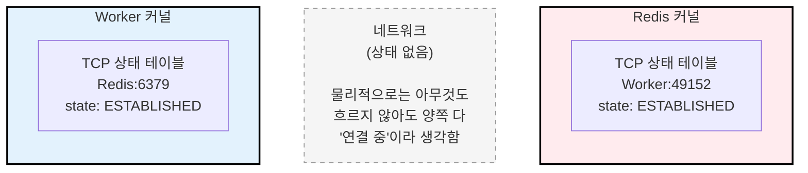

데이터를 안 보내도 양쪽 다 `ESTABLISHED` 상태를 **무한히** 유지한다. TCP 프로토콜 자체에는 "일정 시간 안 쓰면 끊는다"는 규칙이 없다.

### VPC Connector는 "중간자"다

문제는 VPC Connector가 NAT(Network Address Translation) 장비처럼 동작한다는 점이다. Cloud Run은 VPC 외부에 있고, Redis는 VPC 내부에 있으므로, VPC Connector가 중간에서 **연결 추적 테이블(conntrack table)**을 유지한다:

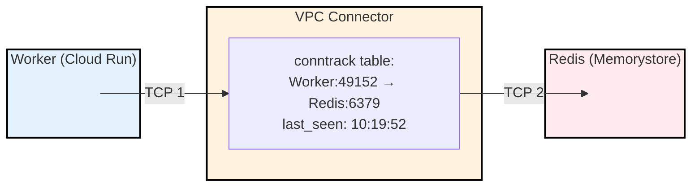

VPC Connector는 TCP 1(Worker→Connector)과 TCP 2(Connector→Redis)를 **매핑**해서, Worker의 패킷을 Redis에 전달하고 응답을 되돌려준다.

### "조용히 끊는다"의 정확한 의미

VPC Connector는 conntrack table의 각 엔트리에 **idle timer**를 유지한다. 약 10분간 패킷이 흐르지 않으면:

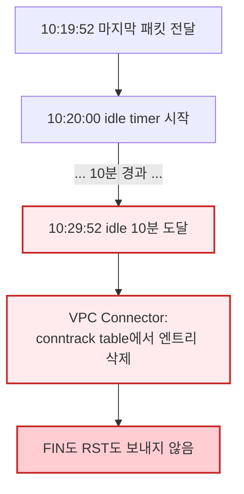

**정상적인 TCP 종료**와 비교하면 차이가 명확하다:

**정상 종료 (FIN/RST):**
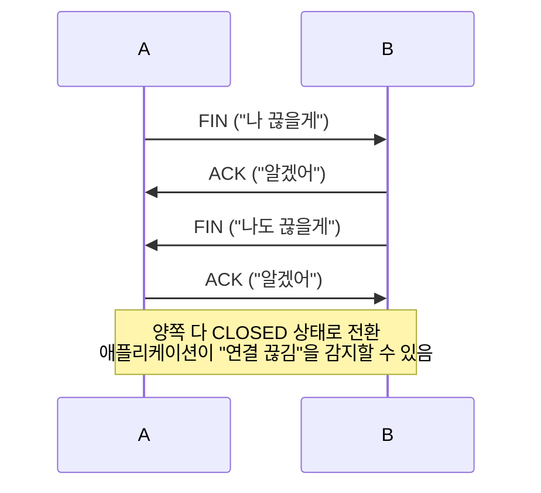

**VPC Connector의 조용한 끊김:**
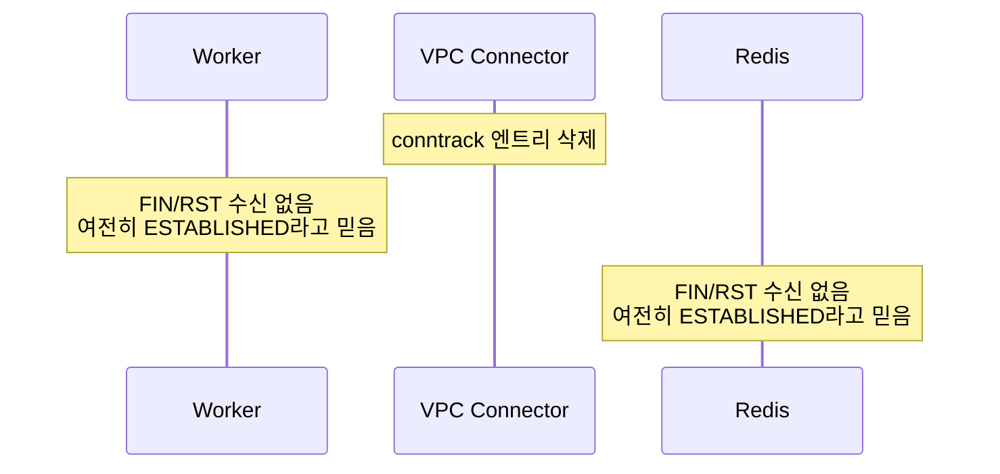

### 끊긴 후 어떤 일이 벌어지나

Worker가 Redis에 명령을 보내려고 하면:

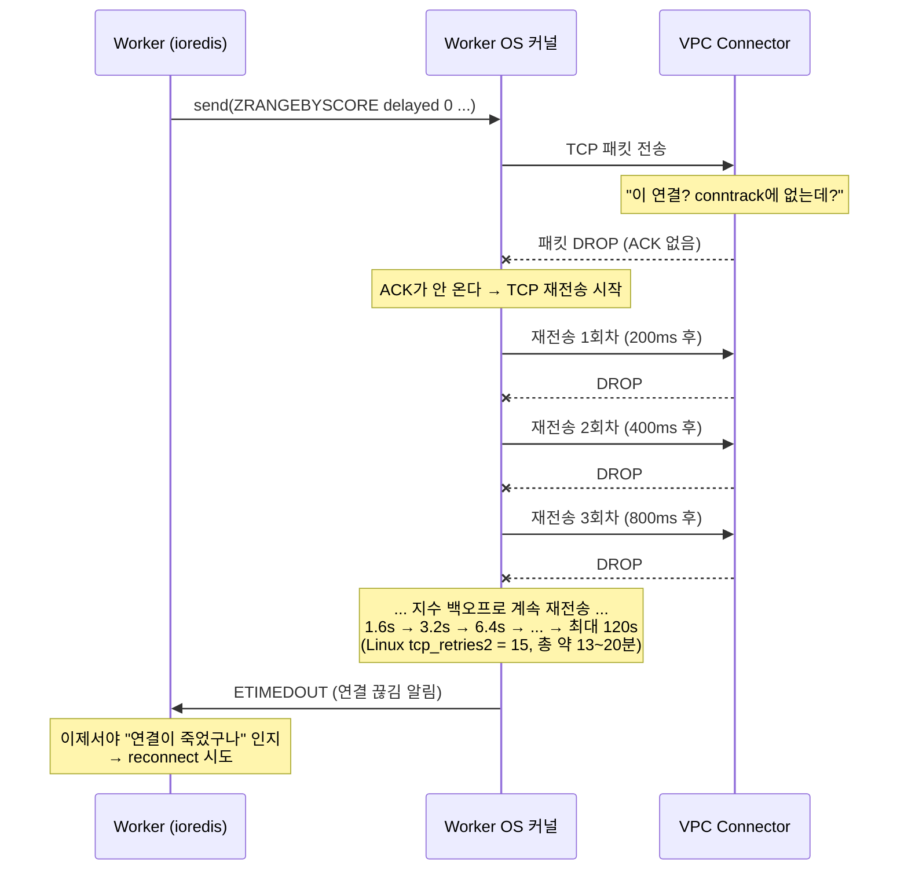

핵심은 **애플리케이션(ioredis)과 OS 커널 사이의 역할 분담**이다.

패킷을 보낸 후 ACK가 돌아오지 않으면, OS 커널의 TCP 스택이 **자체적으로 재전송**을 시도한다. 이 과정에서 애플리케이션에는 아무런 알림이 가지 않는다. 커널은 지수 백오프로 재전송하며, 초기 RTO(Retransmission Timeout)는 측정된 RTT 기반으로 결정된다. VPC 내부 통신은 RTT가 매우 짧으므로 Linux 최솟값인 **200ms**부터 시작하며, 상한은 **120초**다. Linux 기본 설정 `tcp_retries2 = 15`는 커널이 포기 시점을 계산하는 임계값으로, 총 약 **13~20분** 동안 재시도한다.

이 모든 재시도가 실패해야 커널이 `ETIMEDOUT` 에러를 애플리케이션에 전달한다. **그제서야** ioredis가 "연결이 죽었다"는 것을 알게 되고 reconnect를 시작한다.

즉 타임라인은 이렇게 된다:

| 구간 | 소요 시간 | 상태 |
|------|----------|------|
| VPC Connector idle timeout | ~10분 | 연결이 조용히 끊김 |
| OS 커널 TCP 재전송 | ~13~20분 | 커널이 알아서 재시도, 앱은 모름 |
| ioredis reconnect | 수 초 | 새 연결 수립 |
| **총합** | **약 23~30분** | 해당 연결을 통한 통신이 지연됨 |

잡 자체는 Redis에 안전하게 남아있으므로 reconnect 후 처리되지만, **예정 시각보다 수십 분 지연**될 수 있다.

다만 BullMQ Worker는 내부적으로 여러 Redis 연결을 사용한다:

| 연결 | 용도 | idle 가능성 |
|------|------|------------|
| **blocking** | `BRPOPLPUSH`로 잡 대기 (수 초 timeout) | 낮음 (주기적으로 패킷 발생) |
| **subscriber** | pub/sub 이벤트 대기 | 높음 (이벤트 없으면 idle) |
| **client** | 일반 명령 | 높음 (트래픽 없으면 idle) |

blocking 연결은 짧은 timeout으로 반복 호출되므로 idle timeout에 잘 걸리지 않는다. 하지만 subscriber나 client 연결이 끊어지면 delayed job 알림 수신이나 상태 조회에 문제가 생길 수 있다. keepAlive는 **모든 연결**에 적용되므로, 이런 부분적 연결 끊김도 방지한다.

### 대응: TCP KeepAlive 설정

TCP keepalive는 연결이 idle 상태일 때 주기적으로 **빈 ACK 패킷(probe)**을 보내서 연결이 살아있음을 알리는 메커니즘이다. VPC Connector에게 "이 연결 아직 쓰고 있어"라고 알려준다.

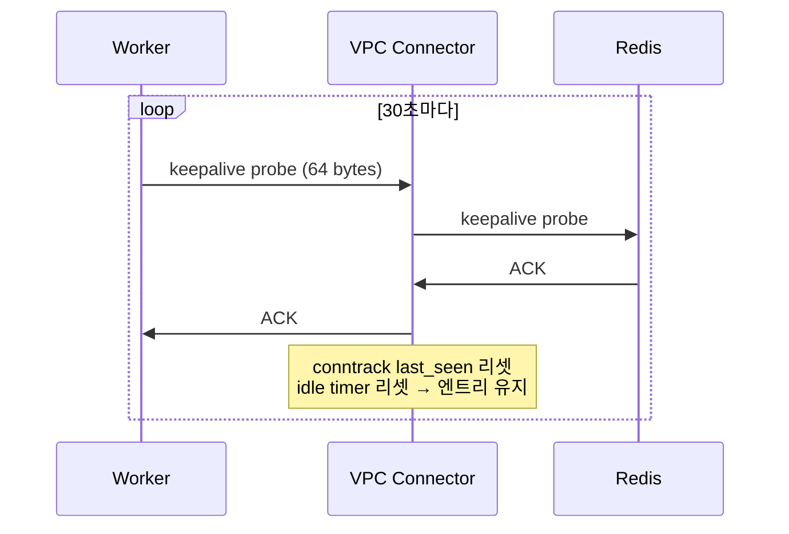

ioredis(BullMQ의 Redis 클라이언트)에서 keepAlive를 활성화한다:

```typescript
// Before — keepAlive 없음
const redisOptions = {
  host: 'redis-host',
  port: 6379,
};

// After — keepAlive 추가
const redisOptions = {
  host: 'redis-host',
  port: 6379,
  enableKeepAlive: true,
  keepAliveInitialDelay: 30000, // 30초마다 keepalive probe
};
```

VPC Connector의 idle timeout(~10분)보다 훨씬 짧은 간격이므로, 연결이 끊어지는 일을 방지할 수 있다.

## 두 번째 의심: Cloud Run의 cpu_idle

keepAlive를 설정했는데도 여전히 문제가 발생했다. 조사해보니 Cloud Run의 `cpu_idle` 설정이 눈에 들어왔다.

### cpu_idle이란?

Cloud Run은 원래 **HTTP 요청-응답 모델**을 위해 설계된 서비스다. 기본적으로 요청을 처리하는 동안만 CPU를 할당하고, 요청이 끝나면 CPU를 회수한다. 이 동작을 제어하는 설정이 `cpu_idle`이다.

| 설정 | 동작 |
|------|------|
| `cpu_idle = true` (기본) | HTTP 요청을 처리하는 동안만 CPU 할당 |
| `cpu_idle = false` | 항상 CPU 할당 |

### min_instances와 cpu_idle은 다른 레이어다

"min_instances를 1로 설정했으니 컨테이너가 항상 떠 있는 거 아닌가?"라고 생각할 수 있다. 하지만 **컨테이너가 존재하는 것**과 **CPU를 사용할 수 있는 것**은 다르다.

| 설정 | 컨테이너 존재 | 프로세스 존재 | CPU 사용 가능 |
|------|:---:|:---:|:---:|
| `min_instances=0` + 요청 없음 | X | X | X |
| `min_instances=1` + `cpu_idle=true` + 요청 없음 | O | O (frozen) | **X** |
| `min_instances=1` + `cpu_idle=false` + 요청 없음 | O | O (active) | **O** |

`min_instances=1`은 컨테이너를 메모리에 유지해서 **cold start를 방지**한다. 하지만 `cpu_idle=true`이면 요청이 없는 동안 CPU를 회수하므로, 프로세스는 존재하지만 **얼어붙은(frozen) 상태**가 된다.

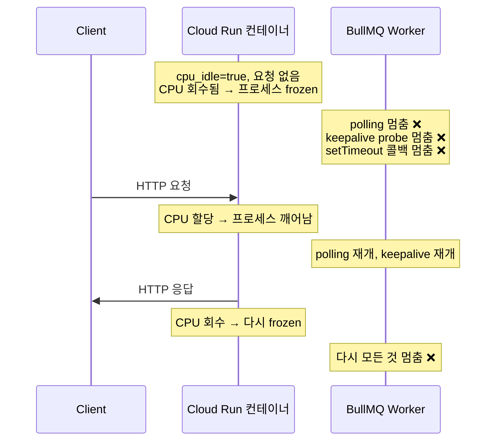

즉 `cpu_idle = true`이면:
- BullMQ Worker의 polling이 멈춤
- keepalive probe도 보내지 못함 → VPC idle timeout까지 유발
- delayed job 실행 시점을 놓침

아무리 keepAlive를 설정해도 CPU가 없으면 소용이 없다. Cloud Run에서 BullMQ Worker처럼 백그라운드 프로세스를 돌린다면, **반드시 `cpu_idle = false`로 설정**해야 한다.

### 비용 영향

`cpu_idle = false`로 바꾸면 요청이 없어도 항상 CPU가 할당되므로 비용이 증가한다. 실제로 얼마나 차이가 나는지 보자.

**Cloud Run 과금 단가 (Tier 1 리전 기준):**

| | cpu_idle=true (요청 시만 과금) | cpu_idle=false (항상 과금) |
|--|--|--|
| CPU | $0.000024 / vCPU-초 | $0.000018 / vCPU-초 |
| 메모리 | $0.0000025 / GiB-초 | $0.0000025 / GiB-초 |

`cpu_idle=false`의 vCPU 단가가 25% 저렴하지만, **항상 과금**되므로 총 비용은 높아진다.

**월간 비용 비교 (1 vCPU, 512MiB, 24/7 운영, 요청 처리 비율 10% 가정):**

| | cpu_idle=true | cpu_idle=false |
|--|--|--|
| CPU 과금 시간 | 전체의 10% (요청 처리 중만) | 전체의 100% |
| CPU 비용 | ~$6.22 | ~$46.66 |
| 메모리 비용 | ~$0.32 | ~$3.24 |
| **월 합계** | **~$6.54** | **~$49.90** |

약 **7~8배** 차이가 난다. BullMQ Worker를 위해 `cpu_idle = false`를 설정하면 비용이 증가하므로, Worker 전용 인스턴스를 분리하거나 적절한 vCPU/메모리 스펙을 선택하는 것이 좋다.

> 이것도 수정했다. 이제는 되겠지?

---

## 그런데 여전히 안 된다

keepAlive도 넣고, cpu_idle도 껐다. 그런데 **여전히 간헐적으로 잡이 실행되지 않았다**.

다시 로그를 자세히 들여다보니, 이상한 점이 보였다. Worker가 잡을 가져가긴 하는데, **DB에서 해당 데이터를 찾지 못하고 skip하는 로그**가 있었다. 자기 서비스에서 등록한 잡이 아닌데 가져간 것이다.

---

## 진짜 원인: 큐 이름 충돌

인프라를 다시 확인해보니, **두 개의 서비스가 같은 Redis 인스턴스에서 같은 큐 이름을 사용**하고 있었다.

이 프로젝트는 모노레포 구조로, 여러 서비스가 공통 라이브러리를 공유한다. 공통 라이브러리에 BullMQ 큐 이름이 상수로 하드코딩되어 있었고, 각 서비스가 이 라이브러리를 그대로 가져다 쓰면서 동일한 큐 이름을 사용하게 됐다. 서로 다른 서비스를 각각 다른 개발자가 작업하다 보니, Redis를 공유한다는 사실과 큐 이름이 겹친다는 점을 아무도 인지하지 못했다.

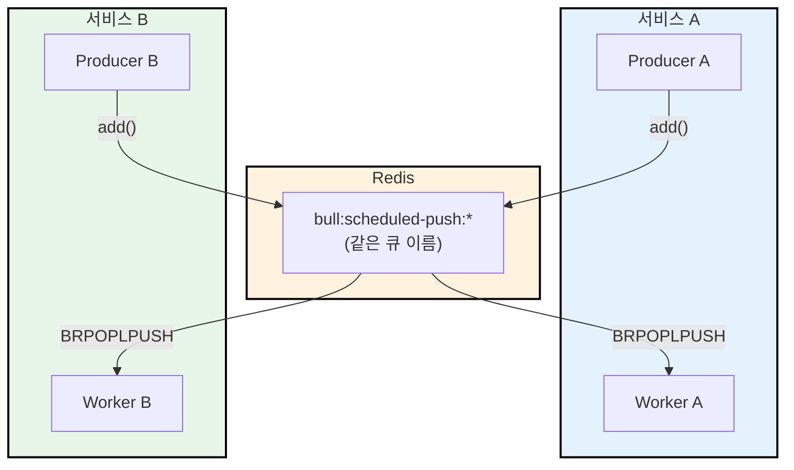

BullMQ의 `BRPOPLPUSH`는 원자적 연산으로, **아무 Worker나 먼저 가져간다**. 서비스 A가 등록한 잡을 서비스 B의 Worker가 가져가면:

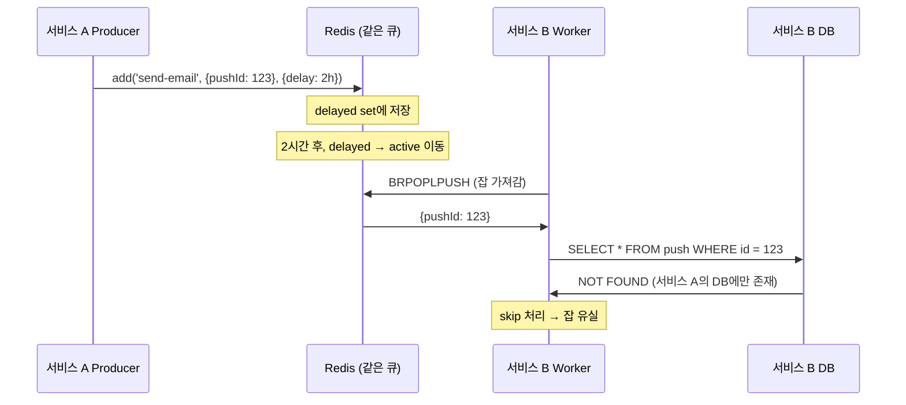

각 서비스는 **별도의 데이터베이스**를 사용하므로, 서비스 B의 Worker가 서비스 A의 잡을 가져가면 DB에서 데이터를 찾지 못하고 skip한다. 잡은 이미 active에서 빠졌으므로 다시 실행되지 않는다.

### 왜 delay가 길수록 실패 확률이 높았나

delay가 길수록 잡이 Redis의 delayed set에 오래 머물고, 그 사이 다른 서비스의 Worker가 active list에서 먼저 가져갈 기회가 많아진다. 5분 delay가 성공한 건 VPC idle timeout 때문이 아니라, 짧은 시간 안에 올바른 Worker가 먼저 가져갈 확률이 높았기 때문이다.

### 해결: 서비스별 큐 이름 분리

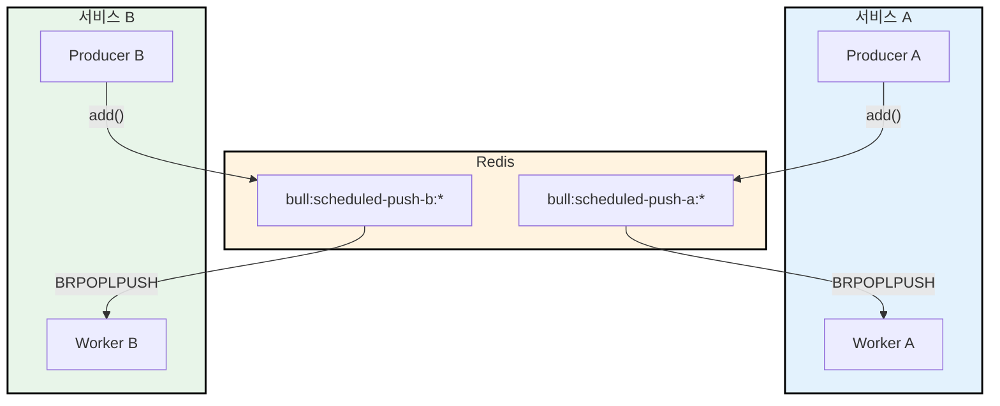

큐 이름을 서비스별로 분리하면, 각 Worker는 자기 서비스의 잡만 가져간다. 경쟁 소비 문제가 원천 차단된다.

---

## 정리

BullMQ delayed job이 실행되지 않을 때, 세 가지 레이어를 모두 확인해야 한다:

| # | 함정 | 증상 | 해결 |
|---|------|------|------|
| 1 | **VPC Connector idle timeout** | 10분 이상 idle 시 TCP 연결이 조용히 끊김 → Worker의 Redis 통신 지연 | `enableKeepAlive: true, keepAliveInitialDelay: 30000` |
| 2 | **Cloud Run cpu_idle** | HTTP 요청 없으면 CPU 중단 → Worker와 keepalive 모두 멈춤 | `cpu_idle = false` |
| 3 | **큐 이름 충돌** | 여러 서비스가 같은 큐를 공유 → 경쟁 소비로 잡 유실 | 서비스별 큐 이름 분리 |

세 가지는 각각 다른 레이어의 문제이며, **모두 수정이 필요**하다:

- **1번 (네트워크)**: Cloud Run에서 VPC Connector를 경유하는 장시간 TCP 연결(Redis, PostgreSQL, gRPC 등)에는 반드시 keepAlive를 설정해야 한다.
- **2번 (런타임)**: Cloud Run에서 백그라운드 프로세스를 돌리려면 `cpu_idle = false`가 필수다. CPU가 없으면 keepAlive조차 동작하지 않는다.
- **3번 (애플리케이션)**: 여러 서비스가 Redis를 공유할 때, 큐 이름이 겹치지 않는지 반드시 확인해야 한다.

이번 케이스에서 직접적인 잡 유실의 원인은 3번(큐 이름 충돌)이었지만, 1번과 2번이 해결되지 않았다면 큐 이름을 분리해도 잡 실행이 지연되는 문제는 남아있었을 것이다. 결국 세 가지를 모두 점검해야 BullMQ delayed job이 안정적으로 동작한다.
