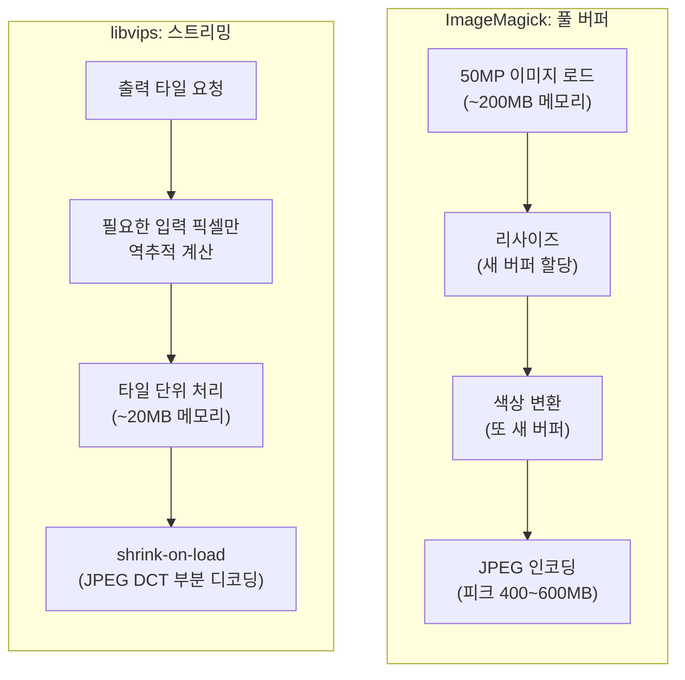
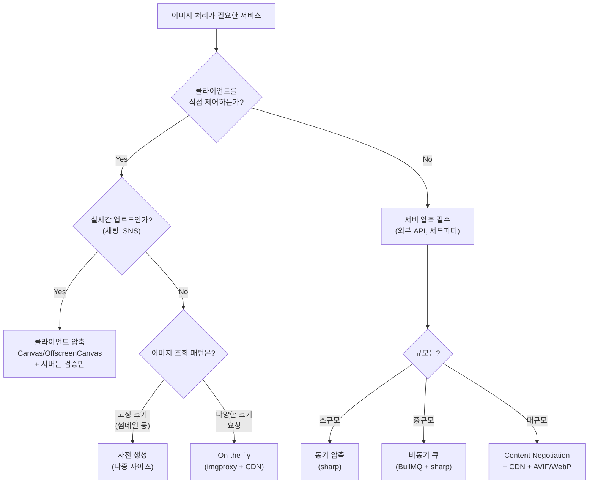

이 글은 [채팅 앱에서 이미지 업로드 아키텍처 설계하기](/post/Network/채팅-앱-이미지-업로드-아키텍처) 글의 이미지 압축 섹션에서 이어지는 글이다. 기존 글에서 "Canvas API로 JPEG 80% 압축"이라고 한 줄로 끝냈는데, 그 한 줄 뒤에서 실제로 어떤 알고리즘이 동작하는지 궁금해서 정리했다.

이 글에서 다루는 것: 포맷별 알고리즘 원리 -> 클라이언트 도구 -> 서버 도구 -> 실무 판단 기준.

---

## 1. 이미지 압축의 기본 원리

깊이 들어가기 전에 용어부터 가볍게 정리하고 가자.

### 손실 압축 vs 무손실 압축

- **손실 압축(Lossy)**: 사람이 인지하기 어려운 정보를 버려서 크기를 줄인다. JPEG, WebP lossy, AVIF.
- **무손실 압축(Lossless)**: 원본과 완전히 동일하게 복원 가능. PNG, WebP lossless, JPEG XL lossless.

### 손실 압축의 3단계 파이프라인

대부분의 손실 압축 포맷은 세 단계를 거친다.

```
원본 이미지 → [1. 변환] → [2. 양자화] → [3. 엔트로피 코딩] → 압축 파일
```

각 단계가 하는 일을 비유로 설명하면:

**1단계: 변환 (DCT / 예측 코딩)**

이미지를 "주파수" 성분으로 분해한다. 오디오에서 음악을 저음/고음으로 나누는 것과 비슷하다. 이미지에서 "저주파"는 넓은 영역의 색상 변화(하늘 그라데이션), "고주파"는 세밀한 디테일(텍스트 가장자리, 머리카락)이다.

**2단계: 양자화 (Quantization)**

고주파 성분을 거칠게 반올림한다. 사람의 눈은 고주파 변화에 둔감하기 때문에, 여기서 정보를 버려도 큰 차이를 느끼지 못한다. **"품질 80%"라는 설정이 실제로 제어하는 것이 바로 이 양자화 테이블의 공격성**이다. 80%면 적당히 반올림, 30%면 아주 거칠게 반올림.

**3단계: 엔트로피 코딩**

양자화 후 남은 데이터를 패턴 기반으로 압축한다. ZIP 압축과 비슷한 원리다. Huffman 코딩, 산술 코딩 등이 있는데, 산술 코딩이 2~5% 더 효율적이지만 더 느리다.

이 세 단계의 "어떤 변환을 쓰느냐", "얼마나 공격적으로 양자화하느냐", "어떤 엔트로피 코딩을 쓰느냐"가 포맷별 차이를 만든다.

---

## 2. 포맷별 알고리즘 비교

### 2-1. JPEG (1992) — DCT + Huffman

가장 오래되고 가장 범용적인 포맷이다. 이미지를 8x8 블록으로 나누고, 각 블록에 DCT(이산 코사인 변환)를 적용한 뒤 양자화하고 Huffman 코딩으로 압축한다.

JPEG의 핵심 라이브러리들은 모두 같은 표준(ISO/IEC 10918-1)을 구현하지만, 구현 최적화 수준이 다르다.

| 라이브러리 | 특징 | 인코딩 속도 | 파일 크기 | 사용처 |
|-----------|------|-----------|----------|--------|
| **libjpeg** | 원조 구현. SIMD 없음 | 1x (기준) | 기준 | 레거시 |
| **libjpeg-turbo** | SIMD 가속 (SSE2, AVX2, NEON). 압축률 동일 | 2~6x 빠름 | 동일 | Chrome, Firefox, sharp, Android |
| **MozJPEG** | libjpeg-turbo 포크. trellis 양자화 + progressive scan 최적화 + 개선된 Huffman | 2~10x 느림 | 10~20% 작음 | Cloudflare, imagemin |

libjpeg-turbo는 "같은 결과를 더 빠르게"에 집중하고, MozJPEG은 "더 느리지만 더 작은 파일"에 집중한다. 실시간 처리에는 libjpeg-turbo, 빌드타임 최적화에는 MozJPEG이 적합하다.

### 2-2. WebP (2010) — VP8 예측 코딩 + DCT + 산술 코딩

Google이 만든 포맷으로, VP8 비디오 코덱의 키프레임 압축을 이미지에 적용한 것이다.

JPEG과의 핵심 차이는 **"예측 -> 잔차 압축" 패러다임**이다.

```
JPEG:  원본 블록 → DCT → 양자화 → Huffman
WebP:  원본 블록 → 주변 픽셀로 예측 → (원본 - 예측) 잔차만 → DCT → 양자화 → 산술 코딩
```

주변 픽셀로 현재 블록을 "예측"하고, 예측이 맞은 부분은 저장할 필요가 없으니 **틀린 부분(잔차)만 압축**한다. 예측이 잘 맞을수록 잔차가 작고, 작은 값은 엔트로피 코딩으로 더 효율적으로 압축된다.

추가로 산술 코딩(Huffman보다 2~5% 효율적)과 인루프 디블로킹 필터(블록 경계 아티팩트 감소)를 사용한다.

결과: JPEG 대비 25~35% 작은 파일. 알파 채널(투명도) 지원.

### 2-3. AVIF (2019) — AV1 인트라 프레임

AV1 비디오 코덱의 키프레임을 이미지로 쓰는 포맷이다. WebP과 같은 "예측 -> 잔차 압축" 패러다임이지만, 예측 도구가 훨씬 정교하다.

**왜 압축률이 높은가:**

| 요소 | JPEG | WebP | AVIF |
|------|------|------|------|
| 블록 크기 | 8x8 고정 | 4x4~16x16 | 4x4~64x64 가변 |
| 예측 모드 | 없음 | 10가지 | **56가지** |
| 엔트로피 코딩 | Huffman | 산술 | ANS (비대칭 수 체계) |
| 인루프 필터 | 없음 | 디블로킹 | 디블로킹 + CDEF + 루프 복원 |

블록 크기가 가변적이므로 하늘 같은 넓은 영역은 64x64로 한 번에, 텍스트 같은 세밀한 영역은 4x4로 정밀하게 처리한다. 56가지 예측 모드로 주변 패턴을 더 정확하게 예측하니 잔차가 더 작아지고, 파일 크기가 줄어든다.

**왜 느린가:**

56가지 예측 모드 x 가변 블록 크기의 조합을 탐색해야 하므로 인코딩 시 탐색 공간이 엄청나게 넓다. 최적의 조합을 찾는 데 시간이 걸린다. JPEG 대비 40~55% 작은 파일을 만들지만, 인코딩 속도는 수십 배 느릴 수 있다.

### 2-4. HEIC — H.265 인트라 프레임

Apple 생태계의 기본 포맷이다. H.265(HEVC) 비디오 코덱의 키프레임을 이미지로 사용한다. AVIF와 비슷한 수준의 압축률(JPEG 대비 40~50% 작음)을 제공하지만, **MPEG-LA의 특허 라이센싱** 문제로 웹 브라우저에서 지원하지 않는다. 사실상 Apple 기기 간 전송 전용이다.

### 2-5. JPEG XL — VarDCT + 무손실 JPEG 재압축

JPEG의 정식 후계자를 목표로 만들어진 포맷이다. 두 가지 모드가 있다:

- **VarDCT 모드 (손실)**: 가변 크기 DCT. JPEG보다 효율적이지만 AVIF보다는 약간 큰 파일.
- **Modular 모드 (무손실)**: MA(Modular Arithmetic) 트리 기반.
- **JPEG 재압축**: 기존 JPEG 파일을 무손실로 ~20% 더 작게 만들 수 있다. 이건 다른 포맷에 없는 고유 기능이다.

브라우저 지원은 복잡한 이력을 가지고 있다. Safari 17+ (2023년 9월)에서 기본 지원을 시작했고, Chrome은 2023년에 실험적 플래그를 제거했다가 2026년 2월(Chrome 145)에 Rust 기반 디코더(`jxl-rs`)로 플래그 뒤에서 다시 지원을 시작했다. Firefox는 안정 버전에서 아직 미지원이다 (Nightly에서만 개발 중). 즉, 2026년 3월 기준 **기본 활성화는 Safari만**, Chrome은 플래그 필요, Firefox는 미지원이라 웹 전송용으로는 아직 이르다.

### 포맷 종합 비교표

| 포맷 | 압축률 (JPEG 대비) | 인코딩 속도 | 브라우저 지원 (2026) | 알파 채널 | HDR |
|------|-------------------|-----------|-------------------|----------|-----|
| **JPEG** | 기준 | 빠름 | 전체 | X | X |
| **WebP** | 25~35% 작음 | 빠름 | 전체 (Baseline) | O | X |
| **AVIF** | 40~55% 작음 | 매우 느림 | Chrome, Firefox, Safari | O | O |
| **HEIC** | 40~50% 작음 | 보통 | X (Apple만) | O | O |
| **JPEG XL** | 30~40% 작음 | 보통 | Safari 17+ 기본, Chrome 145+ 플래그, Firefox 미지원 | O | O |

---

## 3. 클라이언트에서의 압축 (웹 브라우저)

브라우저에서 이미지를 압축하는 방법은 크게 세 가지 계층이 있다.

### Canvas toBlob — 가장 기본적인 방법

```js
const canvas = document.createElement('canvas');
const ctx = canvas.getContext('2d');
canvas.width = targetWidth;
canvas.height = targetHeight;
ctx.drawImage(img, 0, 0, targetWidth, targetHeight);

canvas.toBlob(
  (blob) => { /* blob을 업로드 */ },
  'image/jpeg',
  0.8  // quality: 0.0~1.0 → 내부적으로 libjpeg quality 0~100에 매핑
);
```

내부적으로 브라우저가 내장한 네이티브 인코더를 사용한다. Chrome과 Firefox는 JPEG에 libjpeg-turbo, WebP에 libwebp를 사용한다.

주의할 점:
- `toDataURL`은 **동기**(메인 스레드 블로킹), `toBlob`은 **비동기**이지만 인코딩 자체는 메인 스레드에서 실행된다.
- PNG의 quality 파라미터는 무시된다(항상 무손실).
- quality 0.7~0.8이 sweet spot. 1MP 사진 기준 JPEG quality=0.8에서 ~150~250KB (원본 ~3MB 대비 10~20배 압축).

### OffscreenCanvas — Web Worker에서 압축

`toBlob`의 문제는 인코딩이 메인 스레드에서 실행되어 UI가 잠깐 멈출 수 있다는 것이다. 이미지 한 장이면 괜찮지만, 20장을 동시에 처리하면 UI 쟁크(jank)가 발생한다.

```js
// worker.js
self.onmessage = async (e) => {
  const { imageBitmap, width, height } = e.data;
  const canvas = new OffscreenCanvas(width, height);
  const ctx = canvas.getContext('2d');
  ctx.drawImage(imageBitmap, 0, 0, width, height);
  const blob = await canvas.convertToBlob({ type: 'image/jpeg', quality: 0.8 });
  self.postMessage(blob);
};
```

브라우저 지원: Chrome 69+, Firefox 105+, Safari 16.4+. 2025 기준 Baseline이므로 프로덕션에서 안심하고 쓸 수 있다. 코덱 자체는 브라우저 네이티브와 동일하고, 메인 스레드를 해방하는 것이 핵심이다.

### WebAssembly (squoosh, wasm-vips)

브라우저 내장 인코더 대신 MozJPEG, libaom 같은 고급 인코더를 WASM으로 컴파일해서 브라우저에서 돌리는 방식이다.

- **squoosh**: MozJPEG, libwebp, libaom(AVIF), libjxl(JPEG XL) 등을 WASM으로 제공. MozJPEG은 libjpeg 대비 10~20% 작은 파일을 만든다. 다만 AVIF 인코딩은 WASM에서 이미지당 수 초 걸려서 실시간 업로드에는 부적합하다. `@squoosh/lib`는 2022년 이후 사실상 미관리 상태이고, 2026년 현재 프로덕션급 대안도 없다. WASM 기반 브라우저 AVIF 인코딩이 필요하다면 개별 코덱 WASM 모듈을 직접 호스팅하는 수밖에 없는 상황이다.
- **wasm-vips**: libvips를 Emscripten으로 WASM 컴파일. 번들 ~8~15MB로 무거워서 일반 웹앱에는 비현실적.

### JS 라이브러리

| 라이브러리 | 기반 | 핵심 기능 | 비고 |
|-----------|------|----------|------|
| **browser-image-compression** | Canvas | 자동 해상도 축소, EXIF 처리, Web Worker 지원, 반복 압축으로 목표 크기 달성 | 가장 범용적 |
| **compressorjs** | Canvas | EXIF 처리, 가벼움 | 단순한 압축에 적합 |
| **pica** | Lanczos 리샘플링 | 리사이즈 품질 특화. Canvas의 bilinear보다 깨끗한 결과 | 압축이 아니라 리사이즈 품질이 핵심. 낮은 JPEG quality에서 artifact 감소 |

### WebP/AVIF Canvas 인코딩 지원 현황

| 포맷 | Canvas 인코딩 | 지원 현황 (2026) |
|------|-------------|-----------------|
| JPEG | `toBlob('image/jpeg')` | 전체 브라우저 |
| WebP | `toBlob('image/webp')` | 전체 브라우저 (Baseline) |
| AVIF | `toBlob('image/avif')` | Chrome 113+만. Firefox/Safari 미지원. **프로덕션 사용 불가** |
| JPEG XL | - | Canvas 인코딩 지원 없음 |

클라이언트에서 AVIF로 인코딩하고 싶다면 WASM(squoosh)을 쓰거나, WebCodecs API의 VideoEncoder로 AV1 키프레임을 우회 생성해야 하는데, 두 방법 모두 프로덕션 드롭인으로 쓰기에는 아직 부족하다.

### 브라우저 도구 비교

| 도구 | 포맷 | 속도 | 번들 크기 | 스레드 | 적합한 상황 |
|------|------|------|----------|--------|-----------|
| Canvas toBlob | JPEG, WebP | 빠름 (네이티브) | 0 | 메인 | 단일 이미지, 간단한 압축 |
| OffscreenCanvas | JPEG, WebP | 빠름 (네이티브) | 0 | Worker | 다중 이미지, UI 쟁크 방지 |
| browser-image-compression | JPEG, WebP | 빠름 | ~10KB | Worker 지원 | 범용 (추천) |
| pica + Canvas | JPEG, WebP | 빠름 | ~45KB | Worker 지원 | 고품질 리사이즈가 중요할 때 |
| squoosh (WASM) | JPEG, WebP, AVIF, JXL | 느림 (WASM) | ~수백KB~수MB | Worker | AVIF 클라이언트 인코딩, 빌드타임 |

대부분의 경우 **browser-image-compression**(또는 직접 Canvas/OffscreenCanvas)으로 충분하다. AVIF 클라이언트 인코딩이 필요한 특수한 상황에서만 WASM을 고려한다.

---

## 4. 서버에서의 압축

### 4-1. 라이브러리 비교

#### Node.js

| 라이브러리 | 기반 | 지원 포맷 | 속도 | 메모리 | 적합한 상황 |
|-----------|------|----------|------|--------|-----------|
| **sharp** | libvips (C) | JPEG, WebP, AVIF, HEIC, PNG, GIF | 매우 빠름 (200~400MB/s) | 낮음 (~20MB/50MP) | 프로덕션 이미지 처리 |
| **Jimp** | 순수 JS (jpeg-js, pngjs) | JPEG, PNG, BMP, GIF | 매우 느림 (sharp 대비 10~50x) | 높음 | 네이티브 컴파일 불가 환경 |
| **imagemin** | 외부 바이너리 래핑 (mozjpeg, pngquant, cwebp) | 다양 | 보통 | 보통 | 압축 전용 (리사이즈 없음). 2025 기준 유지보수 모드 |

#### Python

| 라이브러리 | 기반 | 특징 |
|-----------|------|------|
| **Pillow** | libjpeg(-turbo), libpng, libwebp | 범용. GIL 제한으로 동시성 주의 |
| **OpenCV** | cv2.imencode | NumPy 배열 기반. CV 파이프라인에 이미 있을 때 |
| **wand** | ImageMagick | 200+ 포맷. 느림. 보안 이슈(ImageTragick). PDF/SVG 변환 등 특수 용도 |

#### Go

| 라이브러리 | 기반 | 특징 |
|-----------|------|------|
| **bimg** | libvips (CGo) | sharp와 동급 성능. Go 프로덕션 서비스에 적합 |
| **stdlib image/*** | 순수 Go | SIMD 없음. 3~10x 느림. CGo 회피가 필요할 때 |
| **imaging** | 순수 Go | Lanczos 리사이즈 지원. 코덱은 stdlib 의존 |

#### libvips가 빠른 이유

sharp(Node.js), bimg(Go)의 핵심인 libvips와 ImageMagick의 아키텍처 차이가 성능 차이의 근본 원인이다.



| | ImageMagick | libvips |
|--|------------|---------|
| 처리 방식 | 전체 이미지를 메모리에 로드 후 순차 처리 | demand-driven: 출력에 필요한 픽셀만 역추적 |
| 메모리 (50MP) | ~200~400MB | ~20MB |
| 속도 | 1x | 4~5x 빠름 |
| 핵심 최적화 | - | shrink-on-load, 연산 퓨전, 워크스틸링 스레드 풀 |

libvips는 "필요한 것만, 필요할 때만" 계산하는 lazy evaluation 방식이다. JPEG의 경우 DCT 계수를 부분 디코딩(shrink-on-load)하여 리사이즈할 때 전체 픽셀을 디코딩하지 않아도 된다.

### 4-2. 이미지 처리 서비스

직접 라이브러리를 운영하지 않고 서비스로 위임하는 선택지도 있다.

| 서비스 | 아키텍처 | 특징 | 비용 |
|--------|---------|------|------|
| **imgproxy** | Go + libvips, 셀프호스팅 | HMAC URL 서명, CDN 뒤에 배치. 50~200ms/요청 | 인프라 비용만 |
| **Cloudinary** | SaaS | ML 기반 q_auto, CDN 통합 | 대역폭 + 변환 기반 과금 |
| **Cloudflare Image Resizing** | 엣지 변환 | format=auto (Accept 헤더 기반), Pro+ 플랜 필요 | Cloudflare 플랜에 포함 |
| **Lambda@Edge + sharp** | AWS 서버리스 | S3 원본 + CloudFront. 50MB 패키지 제한 | 요청 + 실행 시간 과금. cold start 300~800ms |
| **Thumbor** | Python + OpenCV | 스마트 크롭(얼굴 인식). Pillow 기반으로 느림 | 인프라 비용만 |

### 4-3. 서버 압축 전략

서버에서 이미지를 압축하는 타이밍과 방식에 따라 5가지 전략이 있다.

| 전략 | 동작 | 장점 | 단점 | 적합한 규모 |
|------|------|------|------|-----------|
| **동기 압축** | 업로드 API에서 즉시 압축 후 응답 | 단순한 구현 | 응답 지연 (AVIF는 수 초) | 소규모 |
| **비동기 큐** | 업로드 즉시 응답, BullMQ/SQS로 압축 작업 큐잉 | 빠른 응답, AVIF 등 느린 인코딩에 적합 | 별도 워커 인프라 필요 | 중규모 |
| **On-the-fly** | 원본만 저장, 요청 시 imgproxy 등으로 변환 | 원본 하나만 관리, 유연한 크기/포맷 변환 | 첫 요청 100~500ms, CDN 캐시 필수 | 중~대규모 |
| **다중 사이즈 사전 생성** | 업로드 시 썸네일/중간/원본 여러 벌 생성 | 응답 지연 0 | 스토리지 비용 증가, 크기 변경 시 재생성 필요 | WordPress 등 CMS |
| **Content Negotiation** | Accept 헤더 확인 → WebP/AVIF 자동 선택 | 브라우저별 최적 포맷 제공 | `Vary: Accept` 헤더 필수 (CDN 캐시 분리) | 대규모 |

### AVIF 인코더 비교

AVIF는 인코더 선택이 중요하다. 같은 포맷이라도 인코더에 따라 속도 차이가 크다.

| 인코더 | 언어 | 속도 | 특징 |
|--------|------|------|------|
| **libaom** | C | 매우 느림 (`--cpu-used 0`~`8`) | 레퍼런스 구현. 최고 압축률 |
| **rav1e** | Rust | 빠름 | 안전한 메모리 관리 |
| **SVT-AV1** | C (Intel) | 가장 빠름 | 프로덕션 AVIF에 가장 적합 |

서버에서 AVIF를 실시간으로 생성한다면 SVT-AV1이 사실상 유일한 선택지다. libaom은 빌드타임이나 비동기 큐에서만 현실적이다.

### PNG 압축 참고

PNG 자체는 무손실이지만, 최적화 여지가 있다:

| 도구 | 방식 | 압축률 | 특징 |
|------|------|--------|------|
| **pngquant** | 24비트 → 8비트 팔레트 변환 (손실) | 50~80% 축소 | TinyPNG이 내부적으로 사용 |
| **OxiPNG** | 무손실 재최적화 (Rust, libdeflate) | 5~20% 축소 | 품질 손실 없이 크기만 줄임 |

---

## 5. 실무 판단 기준: 어떤 조합을 선택할 것인가

### 시나리오별 의사결정



### 시나리오별 추천 조합

**채팅 앱** ([기존 글](/post/Network/채팅-앱-이미지-업로드-아키텍처)의 사례)

클라이언트(Capacitor 웹앱)에서 OffscreenCanvas + `convertToBlob('image/webp', 0.8)`로 1920px WebP 압축. 서버는 파일 크기/MIME 검증만 수행한다. 단, 카카오톡 이미지 URL처럼 외부에서 유입되는 경로는 서버(sharp)에서 압축한다. 실측 기준 아이폰 12MP 원본 5MB → WebP 280KB로 약 18배 압축, 3G 환경에서 업로드 시간 40초 → 2.2초.

**이커머스 (상품 이미지)**

서버에서 다중 사이즈 사전 생성(썸네일 150px, 중간 600px, 원본 1200px) + CDN Content Negotiation으로 WebP/AVIF 자동 선택. 상품 이미지는 한 번 올리고 수백만 번 조회하므로, 인코딩 시간보다 전송 크기가 중요하다.

**블로그/CMS**

imgproxy를 CDN 뒤에 배치하고 On-the-fly 변환. AVIF 우선, WebP 폴백. 원본 하나만 관리하면서 URL 파라미터로 크기/포맷을 제어할 수 있어 관리가 편하다.

### 2026년 포맷 선택 가이드

| 포맷 | 포지션 | 언제 선택하나 |
|------|--------|-------------|
| **WebP** | 안전한 선택 | 브라우저 호환성 걱정 없이 JPEG보다 25~35% 절약하고 싶을 때. 2026년 기준 Baseline |
| **AVIF** | 최적의 선택 | 최대 압축률이 필요하고, 인코딩 시간을 감당할 수 있을 때. 서버 비동기 생성 + CDN 캐시 조합으로 사용 |
| **JPEG** | 호환성의 선택 | 레거시 시스템, 이메일 첨부, 외부 API 연동 등 범용성이 최우선일 때 |
| **JPEG XL** | 미래의 선택 | Safari만 안정 지원, Chrome/Firefox 미지원으로 웹 전송용으로는 시기상조. 서버 측 기존 JPEG 무손실 재압축(~20% 절감)이나 아카이빙 용도로 검토 |

---

## 6. 정리

채팅 앱에서 `canvas.convertToBlob({ type: 'image/webp', quality: 0.8 })` 한 줄이면 이미지 압축은 끝난다. 그리고 대부분의 서비스에서 그 한 줄이면 충분하다.

하지만 그 한 줄 뒤에서 DCT가 주파수를 분해하고, 양자화 테이블이 고주파를 버리고, Huffman 코딩이 남은 데이터를 패킹하고 있다. WebP은 예측 코딩으로 잔차만 압축해서 25% 더 줄이고, AVIF는 56가지 예측 모드로 40% 더 줄인다. 서버에서는 libvips가 타일 단위 스트리밍으로 메모리 20MB만 써서 50MP 이미지를 처리하고, imgproxy가 CDN 뒤에서 On-the-fly 변환을 한다.

이 동작 원리를 알면 다음 프로젝트에서 "클라이언트에서 할까 서버에서 할까", "WebP으로 갈까 AVIF로 갈까", "동기로 할까 큐로 돌릴까"를 더 빠르게, 더 근거 있게 판단할 수 있다.

한 가지 유의할 점: 이 글의 압축률 수치(JPEG 대비 25~35%, 40~55% 등)는 일반적인 사진 기준이다. 텍스트 위주 이미지, 일러스트, 스크린샷 등 이미지 특성에 따라 결과는 크게 달라지므로 참고용으로만 사용하고, 실제 서비스에 적용할 때는 본인의 이미지셋으로 벤치마크하는 것을 권장한다.
