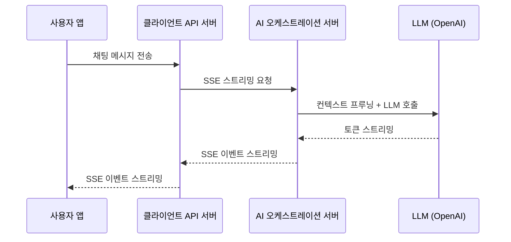

> 사용자 TTFB가 16~22초였다. LLM도, 인프라도 문제가 없었다. 범인은 `flushHeaders()` 한 줄의 부재였다. 구간별 측정 체계를 구축하고 하루 만에 원인을 특정했으며, 수정 후 TTFB는 6초대로 떨어졌다.

---

## 시스템 맥락

AI 채팅 서비스의 백엔드입니다. 사용자가 메시지를 보내면 AI 에이전트가 LLM을 호출해 답변을 스트리밍으로 내려줍니다. 답변 품질만큼이나 첫 토큰이 얼마나 빨리 뜨는지가 체감 성능에 직접적인 영향을 줍니다.

백엔드는 두 개의 NestJS 서비스로 구성되어 있습니다.



- **클라이언트 API 서버**: 사용자 앱과 직접 통신하는 메인 API 서버
- **AI 오케스트레이션 서버**: LLM 호출, 컨텍스트 프루닝, 제안 생성 등 AI 오케스트레이션 담당
- 두 서비스 모두 Cloud Run(Gen2)에서 운영 중
- 서비스 간 통신은 SSE(Server-Sent Events) 스트리밍

---

## 문제: 스트리밍인데 왜 한꺼번에 오는가

개발 중 테스트를 하다가 응답이 너무 오래 걸리는 게 느껴졌습니다. 처음에는 LLM 호출 자체가 느린 것으로 추측했습니다. 그런데 AI 오케스트레이션 서버 내부 로그를 보면 LLM TTFB는 5~6초 수준이었습니다. 분명 스트리밍으로 구현했는데, 화면에서는 답변이 점진적으로 나타나지 않고 16초 뒤에 전체가 한꺼번에 표시되고 있었습니다.

내부와 외부 사이 어딘가에서 스트림이 막히고 있었습니다.

---

## 구간별 성능 측정 체계 구축

문제를 추측으로 해결하려는 시도는 이미 여러 차례 실패했습니다. 정확한 측정 없이는 진짜 병목을 찾을 수 없다고 판단하고, 먼저 E2E 성능 측정 체계를 구축했습니다.

GCP Cloud Logging에서 필터링할 수 있도록 `[AGENT-RESPONSE-TIME-TEST]` 프리픽스를 붙인 로그를 핵심 세 구간에 삽입했습니다.

### 구간 1: 프록시 계층 — `fetchTtfbMs`

클라이언트 API 서버에서 AI 오케스트레이션 서버로 `fetch()` 요청을 보내는 시점부터 HTTP 응답 헤더가 돌아오는 시점까지를 측정합니다. SSE 스트리밍이 정상이라면 `fetchTtfbMs`는 수백 밀리초 이내여야 합니다. fetch() Promise가 해소되는 시점이 곧 HTTP 응답 헤더를 수신한 시점이기 때문입니다.

```typescript
async function measureSseRequest(url: string, body: object): Promise<void> {
  const t0 = performance.now();

  const request = new Request(url, {
    method: 'POST',
    headers: { 'Content-Type': 'application/json', Accept: 'text/event-stream' },
    body: JSON.stringify(body),
  });

  const requestPrepareMs = Math.round(performance.now() - t0);
  const fetchStart = performance.now();

  const response = await fetch(request); // 헤더 수신 시점에 resolve
  const fetchTtfbMs = Math.round(performance.now() - fetchStart);

  console.log('[AGENT-RESPONSE-TIME-TEST] proxy-fetch', {
    requestPrepareMs,
    fetchTtfbMs,
    status: response.status,
  });

  // 구간 2: 스트림 소비 측정
  let firstChunkMs: number | null = null;
  let chunkCount = 0;
  const streamStart = performance.now();
  const reader = response.body!.getReader();
  const decoder = new TextDecoder();

  while (true) {
    const { done, value } = await reader.read();
    if (done) break;
    chunkCount++;
    if (firstChunkMs === null) {
      firstChunkMs = Math.round(performance.now() - streamStart);
    }
    // 청크 처리 로직 ...
    void decoder.decode(value);
  }

  const totalStreamMs = Math.round(performance.now() - streamStart);
  const totalMs = Math.round(performance.now() - t0);

  console.log('[AGENT-RESPONSE-TIME-TEST] stream-summary', {
    firstChunkMs,
    chunkCount,
    totalStreamMs,
    totalMs,
  });
}
```

GCP Cloud Logging에서 다음 필터로 조회합니다.

```
resource.type="cloud_run_revision"
textPayload=~"\[AGENT-RESPONSE-TIME-TEST\]"
```

### 구간 2: E2E 스트림 타이밍 — `firstChunkMs`, `chunkCount`

스트림 루프 안에서 첫 번째 청크 도착 시점(`firstChunkMs`), 청크 수(`chunkCount`), 전체 스트림 소요 시간(`totalStreamMs`)을 기록합니다. 오케스트레이션 서버가 전송하는 `performance_summary` 이벤트도 함께 수집하여, 서버 내부 소요 시간과 클라이언트 측 수치를 교차 검증할 수 있도록 했습니다.

### 구간 3: 자동 응답 트리거

서버 푸시 기반 자동 응답 기능도 동일한 방식으로 `preFetchSetupMs`, `fetchTtfbMs`, `streamProcessMs`를 측정했습니다.

---

## 병목 지점 특정

로그를 배포하고 GCP Cloud Logging에서 `[AGENT-RESPONSE-TIME-TEST]`로 필터링해 데이터를 모았습니다. 결과는 명확했습니다.

| 측정 구간 | 측정값 | 기대값 | 판정 |
|-----------|--------|--------|------|
| AI 오케스트레이션 서버 내부 TTFB | 5,800ms | 5~7초 (LLM 특성상 허용) | 정상 |
| 클라이언트 API 서버 `fetchTtfbMs` | 16,127ms | < 500ms | **이상** |
| 스트림 소비 시간 (`totalStreamMs` - `firstChunkMs`) | 5~16ms | 6~16초 | **이상** |
| 청크 수신 간격 | 한 번에 전부 | 점진적 수신 | **이상** |

`fetchTtfbMs`가 16,127ms라는 것은 클라이언트 API 서버의 `fetch()` Promise가 AI 오케스트레이션 서버의 전체 처리가 끝날 때까지 해소되지 않았다는 뜻입니다. 스트림이 흐르는 게 아니라, 모든 데이터를 버퍼링한 뒤 한꺼번에 응답하고 있었습니다.

`chunkCount`를 보니 수십 개여야 할 청크가 거의 동시에 도착했고, 스트림 소비 시간이 5~16ms에 불과했습니다. 스트리밍이 아니라 버퍼드 응답이었습니다.

---

## 원인 분석

병목 구간이 특정되었으니, 이제 원인을 찾아야 했습니다. 후보는 세 가지였습니다.

| 원인 후보 | 확률 | 근거 |
|-----------|------|------|
| `flushHeaders()` 미호출 | **HIGH** | `res.setHeader()`는 헤더를 큐에만 넣음. 첫 이벤트 전 헤더가 전송되지 않으면 HTTP 응답 자체가 시작되지 않음 |
| NestJS 인터셉터 간섭 | MEDIUM | 인터셉터의 `tap()` 옵저버가 핸들러 리턴 시점에 실행되면서 타이밍에 개입할 가능성 |
| Cloud Run 네트워크 버퍼링 | LOW | Gen2 환경으로 스트리밍 지원. `X-Accel-Buffering: no` 설정 확인. HTTP/1.1 사용 중 |

**NestJS 인터셉터**: 인터셉터를 임시로 모두 제거하고 동일한 요청을 보냈지만, `fetchTtfbMs`는 여전히 16초대였습니다. 인터셉터는 원인이 아니었습니다.

**Cloud Run 버퍼링**: `X-Accel-Buffering: no` 헤더가 이미 설정되어 있었고, Cloud Run Gen2는 스트리밍을 네이티브로 지원합니다. 인프라 레벨에서 버퍼링이 발생하는 구조가 아니었습니다.

남은 후보는 하나였습니다.

`res.setHeader()`는 내부 큐에 헤더를 등록할 뿐, 클라이언트로 즉시 전송하지 않습니다. Express/Node.js는 첫 번째 `res.write()` 또는 `res.end()` 호출 시점에 헤더를 함께 전송합니다. 첫 번째 이벤트를 쓰기 전에 HTTP 응답이 시작되지 않으면, 클라이언트 입장에서는 연결이 열렸는지조차 알 수 없습니다. SSE 구현에서 `flushHeaders()`는 선택이 아니라 필수입니다.

---

## 수정 적용

**Before**

```typescript
// flushHeaders() 없는 상태
res.setHeader('Content-Type', 'text/event-stream');
res.setHeader('Cache-Control', 'no-cache');
res.setHeader('Connection', 'keep-alive');
res.setHeader('X-Accel-Buffering', 'no');
// 여기서 HTTP 응답은 아직 시작되지 않음
// 첫 res.write() 호출 전까지 클라이언트는 연결 여부조차 알 수 없음

for await (const chunk of stream) {
  res.write(`data: ${JSON.stringify(chunk)}\n\n`); // 이 시점에 헤더 + 데이터가 함께 전송됨
}
```

**After**

```typescript
res.setHeader('Content-Type', 'text/event-stream');
res.setHeader('Cache-Control', 'no-cache');
res.setHeader('Connection', 'keep-alive');
res.setHeader('X-Accel-Buffering', 'no');
res.flushHeaders(); // 이 시점에 HTTP 응답 시작. 클라이언트 fetch() Promise 해소

for await (const chunk of stream) {
  res.write(`data: ${JSON.stringify(chunk)}\n\n`); // 이후부터 점진적 스트리밍
}
```

`flushHeaders()`를 호출하는 순간 HTTP 응답이 시작됩니다. 클라이언트의 `fetch()` Promise가 이 시점에 해소되고, 이후 이벤트는 스트림으로 점진적으로 전달됩니다.

---

## 결과

| 지표 | 개선 전 | 개선 후 | 개선율 |
|------|---------|---------|--------|
| 클라이언트 API 서버 `fetchTtfbMs` | 16,127ms | < 500ms | 97% ↓ |
| 사용자 첫 토큰 수신 (TTFB) | 16~22초 | 6~7초 | ~60% ↓ |
| 스트림 체감 방식 | 전체가 한꺼번에 표시 | 토큰이 점진적으로 표시 | - |

`fetchTtfbMs`가 16초에서 500ms 이하로 떨어진 것은 SSE 스트리밍이 의도한 대로 동작하기 시작했다는 직접적인 증거입니다. 사용자 TTFB도 6~7초로 줄었는데, 이는 AI 오케스트레이션 서버 내부 LLM TTFB(5~6초)와 거의 일치합니다. 서비스 간 구간에서 더 이상 불필요한 지연이 없습니다.

---

## 핵심 교훈

### 측정 없이는 최적화 없다

처음에 가장 많은 시간을 낭비한 지점은 원인을 가정하고 수정을 반복했던 것입니다. "LLM이 느린 것 아닐까", "Cloud Run 설정 문제 아닐까" 하는 추측이 반복되었습니다. `[AGENT-RESPONSE-TIME-TEST]` 로그를 넣고 구간별 수치를 보는 데 걸린 시간은 반나절이었지만, 그 데이터가 있었기에 원인을 하루 만에 특정할 수 있었습니다.

서비스 간 통신이 포함된 성능 문제는 특히 E2E 측정이 중요합니다. 각 서비스 내부에서는 정상으로 보여도, 서비스 경계에서 지연이 발생하는 경우가 많습니다.

### NestJS에서 SSE를 구현할 때 반드시 확인할 것

헤더 설정 후 첫 번째 이벤트를 쓰기 전에 반드시 `res.flushHeaders()`를 호출해야 합니다. 이 한 줄이 없으면 HTTP 응답이 첫 이벤트 전까지 시작되지 않습니다. NestJS에서 SSE 엔드포인트를 구현한다면, `res.flushHeaders()` 호출이 빠져있지 않은지 반드시 확인하시기 바랍니다.

---

## 한계와 남은 과제

6~7초라는 TTFB는 LLM 추론 시간이 지배적이기 때문에 현재 구조에서 크게 단축하기 어렵습니다. 다만 몇 가지 개선 방향을 검토하고 있습니다.

- **컨텍스트 프루닝 최적화**: AI 오케스트레이션 서버 내부에서 컨텍스트 프루닝이 LLM 호출 전에 동기적으로 실행됩니다. 이 부분을 최적화하면 TTFB를 1~2초 더 줄일 수 있을 것으로 보입니다.
- **스트리밍 파이프라인 모니터링**: 이번에 구축한 측정 체계를 Grafana 대시보드로 연결해 TTFB 이상 징후를 실시간으로 감지할 수 있도록 할 예정입니다.

비슷한 구조에서 스트리밍 지연을 겪고 계신 분들께 조금이나마 참고가 되길 바랍니다.
