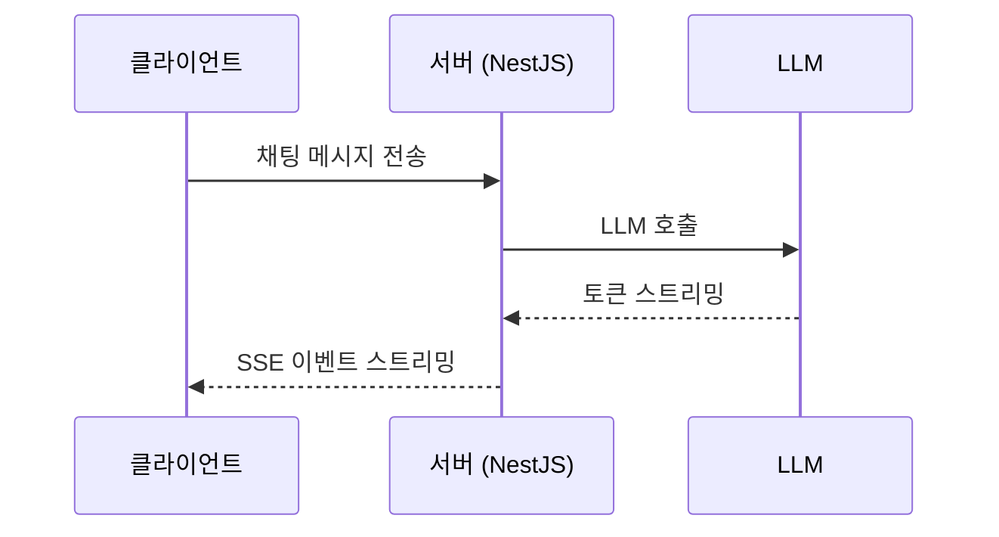

## 시스템 맥락

AI 채팅 서비스의 백엔드입니다. 사용자가 메시지를 보내면 AI 에이전트가 LLM을 호출해 답변을 스트리밍으로 내려줍니다. 답변 품질만큼이나 첫 토큰이 얼마나 빨리 뜨는지가 체감 성능에 직접적인 영향을 줍니다.



서버는 NestJS 기반이며, 클라이언트의 요청을 받아 LLM을 호출하고 응답을 SSE(Server-Sent Events)로 스트리밍합니다.

---

## 문제: 스트리밍인데 왜 한꺼번에 오는가

개발 중 테스트를 하다가 응답이 너무 오래 걸리는 게 느껴졌습니다. 질문을 보내면 16초간 아무 반응이 없다가, 답변 전체가 한꺼번에 나타났습니다. 스트리밍이 아니라 동기 API처럼 동작하고 있었습니다.

분명 스트리밍으로 구현했는데, 화면에서는 16초 뒤에 전체가 한꺼번에 표시되고 있었습니다. 내부와 외부 사이 어딘가에서 스트림이 막히고 있었습니다.

---

## 추측으로 실패한 과정

처음에는 원인을 가정하고 수정을 반복했습니다.

**"LLM이 느린 것 아닐까"** — 서버 내부 로그를 확인했습니다. LLM TTFB는 5~6초 수준이었고 정상 범위였습니다. LLM 자체의 문제가 아니었습니다.

**"콜드스타트 문제 아닐까"** — 서버리스 컨테이너 플랫폼에서 실행 중이었기 때문에 처음에는 콜드스타트를 의심했습니다. 워밍업된 인스턴스에 요청을 보냈지만 결과는 동일했습니다. 16초 지연은 콜드스타트와 무관했습니다.

**"네트워크 지연 아닐까"** — 두 서비스는 같은 리전에서 운영 중입니다. 서비스 간 네트워크 왕복 지연은 수십 밀리초 수준이어야 합니다. 16초는 네트워크로 설명할 수 없는 수치였습니다.

세 가지 추측이 모두 기각되었습니다. 추측으로는 더 이상 진전이 없었고, 구간별로 정확히 측정하는 것 외에 방법이 없었습니다.

---

## 구간별 성능 측정 체계 구축

클라이언트에서 서버로 `fetch()` 요청을 보내는 시점부터 HTTP 응답 헤더가 돌아오는 시점까지를 `fetchTtfbMs`로 측정했습니다.

`fetch()` Promise가 해소되는 시점이 곧 HTTP 응답 헤더를 수신한 시점입니다. SSE 스트리밍이 정상이라면 서버가 헤더를 즉시 보내야 하므로 `fetchTtfbMs`는 수백 밀리초 이내여야 합니다. 만약 이 값이 크다면 서버가 응답을 버퍼링하고 있다는 뜻입니다.

```typescript
const fetchStart = performance.now();
const response = await fetch(request); // 헤더 수신 시점에 resolve
const fetchTtfbMs = Math.round(performance.now() - fetchStart);

console.log('[AGENT-RESPONSE-TIME-TEST]', {
  fetchTtfbMs,
  status: response.status,
});
```

이와 함께 스트림 루프 안에서 첫 번째 청크 도착 시점(`firstChunkMs`)과 청크 수(`chunkCount`)도 기록했습니다. 서버 내부 소요 시간과 클라이언트 측 수치를 교차 검증하기 위해서였습니다.

---

## 병목 지점 특정

로그를 배포하고 데이터를 모았습니다. 결과는 명확했습니다.

| 측정 구간 | 측정값 | 기대값 | 판정 |
|-----------|--------|--------|------|
| 서버 내부 LLM TTFB | 5,800ms | 5~7초 (LLM 특성상 허용) | 정상 |
| 클라이언트 `fetchTtfbMs` | 16,127ms | < 500ms | **이상** |
| 스트림 소비 시간 | 5~16ms | 6~16초 | **이상** |
| 청크 수신 간격 | 한 번에 전부 | 점진적 수신 | **이상** |

수치를 보고 단계적으로 추론했습니다.

`fetchTtfbMs`가 16,127ms라는 것은 `fetch()` Promise 자체가 16초 동안 resolve되지 않았다는 뜻입니다. `fetch()` Promise는 HTTP 응답 헤더를 수신하는 순간 resolve됩니다. 즉, 서버가 16초 동안 HTTP 응답을 아예 시작하지 않은 것입니다.

그렇다면 그 16초 동안 서버는 무엇을 하고 있었을까요. 스트림 소비 시간이 5~16ms에 불과하고, 수십 개여야 할 청크가 거의 동시에 도착했습니다. 서버가 LLM으로부터 토큰을 스트리밍으로 받으면서도 클라이언트로는 내보내지 않고 내부에서 버퍼링하다가, 처리가 완전히 끝난 뒤 한꺼번에 응답하고 있었다는 결론이 나왔습니다.

서버 내부는 5~6초로 정상이었으므로, 문제는 LLM도 네트워크도 아니었습니다. 서버가 응답을 "내보내는 시점"이 잘못되어 있었습니다.

---

## 원인 분석

병목 구간이 특정되었으니, 이제 원인을 찾아야 했습니다. 후보는 세 가지였습니다.

| 원인 후보 | 확률 | 근거 |
|-----------|------|------|
| `flushHeaders()` 미호출 | **HIGH** | `res.setHeader()`는 헤더를 큐에만 넣음. 첫 이벤트 전 헤더가 전송되지 않으면 HTTP 응답 자체가 시작되지 않음 |
| NestJS 인터셉터 간섭 | MEDIUM | 인터셉터의 `tap()` 옵저버가 핸들러 리턴 시점에 실행되면서 타이밍에 개입할 가능성 |
| 서버리스 컨테이너 플랫폼 네트워크 버퍼링 | LOW | 스트리밍을 지원하는 환경. `X-Accel-Buffering: no` 설정 확인. HTTP/1.1 사용 중 |

**NestJS 인터셉터**: 인터셉터를 임시로 모두 제거하고 동일한 요청을 보냈습니다. `tap()` 옵저버가 타이밍에 개입하는지 확인하기 위해서였습니다. 그러나 `fetchTtfbMs`는 여전히 16초대였고, 인터셉터는 원인이 아니었습니다.

**서버리스 컨테이너 플랫폼 버퍼링**: `X-Accel-Buffering: no` 헤더가 이미 설정되어 있는지 확인했고, 실제로 응답 헤더에 포함되어 있었습니다. 해당 플랫폼은 HTTP/1.1 스트리밍을 네이티브로 지원하는 환경이었기 때문에, 인프라 레벨에서 버퍼링이 발생하는 구조가 아니었습니다.

남은 후보는 하나였습니다.

`res.setHeader()`는 내부 큐에 헤더를 등록할 뿐, 클라이언트로 즉시 전송하지 않습니다. Express/Node.js는 첫 번째 `res.write()` 또는 `res.end()` 호출 시점에 헤더를 함께 전송합니다. 첫 번째 이벤트를 쓰기 전에 HTTP 응답이 시작되지 않으면, 클라이언트 입장에서는 연결이 열렸는지조차 알 수 없습니다. SSE 구현에서 `flushHeaders()`는 선택이 아니라 필수입니다.

---

## 수정 적용

**Before**

```typescript
// flushHeaders() 없는 상태
res.setHeader('Content-Type', 'text/event-stream');
res.setHeader('Cache-Control', 'no-cache');
res.setHeader('Connection', 'keep-alive');
res.setHeader('X-Accel-Buffering', 'no');
// 여기서 HTTP 응답은 아직 시작되지 않음
// 첫 res.write() 호출 전까지 클라이언트는 연결 여부조차 알 수 없음

for await (const chunk of stream) {
  res.write(`data: ${JSON.stringify(chunk)}\n\n`); // 이 시점에 헤더 + 데이터가 함께 전송됨
}
```

**After**

```typescript
res.setHeader('Content-Type', 'text/event-stream');
res.setHeader('Cache-Control', 'no-cache');
res.setHeader('Connection', 'keep-alive');
res.setHeader('X-Accel-Buffering', 'no');
res.flushHeaders(); // 이 시점에 HTTP 응답 시작. 클라이언트 fetch() Promise 해소

for await (const chunk of stream) {
  res.write(`data: ${JSON.stringify(chunk)}\n\n`); // 이후부터 점진적 스트리밍
}
```

`res.flushHeaders()`는 Node.js `http.ServerResponse`의 메서드로, 큐에 쌓인 응답 헤더를 즉시 소켓에 기록합니다. 이 호출이 HTTP 응답의 상태 라인과 헤더를 클라이언트로 전송하는 시점을 결정합니다. 따라서 이 한 줄을 호출하는 순간 HTTP 응답이 시작되고, 클라이언트의 `fetch()` Promise가 해소됩니다. 이후 이벤트는 스트림으로 점진적으로 전달됩니다.

---

## 결과

| 지표 | 개선 전 | 개선 후 | 개선율 |
|------|---------|---------|--------|
| 클라이언트 `fetchTtfbMs` | 16,127ms | < 500ms | 97% ↓ |
| 사용자 첫 토큰 수신 (TTFB) | 16~22초 | 6~7초 | ~60% ↓ |
| 스트림 체감 방식 | 전체가 한꺼번에 표시 | 토큰이 점진적으로 표시 | - |

`fetchTtfbMs`가 16초에서 500ms 이하로 떨어진 것은 SSE 스트리밍이 의도한 대로 동작하기 시작했다는 직접적인 증거입니다. 사용자 TTFB도 6~7초로 줄었는데, 이는 서버 내부 LLM TTFB(5~6초)와 거의 일치합니다. 더 이상 불필요한 지연이 없습니다.

---

## 핵심 교훈

### 측정 없이는 최적화 없다

처음에는 원인을 가정하고 수정을 반복하는 데 가장 많은 시간을 낭비했습니다. "LLM이 느린 것 아닐까", "인프라 설정 문제 아닐까" 하는 추측이 반복되었습니다. `[AGENT-RESPONSE-TIME-TEST]` 로그를 넣고 구간별 수치를 보는 데 걸린 시간은 반나절이었지만, 그 데이터가 있었기에 원인을 하루 만에 특정할 수 있었습니다.

서비스 간 통신이 포함된 성능 문제는 특히 E2E 측정이 중요합니다. 각 서비스 내부에서는 정상으로 보여도, 서비스 경계에서 지연이 발생하는 경우가 많습니다.

### NestJS에서 SSE를 구현할 때 반드시 확인할 것

헤더 설정 후 첫 번째 이벤트를 쓰기 전에 반드시 `res.flushHeaders()`를 호출해야 합니다. 이 한 줄이 없으면 HTTP 응답이 첫 이벤트 전까지 시작되지 않습니다. NestJS에서 SSE 엔드포인트를 구현한다면, `res.flushHeaders()` 호출이 빠져있지 않은지 반드시 확인하시기 바랍니다.

---

## 한계와 남은 과제

6~7초라는 TTFB는 LLM 추론 시간이 지배적이기 때문에 현재 구조에서 크게 단축하기 어렵습니다. 다만 몇 가지 개선 방향을 검토하고 있습니다.

- **컨텍스트 프루닝 최적화**: 서버 내부에서 컨텍스트 프루닝이 LLM 호출 전에 동기적으로 실행됩니다. 이 부분을 최적화하면 TTFB를 1~2초 더 줄일 수 있을 것으로 보입니다.
- **스트리밍 파이프라인 모니터링**: 이번에 구축한 측정 체계를 모니터링 대시보드로 연결해 TTFB 이상 징후를 실시간으로 감지할 수 있도록 할 예정입니다.

비슷한 구조에서 스트리밍 지연을 겪고 계신 분들께 조금이나마 참고가 되길 바랍니다.
