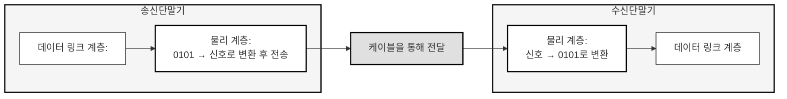
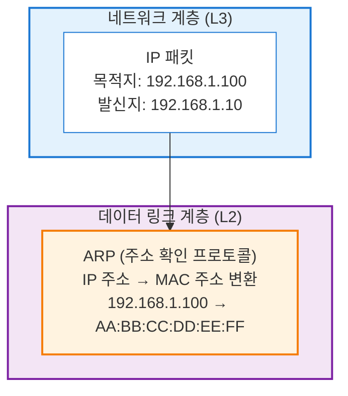
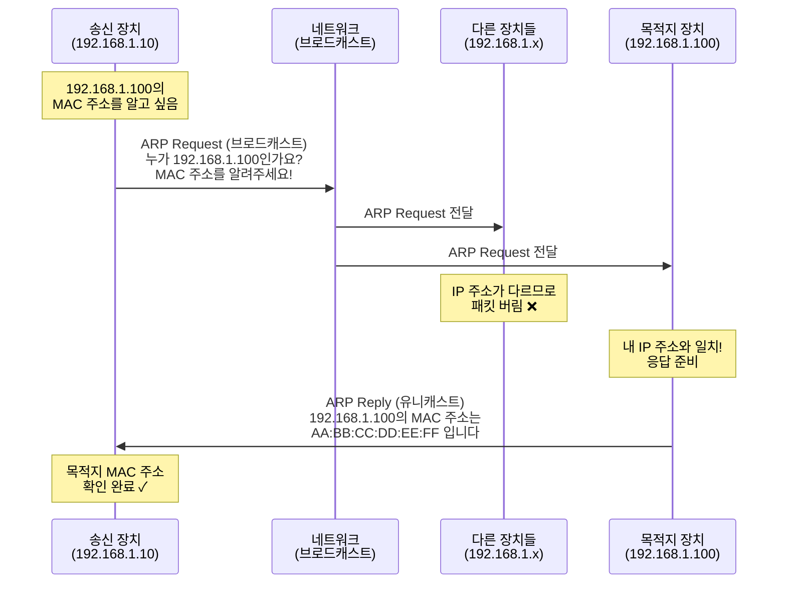
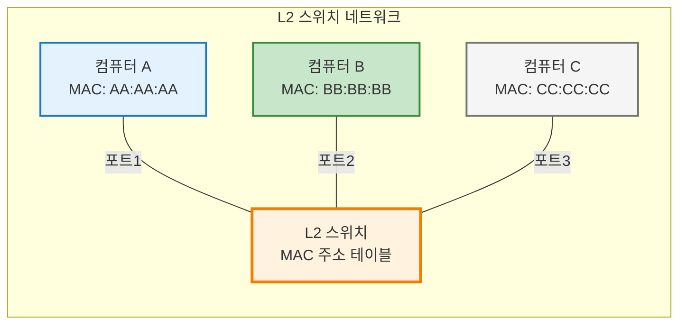
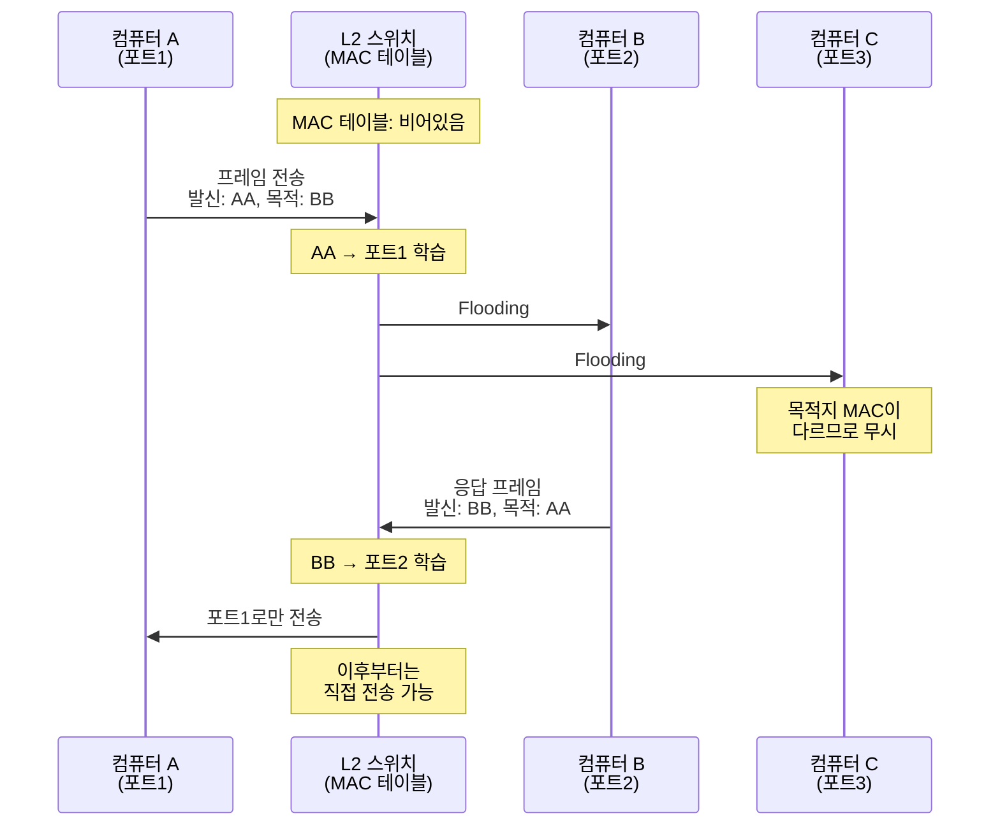
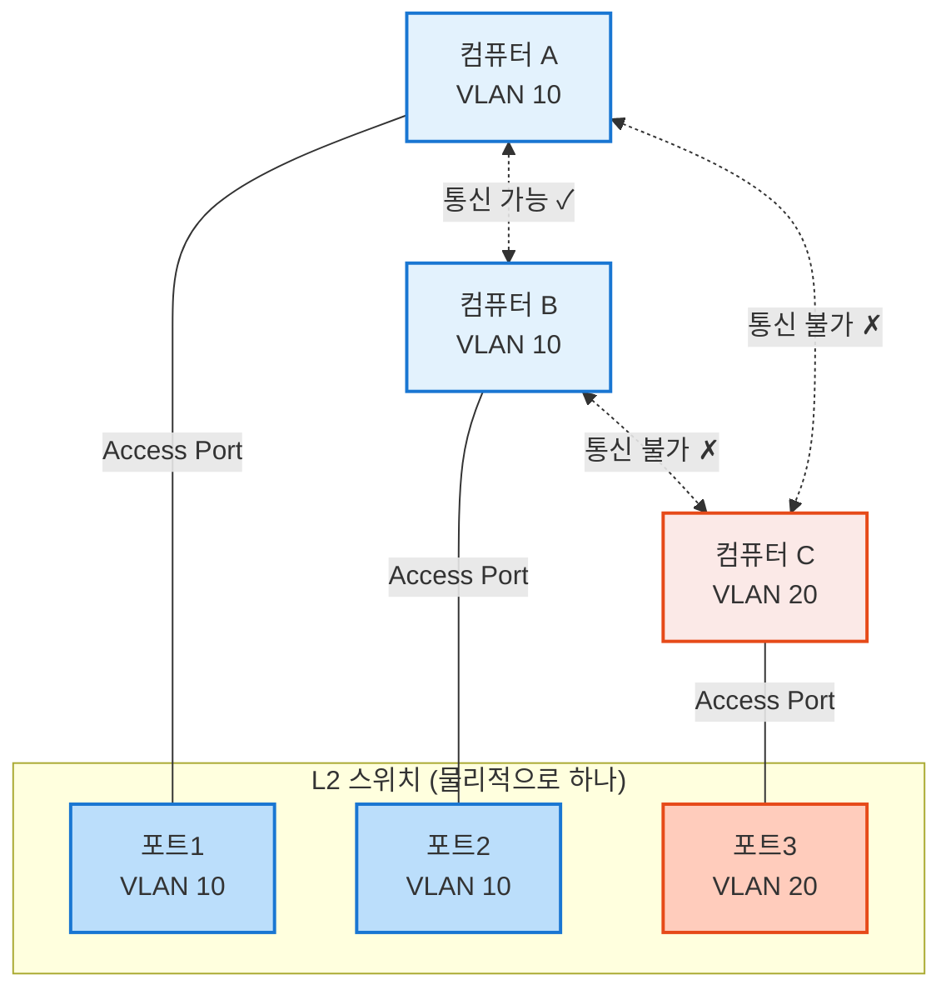
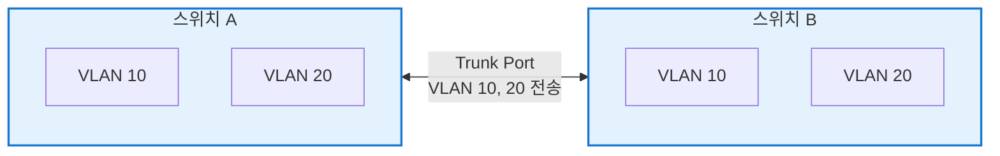
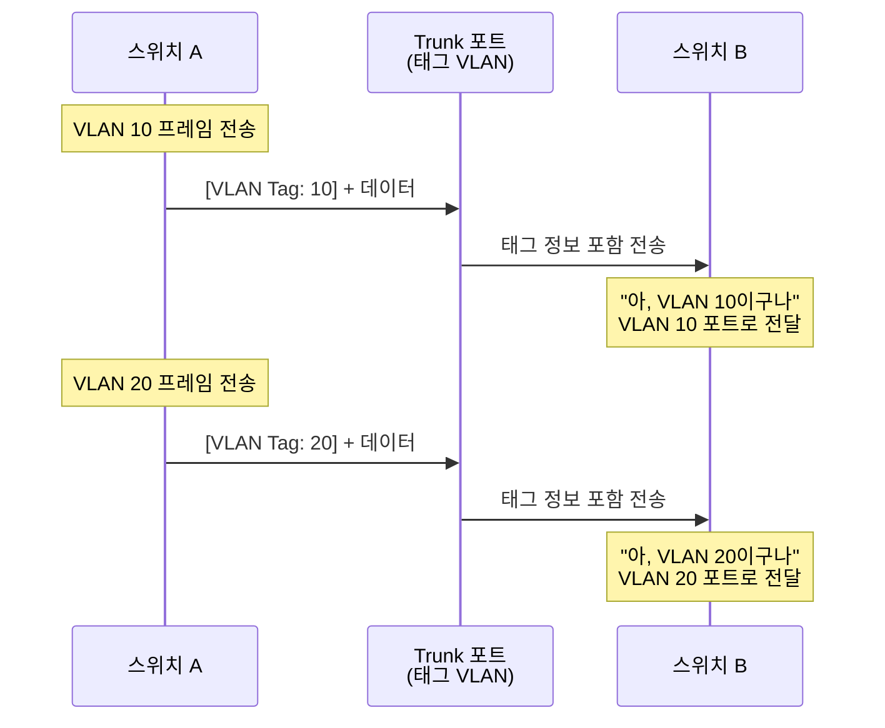
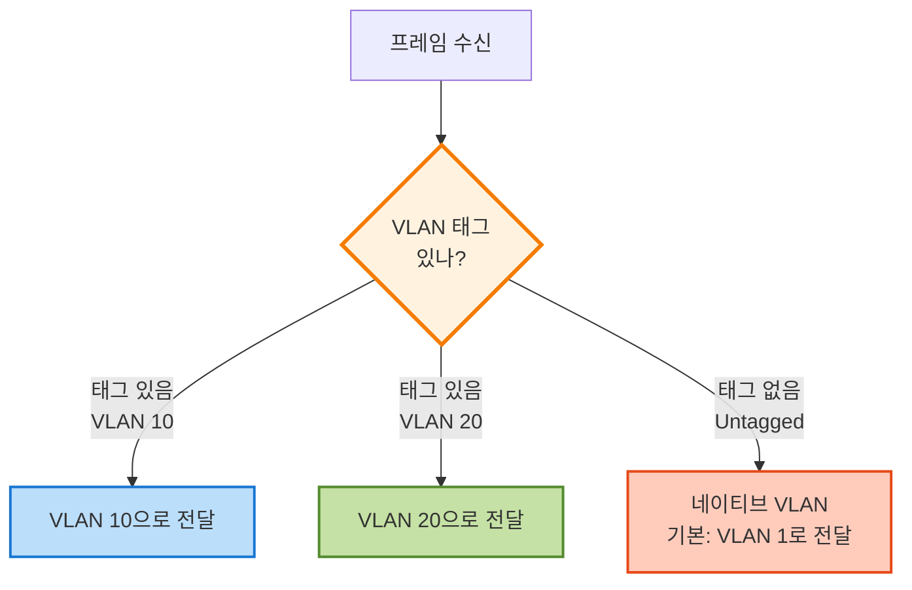

# 네트워크 프로토콜 입문을 읽고 - 레이어2 프로토콜 이해하기
이번 글에서는 네트워크 프로토콜 입문 안에서 레이어2 프로토콜 이해하기 장을 읽으며 공부한 내용을 정리해보고자 한다.

<!--more-->

### L1, L2 Diagram 요약

## 물리 계층 (L1)
- **수신**: 물리 매체(물리적 신호) -> L1 -> 디지털 데이터로 변환 -> L2
- **송신**: L2 -> 디지털 데이터 -> L1 -> 물리적 신호로 변환 -> 물리 매체


## 데이터 링크 계층 (L2)
### 오류 검출
- 물리 계층이 보내주는 신호를 ‘프레임’이라는 단위로 묶고, 오류나 주소를 확인
- 디지털 데이터의 무결성 검사
- 신뢰성 보장

### 주소 지정 (MAC Address)
- LAN 안에서 **어떤 장치에게 신호를 보내야할지 식별**한다.
- 참고로 PC, 스마트폰과 같은 네트워크 장치들은 고유한 MAC 주소를 가지고 있다.

> MAC 주소
> - I/G 비트(Individual/Group 비트)
>    - 8번째 비트
>    - 통신의 종류를 나타냄: 유니캐스트 주소(1:1) vs 멀티캐스트 주소(1:N)
>    - `ff:ff:ff:ff:ff:ff`: 브로드캐스트 주소(같은 LAN에 접속하는 모든 단말)
> - U/L 비트(Universally/Locally Administered 비트)
>    - 7번째 비트
>    - 운영 관리 방법을 나타냄: 범용 주소 vs 로컬 주소

### 흐름제어
수신 장치가 데이터 처리 속도를 못 따라오면 잠시 전송을 멈추게 함.

### 요약
- 물리 계층은 디지털 데이터와 신호 변환후 전달만 진행하고,
- 데이터 링크 계층은 누가 누구에게 보내는지, 데이터가 제대로 도착했는지 확인한다.

## 이더넷
현대 네트워크에서 사용되는 레이어 2 프로토콜은 **유선 LAN이라면 이더넷, 무선 LAN이라면 Wi-Fi**를 사용한다.

### LAN (Local Area Network)
LAN은 좁은 지역 안에서 컴퓨터/장치들이 서로 연결된 네트워크 자체를 말한다. "사무실 네트워크", "집 안 Wi-Fi 네트워크" 모두 LAN이라고 할 수 있다.

L2 프로토콜의 사실상의 표준은 **이더넷**이다.

이더넷에는 어떤 포맷으로 캡슐화할 것인지, 어떻게 오류를 감지할 것인지 정의되어 있다.

중요한 것은 L2 프로토콜을 사용해서 LAN에서 통신한다는 것이다.

### 이더넷 프레임 포맷
이더넷으로 캡슐화된 패킷을 **이더넷 프레임**이라고 한다.

- 프리앰블
    - 이더넷 헤더
    - 지금부터 이더넷 프레임을 보내겠다는 신호를 의미
- 목적지/발신자 MAC 주소
    - 이더넷 헤더
    - 이더넷 네트워크에 연결된 단말을 식별하는 ID
    - 수신측 단말은 목적지 MAC 주소를 보고 자신의 주소가 아니라면 해당 이더넷 프레임을 폐기한다
- 타입
    - 이더넷 헤더
    - 네트워크 계층(L3)에서 어떤 프로토콜을 사용하고 있는지 나타내는 ID
    - ex) IPv4, IPv6
- 이더넷 페이로드
    - 네트워크 계층의 데이터 자체를 나타냄.
    - ex) 네트워크 계층에서 IP를 사용하면 이더넷 페이로드=IP 패킷
- FCS(Frame Check Sequence)
    - 이더넷 프레임이 손상되지 않았는지 확인하기 위한 필드

## ARP (주소 확인 프로토콜)
네트워크 세계에서 주소를 나타나는 것은 MAC주소(L2)와 IP주소(L3)가 있다. 이 두 주소가 독립적으로 동작하면 L2, L3 계층 내 정보가 일치하지 않아 통신이 이루어지지 않는다.
이 두 주소를 연결해서 L2, L3의 매핑 역할을 하는 프로콜이 바로 ARP(Address Resolution Protocol)이다.

네트워크 계층에서 받은 IP 패킷을 이더넷 프레임으로 캡슐화해야 한다. 하지만 **IP 주소만으로는 목적지 MAC 주소를 알 수 없다**. 따라서 ARP를 통해 IP 주소로부터 목적지 MAC 주소를 구하는데 이를 **주소 확인**이라고 한다.

### L2, L3 Diagram 요약


### ARP vs RARP
ARP와 반대로 동작하는 프로토콜로 RARP(Reverse Address Resolution Protocol)가 있다.

- **ARP (Address Resolution Protocol)**
    - IP 주소 → MAC 주소 변환
    - 논리적 주소(IP)에서 물리적 주소(MAC)를 찾아냄
    - 주로 송신측에서 목적지의 MAC 주소를 알아내기 위해 사용

- **RARP (Reverse Address Resolution Protocol)**
    - MAC 주소 → IP 주소 변환
    - 물리적 주소(MAC)에서 논리적 주소(IP)를 찾아냄
    - 디스크가 없는 단말이 자신의 IP 주소를 알아내기 위해 사용
    - 현재는 DHCP, BOOTP 등으로 대체되어 거의 사용되지 않음


### ARP를 통한 주소 확인의 흐름


### ARP의 캐시 기능
ARP는 브로드캐스트를 사용하기 때문에 하나의 MAC 주소를 알기 위해 해당 네트워크에 있는 모든 단말에 패킷을 보내는 비효율적인 통신을 사용한다. 이 문제를 해결하기 위해 ARP에서는 캐시 기능을 가지고 있다.

#### ARP 캐시가 실제로 쓰이는 흐름


## L2 스위치
L2 스위치는 데이터 링크 계층(Layer 2)에서 동작하는 네트워크 장비로, **MAC 주소를 기반으로 효율적인 프레임 전달**을 수행한다.

### L2 스위치의 동작 원리



각 컴퓨터가 L2 스위치에 연결되어 있고 각각 다른 포트에 연결되어 있다고 가정해보자.

컴퓨터 A가 B에게 데이터를 보낼 때, 실제로 선을 타고 흐르는 것은 **이더넷 프레임**이다. 이더넷 프레임에는 최소한 다음 정보가 포함되어 있다:

- 발신자 MAC 주소 (A의 MAC)
- 목적지 MAC 주소 (B의 MAC)

> **중요:** L2 스위치는 **IP 주소를 보지 않고, MAC 주소만 확인**한다.

### MAC 주소 테이블 학습 과정

#### Step 1. 발신자 MAC 주소 학습
A가 B에게 프레임을 보내면, 스위치는 포트1로 들어온 프레임의 발신자 MAC 주소를 확인한다.

스위치는 다음과 같이 학습한다: "MAC 주소 AA:AA:AA는 포트1에 연결되어 있구나"

스위치 내부에 **MAC 주소 테이블**을 생성한다:

| MAC 주소 | 연결된 포트 |
|----------|-------------|
| AA:AA:AA | 포트1       |

#### Step 2. Flooding (플러딩)
스위치는 아직 목적지 B가 어느 포트에 있는지 모르므로, **포트1을 제외한 모든 포트(포트2, 포트3)로 프레임을 전송**한다.

👉 이것을 **Flooding**이라고 한다.

#### Step 3. 목적지 MAC 주소 학습
B가 프레임을 받고 A에게 응답하면서 발신자 MAC 주소로 BB:BB:BB를 포함하여 전송한다. 이 프레임이 포트2로 들어오면 스위치는 다시 학습한다.

| MAC 주소 | 연결된 포트 |
|----------|-------------|
| AA:AA:AA | 포트1       |
| BB:BB:BB | 포트2       |

#### Step 4. 효율적인 전송
이제 스위치는 A와 B의 위치를 알고 있으므로, 다음부터는 **해당 포트로만 직접 전송**할 수 있다.



### 요약
- L2 스위치는 **MAC 주소 기반으로 프레임을 전달**한다
- **MAC 주소 테이블**을 통해 각 포트에 연결된 장치를 학습한다
- 처음에는 **Flooding**으로 모든 포트에 전송하지만, 학습 후에는 **특정 포트로만 전송**한다


## VLAN (Virtual LAN)
VLAN이란 **하나의 물리적 스위치를 여러 개의 논리적인 네트워크로 나누는 기술**이다. 같은 VLAN ID에 속한 포트/장비끼리만 L2 통신(브로드캐스트 포함)이 가능하다.

### VLAN의 필요성
- **브로드캐스트 도메인 분리**: 불필요한 브로드캐스트 트래픽 차단
- **보안 강화**: 부서별, 용도별로 네트워크 분리
- **네트워크 관리 효율성**: 물리적 재배치 없이 논리적으로 네트워크 구성 변경 가능

### 포트 VLAN (Access VLAN)
포트 VLAN은 **이 포트는 무조건 이 VLAN에 소속된다**라고 정해두는 방식이다.



#### Access Port 특징
- 주로 **PC, 프린터 같은 일반 디바이스** 연결용
- 프레임에 **VLAN 태그 정보가 없음** (Untagged)
- 스위치가 포트 설정을 보고 자동으로 VLAN 처리
- 하나의 포트는 하나의 VLAN에만 속함

### 태그 VLAN (Tagged VLAN, Trunk)
여러 VLAN을 하나의 포트로 전송해야 하는 경우 사용하는 방식이다.

#### 문제 상황
스위치 간 연결 시, 여러 VLAN의 트래픽을 동시에 전달해야 하는 경우:



#### 포트 VLAN의 한계
- **한 포트 = 한 VLAN**: Access Port는 하나의 VLAN만 전달 가능
- **여러 VLAN 전달 불가**: VLAN이 10개면 포트도 10개 필요 ❌

#### 스위치 간 연결 시 문제점

VLAN이 10개인 환경에서 두 스위치를 연결해야 한다면?

**Access Port 방식 (포트 VLAN):**
```
스위치 A                         스위치 B
┌─────────┐                     ┌─────────┐
│ VLAN 10 ├──케이블1───────────>│ VLAN 10 │
│ VLAN 20 ├──케이블2───────────>│ VLAN 20 │
│ VLAN 30 ├──케이블3───────────>│ VLAN 30 │
│ VLAN 40 ├──케이블4───────────>│ VLAN 40 │
│  ...    ├──...───────────────>│  ...    │
│ VLAN 100├──케이블10──────────>│ VLAN 100│
└─────────┘                     └─────────┘
```
**결과: 케이블 10개, 포트 20개 필요!** 😱

**Trunk Port 방식 (태그 VLAN):**
```
스위치 A                         스위치 B
┌─────────┐                     ┌─────────┐
│ VLAN 10 │                     │ VLAN 10 │
│ VLAN 20 │                     │ VLAN 20 │
│ VLAN 30 │────하나의 케이블────>│ VLAN 30 │
│  ...    │   (모든 VLAN 전송)  │  ...    │
│ VLAN 100│                     │ VLAN 100│
└─────────┘                     └─────────┘
```
**결과: 케이블 1개, 포트 2개만!** 🎉

> 💡 **핵심**: Access Port는 각 VLAN마다 별도의 물리적 연결이 필요하지만, Trunk Port는 VLAN 태그를 사용하여 하나의 연결로 모든 VLAN을 전송할 수 있다.

#### 해결책: VLAN 태그
이더넷 프레임에 **VLAN ID를 태그로 붙여서 전송**한다.

**프레임 구조:**
```
[이더넷 헤더] [VLAN 태그: ID 10] [데이터] [FCS]
```

스위치는 이 태그를 보고 어느 VLAN인지 구분할 수 있다.



#### Trunk Port 특징
- **여러 VLAN을 한 포트로 동시 전송** 가능
- 주로 **스위치 ↔ 스위치**, **스위치 ↔ 라우터** 연결에 사용
- 프레임에 **VLAN 태그가 포함됨** (Tagged)

#### Access Port vs Trunk Port 비교

| 구분 | Access Port | Trunk Port |
|------|-------------|------------|
| **용도** | 엔드 디바이스 연결 | 스위치 간 연결 |
| **VLAN 수** | 하나의 VLAN만 | 여러 VLAN 동시 전송 |
| **태그** | Untagged (태그 없음) | Tagged (태그 있음) |
| **연결 대상** | PC, 프린터, 서버 등 | 스위치, 라우터 등 |

### 네이티브 VLAN (Native VLAN)
네이티브 VLAN은 **Trunk 포트에서 태그 없이 들어온 프레임을 처리하기 위한 기본 VLAN**이다.

#### 필요성
- 과거 장비나 단순 장비 중 **VLAN 태그를 이해하지 못하는 장비**가 존재
- 하위 호환성을 위해 태그 없는 프레임도 처리 가능해야 함

#### 정의
**네이티브 VLAN**: Trunk 포트에서 태그 없이 들어온 프레임을 자동으로 소속시키는 기본 VLAN

#### 동작 방식



#### 설정 예시

**Trunk 포트 설정:**
- VLAN 10, 20 → 태그 있음 (Tagged)
- VLAN 1 → 네이티브 VLAN (Untagged)

**프레임 처리:**
- 태그 있음 (VLAN 10) → VLAN 10으로 처리
- 태그 있음 (VLAN 20) → VLAN 20으로 처리  
- 태그 없음 → VLAN 1(네이티브)로 처리

#### 중요 포인트
- 네이티브 VLAN은 **Trunk 포트에서만 의미**가 있음
- 양쪽 스위치의 **네이티브 VLAN 설정이 일치**해야 함
- **보안상 기본 VLAN(1)을 사용하지 않는 것이 권장됨**
  - VLAN 1은 관리 트래픽에 사용되므로 공격 대상이 될 수 있음
  - 네이티브 VLAN을 사용하지 않는 VLAN(예: 999)으로 변경 권장

#### 핵심 정리
- VLAN은 **물리적 네트워크를 논리적으로 분리**하는 기술
- **Access Port**: 하나의 VLAN, 태그 없음
- **Trunk Port**: 여러 VLAN, 태그 있음
- **네이티브 VLAN**: Trunk에서 태그 없는 프레임의 기본 처리