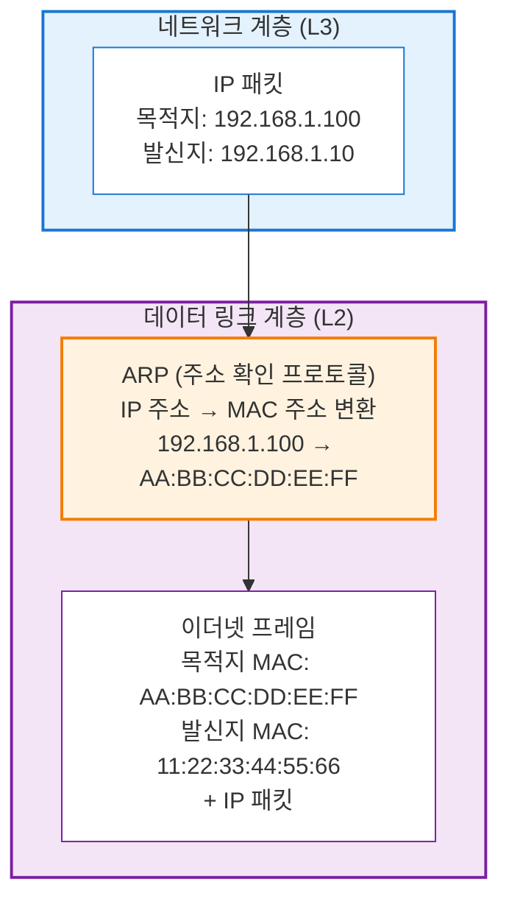

# 네트워크 프로토콜 입문을 읽고 - 레이어2 프로토콜 이해하기
이번 글에서는 네트워크 프로토콜 입문 안에서 레이어2 프로토콜 이해하기 장을 읽으며 공부한 내용을 정리해보고자 한다.

<!--more-->

### L1, L2 Diagram 요약

## 물리 계층 (L1)
- **수신**: 물리 매체(물리적 신호) -> L1 -> 디지털 데이터로 변환 -> L2
- **송신**: L2 -> 디지털 데이터 -> L1 -> 물리적 신호로 변환 -> 물리 매체

## 데이터 링크 계층 (L2)
### 오류 검출
- 물리 계층이 보내주는 신호를 ‘프레임’이라는 단위로 묶고, 오류나 주소를 확인
- 디지털 데이터의 무결성 검사
- 신뢰성 보장

### 주소 지정 (MAC Address)
- LAN 안에서 **어떤 장치에게 신호를 보내야할지 식별**한다.
- 참고로 PC, 스마트폰과 같은 네트워크 장치들은 고유한 MAC 주소를 가지고 있다.

> MAC 주소
> - I/G 비트(Individual/Group 비트)
>    - 8번째 비트
>    - 통신의 종류를 나타냄: 유니캐스트 주소(1:1) vs 멀티캐스트 주소(1:N)
>    - `ff:ff:ff:ff:ff:ff`: 브로드캐스트 주소(같은 LAN에 접속하는 모든 단말)
> - U/L 비트(Universally/Locally Administered 비트)
>    - 7번째 비트
>    - 운영 관리 방법을 나타냄: 범용 주소 vs 로컬 주소

### 흐름제어
수신 장치가 데이터 처리 속도를 못 따라오면 잠시 전송을 멈추게 함.

### 요약
- 물리 계층은 디지털 데이터와 신호 변환후 전달만 진행하고,
- 데이터 링크 계층은 누가 누구에게 보내는지, 데이터가 제대로 도착했는지 확인한다.

## 이더넷
현대 네트워크에서 사용되는 레이어 2 프로토콜은 **유선 LAN이라면 이더넷, 무선 LAN이라면 Wi-Fi**를 사용한다.

### LAN (Local Area Network)
LAN은 좁은 지역 안에서 컴퓨터/장치들이 서로 연결된 네트워크 자체를 말한다. "사무실 네트워크", "집 안 Wi-Fi 네트워크" 모두 LAN이라고 할 수 있다.

L2 프로토콜의 사실상의 표준은 **이더넷**이다.

이더넷에는 어떤 포맷으로 캡슐화할 것인지, 어떻게 오류를 감지할 것인지 정의되어 있다.

중요한 것은 L2 프로토콜을 사용해서 LAN에서 통신한다는 것이다.

### 이더넷 프레임 포맷
이더넷으로 캡슐화된 패킷을 **이더넷 프레임**이라고 한다.

- 프리앰블
    - 이더넷 헤더
    - 지금부터 이더넷 프레임을 보내겠다는 신호를 의미
- 목적지/발신자 MAC 주소
    - 이더넷 헤더
    - 이더넷 네트워크에 연결된 단말을 식별하는 ID
    - 수신측 단말은 목적지 MAC 주소를 보고 자신의 주소가 아니라면 해당 이더넷 프레임을 폐기한다
- 타입
    - 이더넷 헤더
    - 네트워크 계층(L3)에서 어떤 프로토콜을 사용하고 있는지 나타내는 ID
    - ex) IPv4, IPv6
- 이더넷 페이로드
    - 네트워크 계층의 데이터 자체를 나타냄.
    - ex) 네트워크 계층에서 IP를 사용하면 이더넷 페이로드=IP 패킷
- FCS(Frame Check Sequence)
    - 이더넷 프레임이 손상되지 않았는지 확인하기 위한 필드

## ARP (주소 확인 프로토콜)
네트워크 세계에서 주소를 나타나는 것은 MAC주소(L2)와 IP주소(L3)가 있다. 이 두 주소가 독립적으로 동작하면 L2, L3 계층 내 정보가 일치하지 않아 통신이 이루어지지 않는다.
이 두 주소를 연결해서 L2, L3의 매핑 역할을 하는 프로콜이 바로 ARP(Address Resolution Protocol)이다.

네트워크 계층에서 받은 IP 패킷을 이더넷 프레임으로 캡슐화해야 한다. 하지만 IP 주소만으로는 목적지 MAC 주소를 알 수 없다. 따라서 ARP를 통해 IP 주소로부터 목적지 MAC 주소를 구하는데 이를 주소 확인이라고 한다

### L2, L3 Diagram 요약

IP -> MAC: ARP
MAC -> IP: RARP