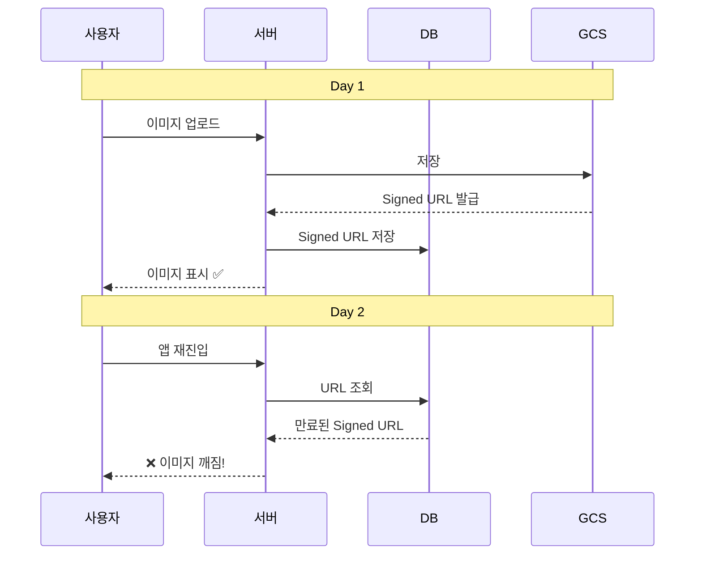
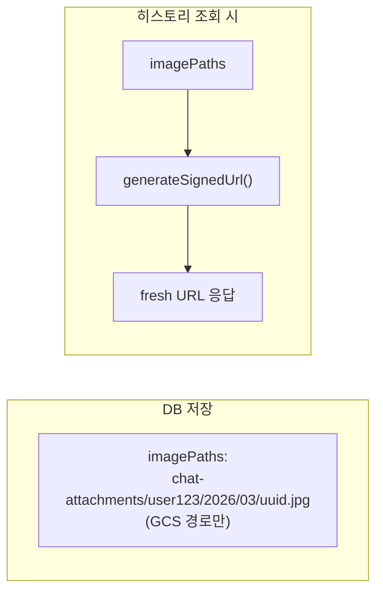
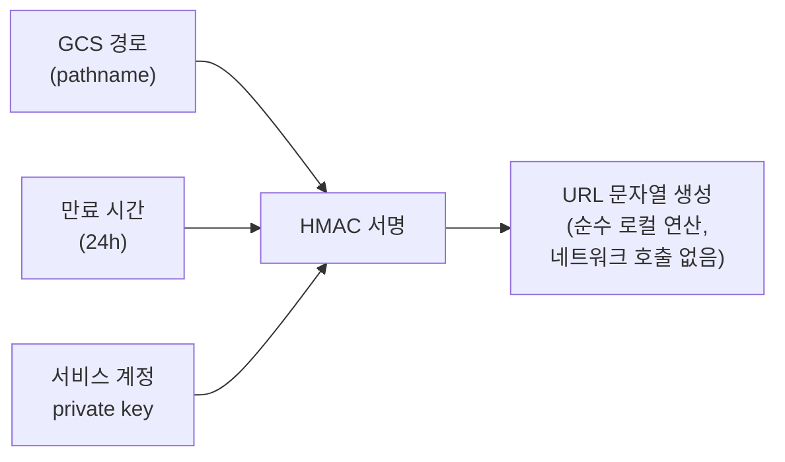
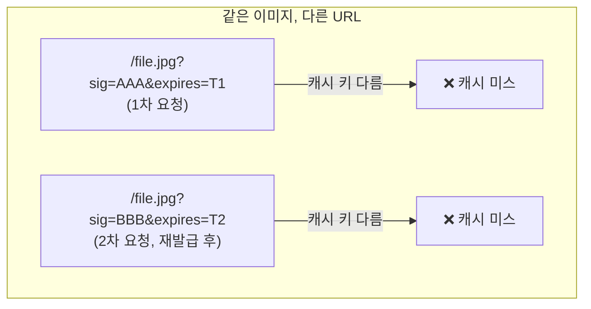
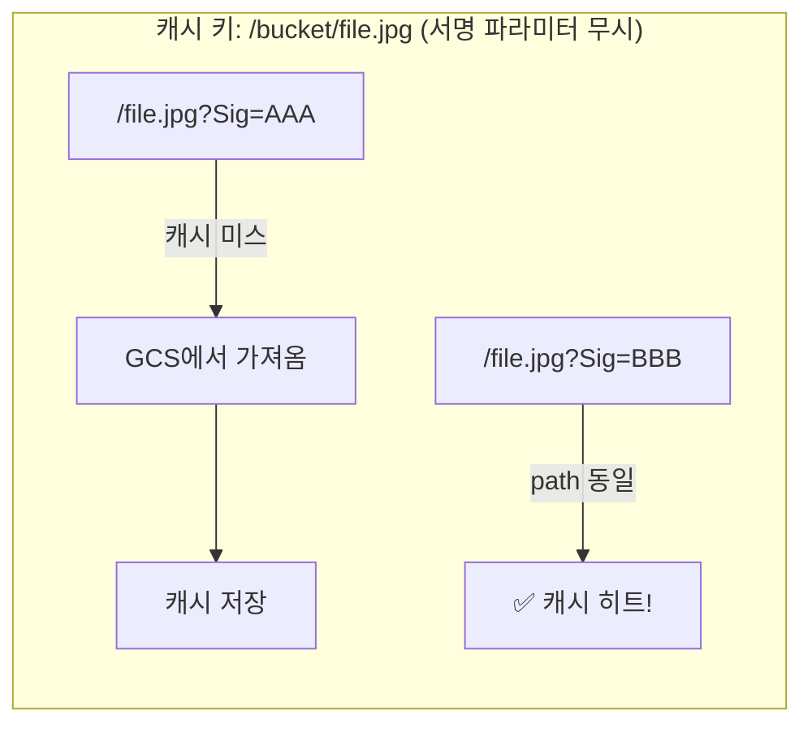
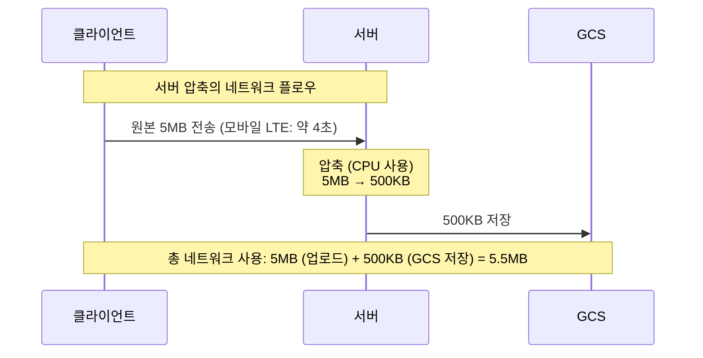
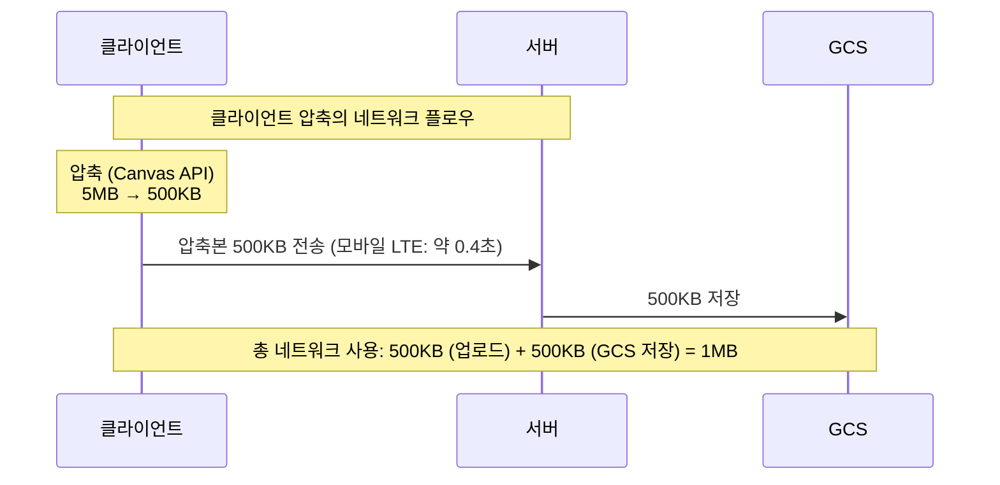
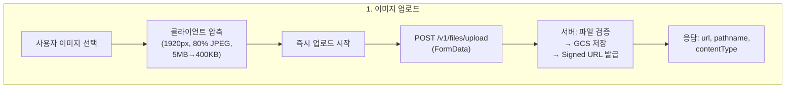
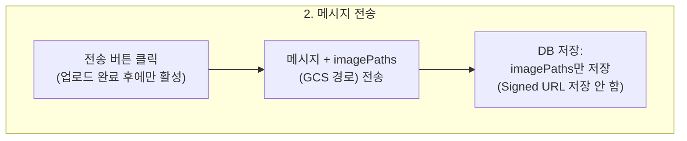
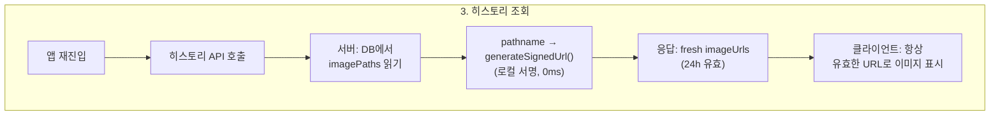

채팅 앱에서 사용자가 이미지를 첨부하여 전송하는 기능을 설계하면서, 생각보다 많은 설계 결정이 필요했다. 단순히 "파일을 업로드하고 보여주면 되는 거 아니야?"라고 생각할 수 있지만, 보안, 성능, 영속성, 비용까지 고려하면 꽤 깊은 고민이 필요하다.

이 글에서는 실제 프로젝트에서 이미지 업로드 기능을 설계하면서 마주한 질문들과 선택의 근거를 정리한다.

---

## 1. 업로드 타이밍: 즉시 업로드 vs 전송 시 업로드

사용자가 이미지를 선택한 후, 텍스트를 입력하고, 전송 버튼을 누르기까지 시간 차이가 있다. 이미지를 **언제** 서버에 업로드할 것인가?

### 선택지

| 방식 | 설명 |
|------|------|
| **즉시 업로드** | 이미지 선택 즉시 서버에 업로드 시작 |
| **전송 시 업로드** | 전송 버튼을 누를 때 이미지를 업로드 |

### 즉시 업로드를 선택한 이유

```
즉시 업로드:    [선택] ──업로드(2s)──▶ [텍스트 입력(3s)] ──전송──▶ 즉시 전달 (0ms)
전송 시 업로드:  [선택] ──[텍스트 입력(3s)]── 전송 ──업로드(2s)대기──▶ 전달
```

1. **체감 속도**: 사용자가 텍스트를 입력하는 동안 백그라운드에서 업로드가 완료된다. 전송 버튼을 누르면 대기 시간 0ms.
2. **실패 사전 감지**: 네트워크 오류나 파일 문제를 전송 전에 미리 알 수 있다.
3. **복수 이미지 성능**: 3~5장을 동시에 올릴 때 선택 즉시 병렬 업로드가 시작된다. 전송 시 업로드는 한 번에 올려야 하므로 대기 시간이 장 수에 비례해 늘어난다.
4. **업계 표준**: ChatGPT, Slack, Discord, WhatsApp 모두 이 방식을 사용한다.

### 고아 파일 문제

즉시 업로드의 단점은 사용자가 이미지를 올렸다가 삭제하면 서버에 사용되지 않는 "고아 파일"이 남는 것이다. 하지만 실제로 계산해보면:

- 고아 파일 1,000장 ≈ 5GB ≈ 월 $0.1 (GCS 저장 비용)
- GCS Lifecycle Policy로 자동 정리 가능

비용이 극히 미미하므로 실질적 문제가 아니다.

### 전송 버튼 비활성화 규칙

즉시 업로드 방식에서 중요한 UX 디테일이 하나 있다. 이미지 업로드가 아직 진행 중일 때 전송 버튼을 비활성화해야 한다. 업로드가 완료되어 URL을 확보한 후에만 전송을 허용한다.

| 텍스트 | 이미지 | 업로드 상태 | 전송 버튼 |
|--------|--------|------------|----------|
| 없음 | 없음 | - | 비활성 |
| 있음 | 없음 | - | 활성 |
| 없음 | 있음 | 완료 | 활성 |
| 있음 | 있음 | 업로드 중 | **비활성** |

---

## 2. 이미지 URL 보안: Public URL vs Signed URL

업로드된 이미지에 접근하기 위한 URL을 어떻게 제공할 것인가?

### Public URL의 위험성

단순하게 GCS 버킷을 public으로 열고 고정 URL을 제공하면 구현이 쉽다. 하지만 이 프로젝트에서 저장되는 이미지는 **약봉지, 약통 등 건강 관련 사진**이다.

| 위험 | 설명 |
|------|------|
| **의료 정보 노출** | 약 이름, 복용량이 담긴 사진이 유출될 수 있다 |
| **GDPR 위반** | EU 데이터 보호법상 건강 데이터는 "특수 범주 개인정보"로 분류된다. 무단 접근 가능 상태 자체가 위반 |
| **URL 추측 공격** | 경로 패턴이 예측 가능하면 다른 사용자의 이미지에 접근할 수 있다 |
| **영구 접근** | URL이 유출되면 만료가 없으므로 **영원히** 접근 가능하고, 회수할 수 없다 |

일반적인 프로필 사진이라면 Public URL도 괜찮을 수 있지만, 민감한 건강 데이터에는 부적합하다.

### Signed URL 선택

GCS Signed URL은 제한된 시간 동안만 유효한 서명된 URL이다.

```
https://storage.googleapis.com/bucket/file.jpg
  ?X-Goog-Signature=abc123...   ← 서명
  &X-Goog-Expires=86400          ← 24시간 후 만료
```

24시간 만료를 적용하면:
- URL이 유출되더라도 24시간 후 자동 무효화
- GCS 실제 경로는 외부에 노출되지 않음
- GDPR/DiGA 컴플라이언스 충족

### ChatGPT의 방식

ChatGPT도 Signed URL 방식을 사용한다:

```
https://files.oaiusercontent.com/file-abc123
  ?se=2026-03-20T12:00:00Z    ← 만료 시간
  &sp=r                        ← 읽기 권한만
  &sig=HMAC_SIGNATURE           ← 서명
```

자체 CDN 도메인(`files.oaiusercontent.com`)을 사용하고, 대화 히스토리 로드 시 새 URL을 재발급하는 구조다.

---

## 3. 이미지 영속성: DB에 무엇을 저장할 것인가

Signed URL은 24시간 후 만료된다. 그런데 사용자가 앱을 껐다가 다음 날 다시 열면? 어제 보낸 이미지가 깨져 보일 것이다.

### 핵심 질문: DB에 Signed URL을 저장하면?



Signed URL을 DB에 저장하면 안 된다. 만료 후 복구할 방법이 없다.

### 해결: DB에는 GCS pathname만 저장



pathname은 만료되지 않는 GCS 내부 경로이므로, 언제든지 새로운 Signed URL을 생성할 수 있다.

### Signed URL 생성은 비용이 들지 않는다

여기서 "매번 URL을 생성하면 성능에 문제가 없나?"라는 의문이 생길 수 있다. 결론부터 말하면, **GCS Signed URL 생성은 GCS API를 호출하지 않는다.**



서버 로컬에서 private key로 서명하는 암호화 연산일 뿐이라, 수 ms도 걸리지 않는다. 메시지 100개에 이미지가 각각 5개씩 있어도 URL 500개 생성은 수십 ms 이내에 완료된다.

실제로 GCS에 네트워크 요청이 가는 건 **클라이언트가 그 URL로 이미지를 다운로드할 때**뿐이다.

### 클라이언트에 만료 시간을 내려줘야 하나?

"서버가 만료 시간을 알려주면 클라이언트가 만료 전에 갱신 요청을 보내는 게 낫지 않을까?"

두 가지 접근법을 비교했다:

| 방법 | 클라이언트 복잡도 | API 호출 |
|------|------------------|----------|
| 만료 시간 전달 + 클라이언트 갱신 | 높음 (타이머, 만료 체크, 갱신 요청 관리) | 이미지별 개별 갱신 API |
| 히스토리 조회 시 서버가 항상 fresh URL 제공 | **낮음** (신경 쓸 것 없음) | 히스토리 조회 1회에 포함 |

**서버가 매번 fresh URL을 제공하는 방식**이 훨씬 단순하다. 클라이언트는 만료 시간을 관리할 필요 없이, 히스토리 API를 호출하면 항상 유효한 URL을 받는다.

유일한 엣지 케이스는 24시간 이상 대화창을 열어놓는 경우인데, 이건 `` 핸들러로 자동 재요청하거나 새로고침으로 해결할 수 있는 드문 케이스다.

---

## 4. CDN 도입 여부: 비용 분석

이미지 트래픽이 많아지면 CDN을 고려하게 된다.

### GCS 직접 접근 vs Cloud CDN 비용

GCS에서 인터넷으로 데이터를 전송하는 이그레스 비용이 핵심이다:

| 항목 | GCS 직접 | Cloud CDN |
|------|----------|-----------|
| 이그레스 비용 | $0.12/GB | $0.08/GB |
| 캐시 채우기 | - | $0.04/GB |

월 1,000 MAU, 사용자당 이미지 10장(2MB), 일 3회 앱 진입으로 가정하면:

```
월간 다운로드 트래픽:
  첨부 직후: 1,000 × 10 × 2MB = 20GB
  히스토리 재로드: 1,000 × 3회/일 × 30일 × 10장 × 2MB ≈ 1,800GB
  총: ~1,820GB
```

| | CDN 없음 | CDN 사용 |
|--|----------|----------|
| 월 비용 | ~$218 | ~$147 |
| 절감 | - | ~33% |

### 하지만 Signed URL과 CDN은 궁합이 나쁘다

**핵심 문제**: Signed URL은 쿼리 파라미터에 서명이 포함되어 있어서, 같은 이미지라도 매번 다른 URL이 생성된다.



### Cloud CDN Signed URL로 해결 가능

Cloud CDN은 자체 Signed URL 체계를 제공한다. GCS Signed URL과 달리, **URL의 path 부분만으로 캐시 키를 구성**할 수 있다:



이렇게 하면 캐시 히트율 80~90%를 달성할 수 있고, 월 비용을 $50~70 수준으로 줄일 수 있다.

### 결론: 규모에 따라 결정

| 규모 | 추천 |
|------|------|
| 소규모 (<1,000 MAU) | CDN 불필요. GCS 직접 접근 (월 $10~20) |
| 중규모 (1,000~10,000 MAU) | CDN 검토. Cloud CDN Signed URL 도입 |
| 대규모 (10,000+ MAU) | CDN 필수. Cookie 기반 인증 또는 CDN Signed URL |

소규모에서는 CDN 구축/운영 비용이 절감액보다 크므로, 스케일업 시점에 도입하는 것이 합리적이다.

---

## 5. 이미지 압축: 어디서, 어떻게 할 것인가

스마트폰 카메라의 원본 사진은 3~15MB에 달한다. 약봉지 사진을 원본 그대로 올리면 저장/전송 비용이 과도하다. "어차피 압축은 해야 한다"는 건 명확한데, 문제는 **어디서** 할 것인가다.

### 선택지: 서버 vs 클라이언트 vs 둘 다

| 방식 | 장점 | 단점 |
|------|------|------|
| **서버 압축** | 일관된 품질 보장, 모든 클라이언트에 동일 적용 | 원본이 먼저 네트워크를 타야 함 |
| **클라이언트 압축** | 대역폭 절감, 서버 부하 0, 업로드 속도 향상 | 브라우저 Canvas API 의존 |
| **둘 다** | 최적의 결과 (이론적으로) | 이중 압축으로 화질 저하, 과잉 설계 |

### 네트워크 관점에서의 핵심 판단

이 결정의 본질은 **"네트워크 비용을 어디서 절감할 수 있는가"**다. 이미지 업로드의 네트워크 플로우를 단계별로 살펴보자.





**네트워크 사용량이 5.5배 차이**난다. 서버 압축은 원본이 네트워크를 타는 순간 이미 대역폭을 소비한 것이다. 서버에서 아무리 잘 압축해도 **이미 지나간 5MB는 돌려받을 수 없다.**

### 모바일 네트워크에서의 체감 차이

실제 사용자는 모바일 환경에서 이미지를 전송한다. 네트워크 조건별 업로드 시간을 비교하면:

```
업로드 시간 = 파일 크기 ÷ 업로드 속도

[원본 5MB를 그대로 전송]
  4G LTE  (업로드 10Mbps): 5MB ÷ 10Mbps = 4.0초
  3G      (업로드 1Mbps):  5MB ÷ 1Mbps  = 40초
  약한 WiFi (업로드 3Mbps): 5MB ÷ 3Mbps  = 13초

[압축 후 500KB 전송]
  4G LTE  (업로드 10Mbps): 500KB ÷ 10Mbps = 0.4초
  3G      (업로드 1Mbps):  500KB ÷ 1Mbps  = 4초
  약한 WiFi (업로드 3Mbps): 500KB ÷ 3Mbps  = 1.3초
```

3G 환경에서 **40초 vs 4초** — 10배 차이다. "즉시 업로드" 패턴과 결합하면, 클라이언트 압축은 사용자가 텍스트를 입력하는 3초 안에 업로드가 완료되어 전송 버튼을 누르는 시점에 대기 시간이 0이 된다. 원본을 그대로 보내면 3G에서는 전송 버튼을 눌러도 37초를 더 기다려야 한다.

### 서버 부하 관점

서버 압축을 하면 추가로 발생하는 비용:

| 항목 | 영향 |
|------|------|
| **CPU** | 이미지 리사이즈/JPEG 인코딩은 CPU-intensive 작업. Cloud Run 인스턴스의 CPU를 이미지 처리에 사용 → API 응답 지연 가능 |
| **메모리** | 5MB 이미지를 디코딩하면 메모리에 ~50MB (비압축 비트맵) 할당. 동시 업로드 10건이면 500MB |
| **의존성** | `sharp` (libvips 바인딩) — 네이티브 C 모듈이라 Docker 이미지 크기 증가, 빌드 시간 증가, Alpine Linux 호환 이슈 |
| **Cold Start** | Cloud Run cold start 시 네이티브 모듈 로딩으로 시작 시간 증가 |

클라이언트 압축은 이 모든 서버 부담이 **0**이다. Canvas API는 브라우저가 이미 내장하고 있으므로 추가 의존성도 없다.

### "둘 다 하면 더 좋지 않을까?"

직관적으로는 그렇게 생각할 수 있지만, 실제로는 아니다.

1. **이중 JPEG 압축의 문제**: JPEG는 손실 압축이다. 80%로 압축한 이미지를 서버에서 다시 80%로 압축하면 화질은 떨어지지만 파일 크기는 거의 줄지 않는다. 이미 압축된 데이터를 다시 압축하면 노이즈만 증가한다.

2. **절감 효과 미미**: 클라이언트에서 400KB로 만들어 보낸 걸 서버에서 다시 압축하면 350KB 정도. 50KB 절감을 위해 서버에 이미지 프로세싱 파이프라인을 구축하는 건 과잉 설계다.

3. **품질 일관성**: 이중 압축 시 어느 쪽 설정이 최종 품질을 결정하는지 모호해진다. 클라이언트 한 곳에서만 압축하면 품질 제어가 단순하다.

### "클라이언트를 신뢰해도 되나?"

서버 압축을 선호하는 일반적인 이유 중 하나는 "클라이언트를 신뢰할 수 없다"는 것이다. 외부 API나 서드파티 앱에서 이미지를 받는 경우라면 맞는 말이다.

하지만 이 서비스에서는:
- 이미지를 보내는 클라이언트 = **우리가 만든 앱** (dha-sleep-app-web)
- 외부 API 연동이나 서드파티 업로드는 없음
- 백엔드에서 파일 크기/MIME type 검증은 별도로 수행

**우리 앱 코드가 압축 로직을 실행하므로, 서버가 클라이언트를 "신뢰"하는 것이 아니라 우리 코드를 신뢰하는 것**이다.

### 결론: 클라이언트 압축만으로 충분하다

```
클라이언트 압축:  원본 5MB → [브라우저 Canvas API] → 500KB → [업로드 0.4초] → GCS
서버 압축:        원본 5MB → [업로드 4초] → [sharp CPU 처리] → 500KB → GCS
```

네트워크 사용량 5.5배 절감, 업로드 시간 10배 단축, 서버 부하 0, 추가 의존성 0. 서버 압축이 필요한 이유를 찾을 수 없다.

### 압축 기준: "충분히 좋으면서 최대한 작은" 지점 찾기

핵심 원칙: **약봉지 텍스트가 AI에게 읽히는 최소 품질을 유지하면서 최대한 압축**

#### 해상도: 왜 1920px인가

| 해상도 | 약봉지 5pt 텍스트 | AI 인식 | 비고 |
|--------|-----------------|---------|------|
| 원본 4032px | 완벽 | 불필요 (AI가 내부 리사이즈) | Gemini는 ~2048px로 축소 후 처리 |
| 2560px | 완벽 | OK | 과잉 |
| **1920px** | **충분** | **OK** | **Full HD 해상도, AI 처리 기준 근접** |
| 1280px | 약간 열화 | OK | HD, 미세한 글씨 손실 가능 |
| 960px | 열화 | 간신히 | 작은 텍스트 뭉개짐 |

1920px로 정한 이유:
- Gemini Vision은 내부적으로 이미지를 ~2048px로 리사이즈한다. 원본 4032px를 보내도 AI가 어차피 줄이므로, **우리가 미리 줄여서 보내면 네트워크만 절약**된다.
- 12MP(4032×3024) → 1920×1440 리사이즈만으로도 **파일 크기가 약 70% 감소**한다 (픽셀 수 기준 77% 감소).
- Full HD(1920×1080) 화면에서 프리뷰 시 브라우저가 추가 리사이즈할 필요 없다.

#### JPEG 품질: 왜 80%인가

| 품질 | 1920px 기준 크기 | 텍스트 인식 | SSIM |
|------|----------------|------------|------|
| 100% | ~1.5MB | 완벽 | 1.00 |
| 90% | ~800KB | 완벽 | 0.98 |
| **80%** | **~400KB** | **충분** | **0.95** |
| 70% | ~250KB | 작은 글씨 약간 열화 | 0.91 |
| 60% | ~150KB | 글씨 뭉개짐 시작 | 0.86 |

SSIM(Structural Similarity Index)이 0.95 이상이면 인간의 눈으로 원본과 구별하기 어렵다. 80%는 **품질과 크기의 최적 균형점**이다. 70%로 내리면 160KB를 더 절약하지만 작은 글씨 품질이 떨어지고, 90%로 올리면 400KB를 더 쓰지만 눈에 보이는 개선이 없다.

#### 포맷 변환 규칙

| 원본 포맷 | 출력 포맷 | 이유 |
|----------|----------|------|
| JPEG | JPEG | 그대로 |
| PNG | JPEG | 약봉지 사진에 투명도 불필요. PNG는 무손실이라 JPEG보다 3~5배 큼 |
| WebP | JPEG | 브라우저 호환성 + AI 모델 호환성 |
| GIF | **그대로 (압축 안 함)** | Canvas로 변환하면 애니메이션이 깨짐. 실사용 빈도 극히 낮음 |

### 압축 결과와 비용 영향

| 소스 | 원본 | 압축 후 | 압축률 |
|------|------|---------|--------|
| 아이폰 12MP | 3~5MB | ~400KB | 약 12배 |
| 갤럭시 50MP | 8~15MB | ~500KB | 약 30배 |
| 스크린샷 | 500KB~2MB | ~200KB | 약 5배 |

월 1,000 MAU 기준:

| 항목 | 원본 그대로 | 클라이언트 압축 |
|------|-----------|---------------|
| 월간 저장량 | 50GB | 5GB |
| GCS 저장 비용 | $1.00/월 | $0.10/월 |
| 이그레스 비용 (히스토리 조회) | ~$218/월 | ~$22/월 |
| 사용자 업로드 대기 (LTE) | 4초 | 0.4초 |
| 사용자 업로드 대기 (3G) | 40초 | 4초 |

저장/전송 비용 10배 절감, 사용자 체감 속도 10배 향상. 압축하지 않을 이유가 없다.

---

## 6. 전체 아키텍처 요약

최종 설계를 정리하면:







### 설계 결정 요약

| 결정 | 선택 | 핵심 이유 |
|------|------|----------|
| 업로드 타이밍 | 즉시 업로드 | 전송 시 대기 0ms, UX 우수 |
| URL 보안 | Signed URL (24h) | 민감 데이터 보호, GDPR 컴플라이언스 |
| DB 저장 | GCS pathname | Signed URL은 만료되므로 경로만 저장 |
| URL 갱신 | 서버가 매번 재발급 | 클라이언트 복잡도 제거 |
| 이미지 압축 | 클라이언트 (1920px, 80% JPEG) | 서버 압축은 대역폭 절감 효과 0, 5~30배 용량 감소 |
| CDN | 현재 미도입 | 소규모에서는 비용 대비 효과 낮음 |

이미지 업로드라는 겉보기에 단순한 기능이지만, 보안(GDPR), 성능(즉시 업로드), 영속성(pathname 저장), 비용(CDN)까지 고려하면 꽤 많은 설계 결정이 필요하다. "일단 돌아가게 만들자"가 아니라 이런 결정들을 미리 정리해두면, 나중에 스케일업할 때 큰 리팩토링 없이 확장할 수 있다.
