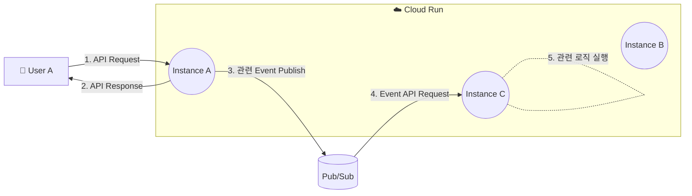
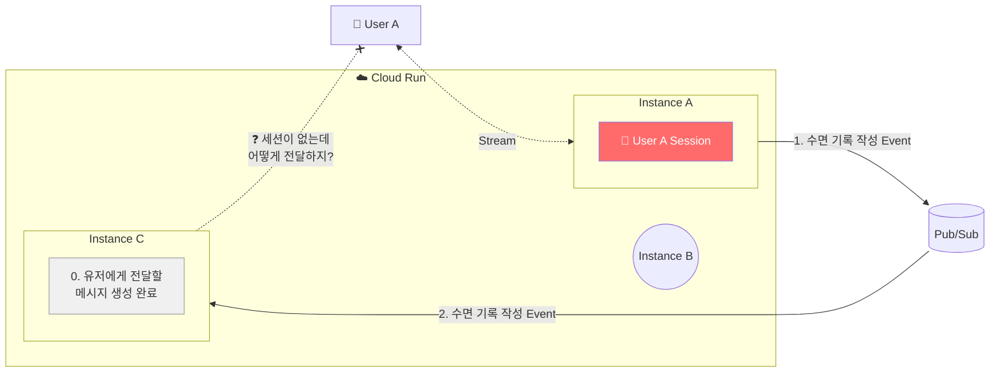
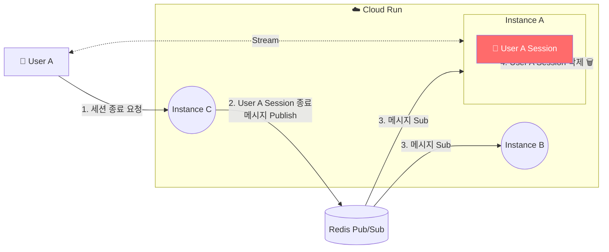

# 문제의 시작: "왜 메시지가 안 와요?"

서버에서 클라이언트로 실시간 메시지를 보내는 기능을 개발하고 있었다. 프로토콜은 **Streamable HTTP** 방식을 사용했다.

> **Streamable HTTP**는 HTTP POST와 Server-Sent Events(SSE)를 결합해 클라이언트-서버 간 양방향 통신을 가능하게 하는 전송 프로토콜이다. MCP(Model Context Protocol)에서 정의된 방식으로, 일반적인 HTTP 요청-응답 패턴을 넘어서 **서버가 자체적으로 클라이언트에게 메시지를 푸시**할 수 있다.

로컬 환경에서는 완벽하게 동작했다. 인스턴스가 하나니까.

하지만 **다중 인스턴스 환경에 배포**하자마자 문제가 터졌다. 특정 사용자에게 메시지가 전달되지 않는 현상이 간헐적으로 발생한 것이다.

---

# 현재 아키텍처: 이벤트 기반 다중 인스턴스

먼저 현재 서버 아키텍처를 살펴보자. Cloud Run 위에 여러 인스턴스가 떠 있고, 이벤트 기반으로 동작한다.



클라이언트가 API 요청을 보내면 임의의 인스턴스가 처리하고, 관련 이벤트를 Pub/Sub에 발행한다. 이 이벤트는 다시 **임의의 인스턴스**로 라우팅되어 후속 로직을 실행한다.

여기서 핵심은 **요청을 처리하는 인스턴스와 이벤트를 수신하는 인스턴스가 다를 수 있다**는 것이다.

---

# 왜 다중 인스턴스에서 세션이 깨지는가?

실시간 메시지 전송의 핵심은 **서버가 사용자의 세션 정보를 메모리에 유지하고 있어야 한다**는 것이다.

흐름을 정리하면 이렇다:

```
1. 클라이언트 → 서버: Session ID 발급 요청
2. 서버 → 클라이언트: Session ID 반환
3. 클라이언트 → 서버: Session ID로 세션 등록 (SSE 연결)
4. 서버: 세션을 메모리에 저장, 이후 자유롭게 메시지 푸시 가능
```

인스턴스가 하나일 때는 아무 문제 없다. 세션을 등록한 인스턴스 = 이벤트를 처리하는 인스턴스이기 때문이다.

하지만 **다중 인스턴스 + 이벤트 기반 아키텍처**에서는 상황이 달라진다.



위 다이어그램을 보면 문제가 명확하다. User A의 세션은 **인스턴스 A**의 메모리에 저장되어 있다. 그런데 이벤트를 수신한 **인스턴스 C**가 User A에게 메시지를 전달해야 하는 상황이 발생한다. 인스턴스 C는 User A의 세션 정보가 없으니 **메시지를 전달할 방법이 없다**.

핵심은 **세션을 가진 인스턴스 ≠ 이벤트를 처리하는 인스턴스**라는 것이다.

---

# 해결 전략: Redis Pub/Sub 도입

이 문제를 해결하려면 인스턴스 간에 **"이 사용자에게 메시지를 보내줘"**라고 통신할 수 있는 채널이 필요하다.

여기서 **Redis Pub/Sub**을 선택했다.

## Redis Pub/Sub이란?

게시자(Publisher)가 특정 채널(Channel)에 메시지를 발행하면, 해당 채널을 구독(Subscribe)하는 모든 구독자에게 메시지를 즉시 전달하는 메시징 패턴이다.

```
Publisher → Channel("user-messages") → Subscriber A (인스턴스 A)
                                     → Subscriber B (인스턴스 B)
                                     → Subscriber C (인스턴스 C)
```

핵심은 **발행자가 구독자를 알 필요 없다**는 것이다. 채널에 던지면 구독 중인 모든 인스턴스가 받는다.

## 적용 아키텍처

### Case 1: 다른 인스턴스에 세션이 있는 경우

이벤트를 수신한 인스턴스에 세션이 없을 때의 흐름이다.

```mermaid
graph LR
    Client["📱 User A"]

    subgraph CloudRun["☁️ Cloud Run"]
        subgraph IA["Instance A"]
            Session["🔴 User A Session"]
        end
        B(("Instance B"))
        subgraph IC["Instance C"]
            Msg["0. 유저에게 전달할<br/>메시지 생성 완료"]
        end
    end

    Redis[("Redis")]

    Client <-.->|"Stream"| IA
    IC -->|"1. Session 확인"| Redis
    IC -->|"2-1. Session이 있을 경우<br/>Message Publish"| Redis
    IC -.->|"2-1. Session 없을 경우<br/>Push Message 전송"| Client
    Redis -->|"3. 메시지 Sub"| IA
    Redis -->|"3. 메시지 Sub"| B
    IA -->|"4. 실시간 메시지 전달<br/>ex&#41; 수면 기록을 작성하세요."| Client

    style Session fill:#ff6b6b,color:#fff
    style Msg fill:#f0f0f0,stroke:#999
```



흐름을 따라가보면:

0. **인스턴스 C**에서 유저에게 전달할 메시지가 생성된다.
1. Redis에서 해당 사용자의 활성 세션이 존재하는지 **확인**한다.
2. 활성 세션이 있으므로, Redis 채널에 메시지를 **Publish**한다. (세션이 없었다면 오프라인 사용자로 판단하고 푸시 알림을 전송한다.)
3. 모든 인스턴스가 Redis 채널을 **Subscribe**하고 있으므로 메시지를 수신한다.
4. User A의 세션을 실제로 보유한 **인스턴스 A**가 SSE Stream을 통해 클라이언트에 실시간 메시지를 전달한다.

### Case 2: 해당 인스턴스에 세션이 있는 경우

이벤트를 수신한 인스턴스가 마침 세션도 보유하고 있을 때의 흐름이다.

```mermaid
graph LR
    Client["📱 User A"]

    subgraph CloudRun["☁️ Cloud Run"]
        A(("Instance A"))
        B(("Instance B"))
        subgraph IC["Instance C"]
            Session["🔴 User A Session"]
            Msg["0. 유저에게 전달할<br/>메시지 생성 완료"]
        end
    end

    Redis[("Redis")]

    Client <-.->|"Stream"| IC
    IC -->|"1. 최신 Session 확인"| Redis
    IC -.-|"2. Session 활성화<br/>여부 확인 → 내 메모리에 있다!"| IC
    IC ==>|"3. 실시간 메시지 전달<br/>ex&#41; 수면 기록을 작성하세요."| Client

    style Session fill:#ff6b6b,color:#fff
    style Msg fill:#f0f0f0,stroke:#999
```



이 경우는 훨씬 간단하다:

0. **인스턴스 C**에서 유저에게 전달할 메시지가 생성된다.
1. Redis에서 최신 세션 정보를 확인한다.
2. 자체 메모리에서 활성 세션을 확인하고, **있다!**
3. Redis Pub/Sub을 거치지 않고 바로 SSE Stream으로 클라이언트에 메시지를 전달한다.

이 **최적화 경로** 덕분에 불필요한 Redis 통신을 줄일 수 있다.

### Case 3: 세션 종료

세션 종료 요청도 Redis Pub/Sub을 통해 처리한다.



1. User A가 **인스턴스 C**에 세션 종료를 요청한다.
2. 인스턴스 C가 Redis 채널에 세션 종료 메시지를 **Publish**한다.
3. 모든 인스턴스가 메시지를 **Subscribe**하여 수신한다.
4. User A의 세션을 실제로 보유한 **인스턴스 A**가 메모리에서 세션을 안전하게 **삭제**한다.

이렇게 세션 종료 요청이 어떤 인스턴스에 도착하든, 실제 세션을 가진 인스턴스가 이를 수신하고 정리할 수 있다.

---

# 왜 Redis Pub/Sub인가?

다른 선택지도 있었다. 비교해보면:

| 방법 | 장점 | 단점 |
|------|------|------|
| **Sticky Session** (로드밸런서) | 구현 간단 | Cloud Run에서 지원 제한, 오토스케일링과 충돌 |
| **공유 세션 저장소** (Redis에 세션 자체 저장) | 어느 인스턴스든 세션 접근 가능 | SSE 연결은 특정 인스턴스에 묶여 있어 근본 해결 안됨 |
| **Redis Pub/Sub** | 느슨한 결합, 확장 용이 | 메시지 영속성 없음 (실시간 전달 전용) |

Redis Pub/Sub을 선택한 핵심 이유:

1. **SSE 연결의 본질**: SSE 연결은 특정 인스턴스의 메모리에 바인딩된다. 세션을 공유 저장소에 옮기는 것만으로는 해결이 안 된다. 결국 **"세션을 가진 인스턴스에게 알려주는"** 메커니즘이 필요하다.

2. **느슨한 결합**: 각 인스턴스가 서로의 존재를 알 필요 없다. 새 인스턴스가 추가되면 채널을 구독하기만 하면 된다.

3. **메시지 영속성이 불필요**: 실시간 메시지는 전달 시점에만 의미가 있다. 오프라인 사용자에게는 별도로 푸시 알림을 보내므로, Pub/Sub의 "fire-and-forget" 특성이 오히려 적합하다.

---

# 구현하면서 배운 것들

## 1. "로컬에서 되면 다 되는 거 아닌가?"의 함정

단일 인스턴스에서 완벽하게 동작하는 코드가 다중 인스턴스에서는 완전히 다른 문제를 만들어낸다. 이번 경험을 통해 **분산 환경을 전제로 설계하는 습관**의 중요성을 체감했다.

특히 **메모리에 상태를 저장하는 모든 로직**은 다중 인스턴스에서 문제가 될 수 있다는 점을 항상 염두에 둬야 한다.

## 2. Redis Pub/Sub의 한계를 이해하기

Redis Pub/Sub은 만능이 아니다:

- **메시지 영속성이 없다**: 구독자가 없는 시점에 발행된 메시지는 사라진다. 오프라인 사용자에 대한 별도 처리(푸시 알림 등)가 반드시 필요하다.
- **메시지 순서 보장이 제한적**: 단일 Publisher 내에서는 순서가 보장되지만, 여러 Publisher가 동시에 발행하면 수신 순서는 보장되지 않는다.
- **구독자 수에 따른 부하**: 모든 인스턴스가 모든 메시지를 받기 때문에, 인스턴스가 많아지면 불필요한 메시지 처리가 늘어난다.

만약 메시지 영속성이 필요한 경우라면 **Redis Streams**나 **Kafka**를 고려해야 한다.

## 3. 최적화 경로의 중요성

"세션이 내 메모리에 있으면 Redis를 거치지 않고 바로 보낸다"는 단순한 최적화지만, 실제로는 상당히 효과적이다. 이벤트를 처리하는 인스턴스가 우연히 세션을 보유하고 있을 확률이 생각보다 높기 때문이다.

---

# 남은 과제

## 인스턴스 매핑으로 불필요한 브로드캐스트 줄이기

현재 구조에서는 메시지가 **모든 인스턴스에 브로드캐스트**된다. 인스턴스가 수백 개로 늘어나면 불필요한 네트워크 트래픽과 CPU 낭비가 발생할 수 있다.

개선 방향은 **"어떤 사용자의 세션이 어떤 인스턴스에 있는지"를 기록하는 중앙 레지스트리**를 만드는 것이다.

```
Redis Hash: session-registry
  user-a → instance-id-1
  user-b → instance-id-3
  user-c → instance-id-1
```

이렇게 하면 특정 인스턴스에만 메시지를 보내는 **타겟 Pub/Sub**이 가능해진다. 채널을 `user-messages:{instance-id}`처럼 인스턴스별로 분리하면 된다.

## 분산 환경 모니터링

메시지가 발행부터 클라이언트 수신까지 여러 컴포넌트를 거치기 때문에, "어디서 문제가 생겼는지" 추적하는 것이 쉽지 않다. 분산 추적(Distributed Tracing)이나 메시지 흐름별 메트릭 수집이 필요하다고 느꼈다.

---

# 마무리

처음에는 단순히 "서버에서 클라이언트로 메시지 보내기"라는 간단한 요구사항이었다. 하지만 다중 인스턴스 환경에서는 **"어떤 인스턴스가 어떤 사용자에게 메시지를 보낼 수 있는가?"**라는 근본적인 질문과 마주하게 된다.

Redis Pub/Sub은 이 문제에 대한 깔끔한 해답이었다. 각 인스턴스가 서로를 몰라도, 채널을 통해 메시지를 주고받으면서 느슨하게 협력할 수 있다. 이벤트 기반 아키텍처의 유연성을 해치지 않으면서도 실시간 통신의 안정성을 확보할 수 있었다.

분산 시스템을 다루면서 가장 크게 느낀 점은, **"단일 인스턴스에서의 당연함이 다중 인스턴스에서는 당연하지 않다"**는 것이다. 메모리에 저장하는 모든 상태는 분산 환경에서 문제가 될 수 있고, 이를 해결하는 과정에서 시스템의 본질을 더 깊이 이해하게 된다.
